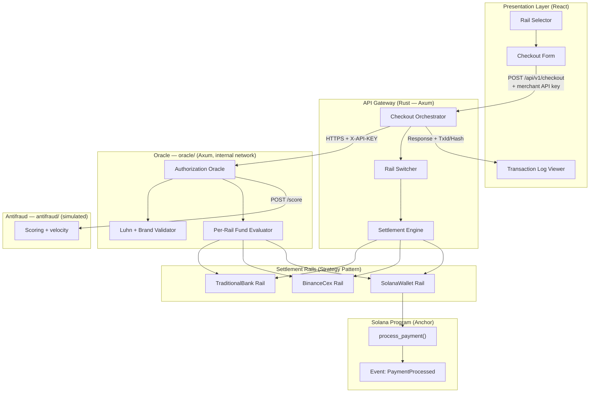
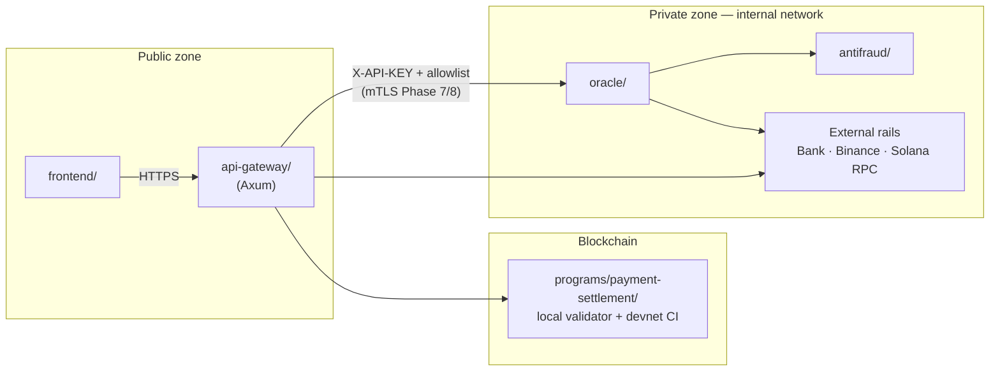
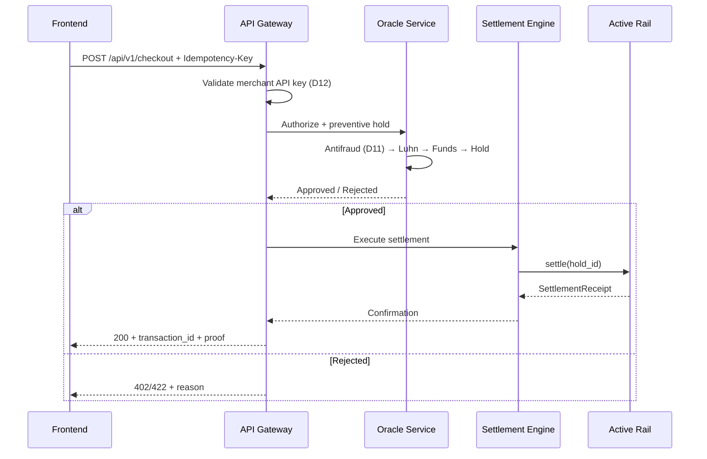
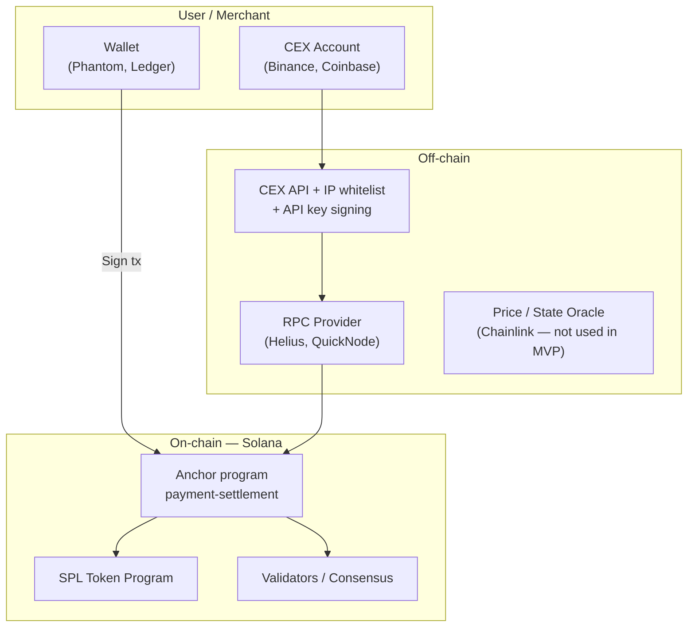
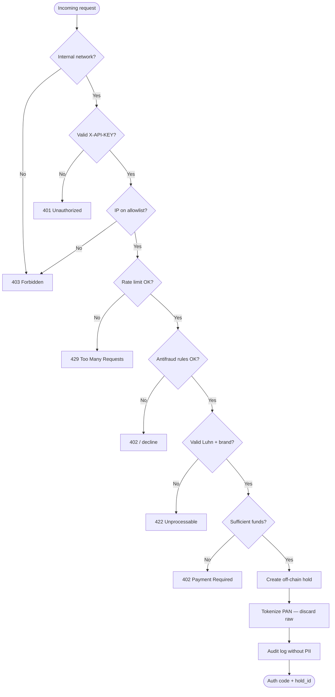

# Multi-Rail Payment System Architecture

> Reference document for the design and implementation of the Web2/Web3-agnostic payment processor described in [Contexto General-en.md](./Contexto%20General-en.md).  
> **Design decisions:** [§12](#12-design-decisions--resolved-phase-0) (closed 2026-07-25) · **Plan:** [Plan-de-Implementacion-en.md](./Plan-de-Implementacion-en.md)

---

## 1. Overview

The system is a **microservices payment processor** that enables card purchase authorization and settlement of the backing funds through **multiple interchangeable rails** (Multi-Rail):

| Rail | Type | Settlement mechanism |
|------|------|----------------------|
| **TraditionalBank** | Fiat (USD/EUR) | Simulated bank clearing (ISO 20022 / ACH) |
| **BinanceCex** | Custodial CEX | Simulated Binance API — Spot USDC/USDT debit |
| **SolanaWallet** | Non-custodial on-chain | Anchor program — atomic SPL transfer |

The distinguishing feature is **rail mutability**: the funding source (`FundingSource`) and settlement destination (`SettlementRail`) are decoupled via the **Strategy** pattern, allowing provider switching without modifying the checkout flow.

---

## 2. Architectural Principles

These principles derive from the directives defined in the repository's `.cursorrules` files.

### 2.1 Rust (Backend)

- **Safety first**: no `unsafe` blocks; `.unwrap()` / `.expect()` forbidden in production code.
- **Error handling**: `thiserror` for library/domain errors; `anyhow` for application logic.
- **Explicit typing**: **Newtype** pattern for domain types (`TransactionId`, `CardNumber`, `Amount`).
- **Modularity**: Cargo workspace with separate crates by responsibility.
- **TDD**: tests in `tests/` or `mod tests` **before** implementation; `cargo test` mandatory before closing a task.
- **Documentation**: every public function with a doc comment (`///`) specifying purpose, inputs, and returns/errors.

### 2.2 Solana / Anchor (On-Chain)

- **Explicit account validation**: constraints in `#[derive(Accounts)]` with `seeds`, `bump`, `owner`, `signer`, `has_one`, `constraint`.
- **On-chain security**: prevention of Account Substitution, Missing Ownership Check, and arithmetic overflows.
- **Custom errors**: `#[error_code]` block; `.unwrap()` / `.expect()` forbidden.
- **Per-instruction documentation**: comment block with `@notice`, `@dev`, `@param`, `@return`.
- **TDD**: TypeScript tests (`anchor test`) or Rust (`program-test`) **before** implementing logic.
- **Compute Budget**: optimize instructions to stay within compute unit limits.

### 2.3 React (Frontend)

- **Functional components** with Hooks; strict TypeScript (no `any`).
- **Data validation**: Zod for props and API payloads.
- **Package manager**: `pnpm`.
- **Minimal local state**: Context API only when necessary; no implicit global state.
- **TDD**: Vitest + React Testing Library; user interaction tests, not implementation tests.
- **Documentation**: JSDoc on every component and hook.

### 2.4 QA (Cross-Cutting)

- Minimum **3 edge cases** per function/component (nulls, empty arrays, extreme loads).
- Performance review (re-renders, API latency, bottlenecks).
- Security review (XSS, unprotected routes, PII exposure).
- Test strategy: Vitest/Jest (unit), Playwright (checkout E2E).

---

## 3. Component Diagram



---

## 4. Project Structure

The system is organized into **three independently deployable units** within the `pasarela/` **monorepo** (decision **D5**). They share a Cargo workspace for unified DX (`cargo test` at root), but maintain **separate logical and deployment boundaries**.

### Workspace dependency rules

| Crate / service | May depend on | Must not depend on |
|-----------------|---------------|---------------------|
| `crates/domain` | (no infra) | HTTP, DB, Solana, Oracle |
| `crates/rail-switcher` | `domain` | Oracle, Gateway |
| `crates/oracle-client` | serde, reqwest | Oracle, domain, DB |
| `oracle/` | `oracle-client` (wire contract) | `domain`, `rail-switcher` |
| `antifraud/`, `binance-sim/` | Axum, serde | Gateway, domain |

The HTTP contract Gateway ↔ Oracle lives in **`crates/oracle-client/`**; the Oracle re-exports it at runtime via `oracle/src/api/`.

### 4.1 Pasarela (Gateway + Domain + On-Chain + Frontend)

```
pasarela/
├── Doc/                          # Architecture and context documentation
├── crates/
│   ├── domain/                   # Domain traits, structs, enums (no external dependencies)
│   ├── rail-switcher/            # Rail decision engine
│   ├── oracle-client/            # Typed HTTP client toward the Oracle (API contract only)
│   ├── api-gateway/              # Gateway + Orchestrator (Phase 4)
│   └── settlement-adapters/      # Concrete implementations for each rail
├── programs/
│   └── payment-settlement/       # Anchor program (Phase 3)
├── frontend/                     # React + Tailwind ✅ (Phase 5 — closed 2026-07-26)
├── tests/
│   ├── integration/              # Cross-crate tests (Gateway ↔ Oracle mocks)
│   └── e2e/                      # Playwright
├── Cargo.toml                    # Workspace root (domain, gateway, oracle-client, oracle, simulators)
├── solana.cursorrules
├── rust.cursorrules
├── react.cursorrules
└── qa.cursorrules
```

### 4.2 Authorization Oracle (separate independent entity)

```
oracle/                           # Phase 2 — Axum (D1)
├── Cargo.toml
├── .env.example
├── src/
│   ├── main.rs
│   ├── config.rs
│   ├── auth/                     # X-API-KEY + allowlist (MVP); mTLS Phase 7/8 (D7)
│   ├── validation/               # Luhn, brand, in-memory token hash (D6)
│   ├── funds/                    # Per-rail evaluator; spread via BINANCE_SPREAD_BUFFER_PCT (D4)
│   ├── antifraud_client/         # HTTP client toward antifraud/ (D11)
│   └── routes/
├── tests/
├── rust.cursorrules
└── README.md
```

### 4.3 Simulated antifraud service (separate entity)

```
antifraud/                        # Phase 2 — simulated microservice (D11)
├── Cargo.toml                    # Standalone Rust project — Axum (D1)
├── .env.example
├── src/
│   ├── main.rs
│   ├── routes/                   # POST /internal/v1/score
│   └── rules/                    # Velocity, maximum amount, basic scoring
└── tests/
```

The Oracle invokes `antifraud/` **after** UC-11 (auth) and **before** creating the hold. If the service does not respond → **fail closed** (decline).

### 4.4 Independence principles

| Aspect | Pasarela (Gateway) | Oracle | Antifraud |
|--------|-------------------|--------|-----------|
| **Cargo workspace** | `pasarela/Cargo.toml` | `oracle/Cargo.toml` | `antifraud/Cargo.toml` |
| **HTTP framework** | Axum (D1) | Axum (D1) | Axum (D1) |
| **Build** | `cargo build` in pasarela | `cargo build` in oracle | `cargo build` in antifraud |
| **Deployment** | Own container | Own container | Own container |
| **Port** | Public (frontend → Gateway) | Internal network only | Internal network only |
| **Secrets** | `GATEWAY_*`, merchant keys | `ORACLE_*`, RPC/CEX | `ANTIFRAUD_*` |
| **Persistence** | Transactions, settlements, merchants | Holds, audit log | Scoring log (no PII) |
| **Communication** | — | HTTP/JSON; no cross-imports | Oracle → Antifraud only |

> **Boundary rule:** the Gateway consumes the Oracle exclusively through the `oracle-client` crate (DTOs + HTTP client). No other component — including the frontend — may invoke the Oracle directly.

### 4.5 Deployment topology



---

## 5. Domain Layer (Phase 1)

### 5.1 Core traits

```rust
/// Processes an end-to-end payment request.
trait PaymentProcessor {
    fn process(&self, request: PaymentRequest) -> Result<PaymentResponse, PaymentError>;
}

/// Evaluates liquidity and executes hold/settlement on the active rail.
trait LiquidityEngine {
    fn evaluate_funds(&self, amount: Amount, rail: FundingType) -> Result<FundStatus, LiquidityError>;
    fn hold(&self, amount: Amount) -> Result<HoldId, LiquidityError>;
    fn settle(&self, hold_id: HoldId) -> Result<SettlementReceipt, LiquidityError>;
}
```

### 5.2 Data structures

| Type | Description |
|------|-------------|
| `PaymentRequest` | Amount, currency, `CardPayload`, selected `FundingType`, merchant metadata |
| `CardPayload` | PAN (tokenized in transit), expiry, fictitious CVV, cardholder |
| `FundingType` | Enum: `TraditionalBank`, `BinanceCex`, `SolanaWallet` |
| `TransactionStatus` | Enum: `Pending`, `Authorized`, `Held`, `Settled`, `Failed`, `Reversed` |
| `PaymentResponse` | `transaction_id`, `status`, `rail_used`, `settlement_proof` (bank hash or Tx Signature) |

### 5.3 Rail Switcher — Decision engine

The **Rail Switcher** selects the active rail according to configurable business rules:

1. **Explicit preference** from user/merchant (from the frontend).
2. **Availability** — the Oracle confirms sufficient funds on the candidate rail.
3. **Cost** — fees/spread per rail (e.g. spread buffer on Binance).
4. **Automatic fallback** (D3) — if the preferred rail fails, tries the next according to a **priority list** in `RAIL_CONFIG` (not manual).

```
Input: PaymentRequest + RailPreference (optional)
  │
  ├─► Evaluate business rules
  ├─► Query availability (Oracle)
  └─► Output: selected FundingType
```

---

## 6. Microservices

### 6.1 Authorization Oracle (Phase 2) — Independent service

**Location**: root directory `oracle/`, monorepo workspace member with independent deployment.

**Responsibility**: simulate the processing network (Visa/Mastercard) with real-time validation (~1–3 s). Acts as an **isolated trusted entity**: concentrates access to sensitive card data and liquidity sources, without exposing itself to the frontend or sharing memory with the Gateway.

| Module | Function |
|--------|----------|
| **Card validator** | Luhn algorithm + brand detection (Visa/MC/Amex) |
| **Authentication** | `X-API-KEY` middleware + IP allowlist (MVP); mTLS in Phase 7/8 (D7) |
| **Antifraud client** | Query to `antifraud/` before hold; fail closed (D11) |
| **Fund evaluator** | Rail-specific logic (see table below) |
| **Tokenization** | In-memory hash post-Luhn; PAN discarded — not persisted (D6) |
| **Hold manager** | Creation, expiration, and release of off-chain holds |
| **Audit logger** | Structured log without PII (brand, amount, rail, result) |

**Per-rail fund evaluation:**

| Rail | Balance source | Hold logic |
|------|----------------|------------|
| TraditionalBank | Fictitious bank balance / static limit | Hold on available limit |
| BinanceCex | Simulated Spot API | Hold in USDC/USDT − spread buffer (`BINANCE_SPREAD_BUFFER_PCT`, D4) |
| SolanaWallet | Solana RPC (on-chain balance) | Hold on wallet SPL balance |

**Internal endpoints** (Gateway only):

| Method | Route | Description |
|--------|-------|-------------|
| `POST` | `/internal/v1/authorize` | Validate card + evaluate funds + create hold |
| `POST` | `/internal/v1/hold/release` | Release hold on settlement failure |
| `GET` | `/health` | Healthcheck for container orchestration |

**Stack**: Rust + **Axum** (D1), deployed as HTTP microservice on private network.

**Contract with Gateway**: the `pasarela/crates/oracle-client/` crate defines request/response DTOs; the Oracle **re-exports** them in `src/api/` as the single source of wire format v1.

### 6.1.1 Simulated antifraud service (Phase 2)

**Location**: `antifraud/`, monorepo, workspace member with independent deployment.

| Module | Function |
|--------|----------|
| **Scoring** | Evaluates transaction risk (amount, velocity, token hash) |
| **Rules** | Decline if configurable thresholds exceeded |
| **Internal API** | `POST /internal/v1/score` — Oracle only |

If `antifraud/` does not respond within timeout → Oracle rejects with decline (**fail closed**, D11).

### 6.2 API Gateway and Orchestrator ✅ (Phase 4 — closed 2026-07-26)

**Main endpoints**:

| Method | Route | Auth | Description |
|--------|-------|------|-------------|
| `POST` | `/api/v1/checkout` | Merchant API key (D12) + `Idempotency-Key` (D9) | Full checkout |
| `GET` | `/api/v1/transactions/{id}` | Merchant API key | Status query |

**Orchestrator flow:**



**Settlement Engine — actions per rail:**

| Rail | Settlement action | Settlement proof |
|------|-------------------|------------------|
| SolanaWallet | Invoke `process_payment` via `solana-client`; wait for **`finalized`** commitment (D10) | Tx Signature (on-chain hash) |
| BinanceCex | Simulated custodial Binance API debit | CEX order ID |
| TraditionalBank | Generate simulated clearing file (ISO 20022 / ACH) | Bank reference |

**HTTP error mapping:**

| Code | Condition |
|------|-----------|
| `200` | Payment authorized and settled |
| `402` | Insufficient funds |
| `422` | Invalid card (Luhn failed) |
| `401` | Invalid API Key (Oracle / merchant) |
| `409` | Duplicate Idempotency-Key (same cached response) |
| `503` | Rail unavailable / RPC timeout |
| `500` | Unrecoverable internal error |

---

## 7. Solana Program (Phase 3)

**Development environment** (D2): **local validator** for daily development; **devnet** in CI pipeline.

**Client confirmation** (D10): the Gateway does not respond `200` until **`finalized`** commitment of the Solana transaction.

### 7.1 Main instruction

```rust
/// @notice Processes an on-chain payment by transferring SPL tokens to the merchant.
/// @dev Emits PaymentProcessed event without PII.
/// @param amount Amount of SPL tokens to transfer.
/// @param brand_code Numeric card brand code (no PAN).
/// @param settlement_rail_id Settlement rail identifier.
pub fn process_payment(
    ctx: Context<ProcessPayment>,
    amount: u64,
    brand_code: u8,
    settlement_rail_id: u64,
) -> Result<()>
```

### 7.2 Involved accounts

| Account | Role |
|---------|------|
| `payer_token_account` | Payer/custody SPL account (signer) |
| `merchant_token_account` | Merchant SPL account |
| `settlement_state` | PDA with seeds `[b"settlement", merchant.key()]` |
| `token_program` | SPL Token Program |
| `system_program` | System Program |

### 7.3 Audit event

```rust
#[event]
pub struct PaymentProcessed {
    pub amount: u64,
    pub brand_code: u8,
    pub settlement_rail_id: u64,
    pub timestamp: i64,
    // No PII: no PAN, no name, no address
}
```

### 7.4 Mandatory tests (TDD)

- Signature by unauthorized user → must fail.
- Account with insufficient space → must fail.
- Arithmetic overflow in `amount` → must fail.
- Successful transfer → verify balances and event emission.

---

## 8. Presentation Layer (Phase 5) ✅ — closed 2026-07-26

> Record: [Acta-Cierre-Fase-5-en.md](./Acta-Cierre-Fase-5-en.md) · Operations: [frontend/README.md](../frontend/README.md)

### 8.1 Components

| Component | Responsibility |
|-----------|----------------|
| `CardForm` | Fictitious card data entry; validation with Zod |
| `RailSelector` | Radiogroup to choose settlement rail |
| `TransactionViewer` | Real-time log: rail used, status, Tx Signature or bank ref. |
| `CheckoutErrorAlert` | Gateway UX errors (402, 422, 503, network) |
| `CheckoutPage` | Orchestrates the full flow; calls `POST /api/v1/checkout` |

### 8.2 Frontend data flow

```
User enters card + selects rail
  │
  ├─► Local validation (Zod)
  ├─► POST /api/v1/checkout
  └─► TransactionViewer shows response in real time
```

### 8.3 Frontend stack

- **React** (functional components + Hooks)
- Strict **TypeScript**
- **Tailwind CSS**
- **Zod** for validation
- **Vitest + React Testing Library** for tests (77 tests)
- **pnpm** as package manager

### 8.4 API client (Gateway only)

| Module | Endpoints |
|--------|-----------|
| `frontend/src/api/gateway.ts` | `POST /api/v1/checkout`, `GET /api/v1/transactions/{id}`, `GET /health` |

Checkout headers: `Authorization: Bearer sk_*`, `Idempotency-Key` (UUID).

### 8.5 Environment variables

| Variable | Description |
|----------|-------------|
| `VITE_API_BASE_URL` | Gateway URL (default `http://127.0.0.1:8080`) |
| `VITE_GATEWAY_API_KEY` | Merchant API key — aligned with `GATEWAY_TEST_API_KEY` |

Template: `frontend/.env.example` → `.env.local`.

---

## 9. Security

This chapter describes **real-world security structures** in commercial banking and Web3, and how they translate to the pasarela design. The project simulates several components (processing network, banking core, CEX API); the scope table (§9.6) distinguishes what is implemented in the MVP and what would apply in production.

### 9.1 Commercial banking — real structures

In a real fiat payment processor, security is not a single service: it is an **ecosystem of regulated, physical, and logical layers**.

#### 9.1.1 Regulatory framework and governance

| Structure | What it requires in real life | Role in pasarela |
|-----------|------------------------------|------------------|
| **PCI-DSS** | Never store CVV; minimize PAN exposure; segment CDE (Cardholder Data Environment) | Oracle = simulated CDE zone; PAN only in transit to Oracle; no CVV persistence |
| **PSD2 / SCA** | Strong cardholder authentication (3-D Secure 2.x) before debiting | **Post-MVP** (D8); no 3DS in this project |
| **KYC / AML** | Verified identity of merchant and cardholder; screening against lists (OFAC, PEP) | MVP: fictitious data; production: KYC/AML provider integration before checkout |
| **Basel / operational risk** | Controls over settlement failures, fraud, and continuity | Holds + rail fallback + off-chain reconciliation |
| **Audit (SOX, IFRS)** | Immutable traceability of authorizations and settlements | Oracle audit log + per-rail proofs (bank ref., CEX ID, Tx Signature) |

#### 9.1.2 Banking operational architecture

```mermaid
flowchart TB
    subgraph Public["Public zone"]
        Browser["Checkout / 3DS"]
        GW["Payment Gateway"]
    end

    subgraph CDE["CDE — Cardholder Data Environment"]
        Auth["Authorization Host\n(simulates Visa/MC)"]
        TokenVault["Token Vault / HSM"]
    end

    subgraph Internal["Internal banking network"]
        Fraud["Antifraud engine\n(antifraud/)"]
        Core["Banking core"]
        ACH["ACH / SWIFT / ISO 20022 clearing"]
    end

    Browser -->|TLS 1.2+| GW
    GW -->|X-API-KEY + allowlist\n(mTLS Phase 7/8)| Auth
    Auth --> Fraud
    Auth --> TokenVault
    GW --> ACH
    ACH --> Core
```

| Real component | Function | Project equivalent |
|----------------|----------|-------------------|
| **Payment Gateway (merchant)** | Receives checkout; never touches banking core | `api-gateway/` |
| **Authorization Host / Processor** | Validates card, queries issuer, creates auth code | `oracle/` (simulates processing network) |
| **Token Vault + HSM** | Generates and safeguards PAN tokens; keys in hardware | In-memory tokenization in Oracle (MVP); external HSM in production |
| **Antifraud engine** | Scoring, velocity checks, geolocation, device fingerprint | **`antifraud/`** simulated microservice (D11); Oracle queries it pre-hold |
| **Banking core** | Account ledger; definitive debits/credits | Simulated in `TraditionalBank` rail |
| **Clearing / Settlement** | Batch clearing (T+1/T+2) via ACH, Fedwire, SEPA, ISO 20022 | Simulated ISO 20022 / ACH message generation |
| **Chargeback / disputes** | Reversal up to 120 days post-transaction | MVP: `Reversed` in enum; no full dispute flow |

#### 9.1.3 Standard banking technical controls

| Control | Industry standard | MVP implementation | Real production |
|---------|-------------------|-------------------|-----------------|
| Encryption in transit | TLS 1.2+ (preferably 1.3) | TLS between FE ↔ GW ↔ Oracle | Managed certificates (Let's Encrypt / ACM) + HSTS |
| Encryption at rest | AES-256 | N/A (no PAN persistence) | Encrypted DB; sensitive columns with envelope encryption |
| Service-to-service authentication | mTLS + OAuth2 client credentials | MVP: `X-API-KEY` + allowlist (D7); **mTLS Phase 7/8** |
| PAN tokenization | PCI token vault (format-preserving or random) | In-memory hash post-Luhn (D6); HSM post-MVP |
| Idempotency | `Idempotency-Key` on authorizations | **Phase 4** Gateway (D9) |
| Reconciliation | Daily batch Gateway ↔ processor ↔ bank | Structured log | Reconciliation jobs + mismatch alerts |
| Log retention | 7 years (varies by jurisdiction) | Structured logs without PII | SIEM + WORM storage |

---

### 9.2 Web3 — real structures

In Web3, trust shifts from the institution to the **cryptographic protocol** and **key custody**. There is no native chargeback: security prioritizes on-chain integrity and irreversibility.

#### 9.2.1 Web3 ecosystem layers



| Structure | What it protects in real life | Project equivalent |
|-----------|------------------------------|-------------------|
| **Private key / seed phrase** | Fund ownership; loss = irreversible loss | Solana rail: `payer_token_account` must sign; user custodies their wallet |
| **Hardware wallet (Ledger/Trezor)** | Key never leaves the device | Recommended in production for high amounts |
| **Multisig / MPC** | M-of-N signers for corporate treasury | MVP: single signer; production: Squads Protocol or Fireblocks |
| **CEX custodial** | API keys with minimum permissions, 2FA, withdrawal whitelist | `BinanceCex` rail: simulated API; production: IP whitelist + HMAC signing + sub-accounts |
| **Smart contract audit** | Vulnerabilities before mainnet deploy | TDD tests + external audit pre-mainnet |
| **Upgrade authority** | Who can modify the deployed program | MVP: fixed authority; production: multisig or immutable program |
| **Reliable RPC** | Avoid false balance or state responses | MVP: public RPC/devnet; production: dedicated provider + fallback |
| **Compute budget / priority fees** | Avoid failures due to insufficient CU or expired tx | Anchor instruction optimization (§2.2) |

#### 9.2.2 Web3 attack vectors and real mitigations

| Vector | Real impact | Industry mitigation | In the Anchor program |
|--------|-------------|---------------------|----------------------|
| **Seed / API key phishing** | Total fund theft | Education + hardware wallet + minimum API permissions | Document in frontend: never ask for seed |
| **Account Substitution** | Transfer to wrong account | Validate `owner`, `signer`, token mint | `#[derive(Accounts)]` with constraints |
| **Reentrancy** | Drain in complex contracts | Checks-effects-interactions | Atomic SPL transfer; no callbacks |
| **Integer overflow** | Incorrect amounts | Checked math | `checked_add` / `checked_sub` |
| **Front-running / MEV** | Transaction reordering | Private mempool, Jito bundles | MVP: acceptable on devnet; production: evaluate |
| **Oracle manipulation** | False prices/states | Chainlink, TWAP, multiple sources | N/A in MVP (no price oracle) |
| **Bridge exploits** | Multimillion-dollar losses | Audits, limits, monitoring | N/A (single-chain Solana) |
| **PII on-chain** | GDPR impossible to erase | Zero PII in events/logs | `PaymentProcessed` without PAN or name |

#### 9.2.3 CEX vs non-custodial — security differences

| Dimension | CEX (BinanceCex) | Non-custodial (SolanaWallet) |
|-----------|------------------|------------------------------|
| **Custody** | Exchange holds funds | User holds keys |
| **Authentication** | API key + HMAC + IP whitelist + 2FA | Cryptographic transaction signature |
| **Reversibility** | CEX support can freeze/revert internally | Irreversible on-chain |
| **Compliance** | Exchange KYC, Travel Rule on withdrawals | Pseudonymity; separate off-ramp KYC |
| **Failure point** | API key compromise or exchange hack | Seed loss or contract bug |
| **Payment proof** | Order ID / withdrawal hash | Tx Signature verifiable on explorer |

---

### 9.3 Cross-cutting Web2 vs Web3 comparison

| Dimension | Commercial banking | Web3 |
|-----------|-------------------|------|
| **Source of trust** | Regulated institution + state | Cryptography + consensus + code |
| **Identity** | Mandatory KYC, legal document | Public address (pseudonym) |
| **Authorization** | Auth code + off-chain hold | On-chain transaction signature |
| **Settlement** | Batch T+1/T+2 (ACH, SEPA, SWIFT) | Finality in seconds (Solana ~400 ms) |
| **Disputes** | Chargeback up to 120 days | No native reversal |
| **Sensitive data** | PAN, CVV, PII → PCI-DSS | Private key, seed phrase |
| **Audit** | Centralized logs + regulator | Public explorer + indexed events |
| **Fraud** | Centralized engine + rules + ML | Contract exploits, phishing, rug pulls |

---

### 9.4 Oracle — trust boundary (independent service)

The Oracle concentrates sensitive data (PAN in transit, liquidity evaluation) and replicates the role of a banking **Authorization Host** or card processor. It operates isolated from the Gateway, as PCI-DSS requires for the CDE.

| Control | Real-world reference | MVP implementation |
|---------|---------------------|-------------------|
| **Network isolation** | CDE separate from public DMZ | Oracle on internal network only (VPC); frontend **never** contacts it |
| **Mutual authentication** | mTLS between acquirer and processor | `X-API-KEY` (`ORACLE_API_KEY`); production: additional mTLS |
| **Origin allowlist** | Gateway fixed IP in commercial contract | `ORACLE_ALLOWED_CALLERS` middleware |
| **Minimal surface** | Authorization APIs only; no public admin | `/internal/v1/` routes; `GET /health` without PII |
| **Rate limiting** | Protection against credential stuffing / abuse | 100 req/min per API key and IP |
| **Secrets** | HSM / AWS Secrets Manager / Vault | Environment variables; `.env` in `.gitignore` |
| **PAN tokenization** | PCI Level 1 vault | In-memory token post-Luhn; PAN not persisted or logged |
| **Antifraud engine** | FICO, SAS, processor services | Simulated **`antifraud/`** (D11); fail closed |
| **3-D Secure** | Issuer ACS (Visa Secure, Mastercard ID Check) | **Post-MVP** (D8) |
| **Secure logs** | PCI: forbidden to log PAN/CVV | Only `request_id`, brand, amount, rail, result |
| **Strict timeouts** | Processor SLA ~2–3 s | Timeout per RPC/CEX query |
| **Fail closed** | Industry standard: decline if in doubt | Immediate `401`/`403`/`422`; never authorize by default |
| **Independent deployment** | Processor on infra separate from merchant | Separate binary and CI from Gateway |



---

### 9.5 Security per settlement rail

#### 9.5.1 TraditionalBank (fiat)

| Real phase | Mechanism | In the project |
|------------|-----------|----------------|
| Authorization | Issuer auth code via Visa/MC network | Oracle simulates approval post-Luhn + funds |
| Capture / settlement | Batch ACH (US), SEPA (EU), ISO 20022 pacs.008 | Simulated clearing message generation |
| Reconciliation | Daily clearing file | `settlement_proof` = fictitious bank reference |
| Security | SWIFT CSP, account segregation, bank signatures | Off-chain hold + audit log |

#### 9.5.2 BinanceCex (custodial)

| Real Binance control | In the project |
|---------------------|----------------|
| API key with **Spot Trading** permission only (no withdrawal) | Simulated API with minimum scope |
| IP whitelist in Binance panel | Configurable via env |
| HMAC-SHA256 request signing | Simulate in adapter; mandatory in production |
| 2FA on CEX account | Out of MVP scope (operator) |
| Spread buffer / slippage protection | Hold = amount; effective balance = balance × (1 − `BINANCE_SPREAD_BUFFER_PCT`) (D4) |
| Payment proof | API `orderId` or `clientOrderId` |

#### 9.5.3 SolanaWallet (non-custodial)

| Real control | In the project |
|-------------|----------------|
| User signs with wallet (Phantom, etc.) | `payer_token_account` = signer |
| Mint verification (official USDC) | Constraint on SPL token mint |
| PDA for settlement state | `settlement_state` with documented seeds |
| Finality before confirming to client | Wait for **`finalized`** commitment (D10) |
| Payment proof | Tx Signature verifiable on Solscan/Explorer |
| Zero PII on-chain | `PaymentProcessed` event without PAN or name |

---

### 9.6 Off-chain (Gateway and Frontend)

| Vector | Real-world reference | MVP mitigation |
|--------|---------------------|----------------|
| PAN in transit | PCI: end-to-end encryption | TLS; Gateway forwards PAN to Oracle only, does not persist |
| Frontend → Oracle | PCI violation if browser touches CDE | **Forbidden** — Gateway → Oracle only |
| Idempotency | Stripe, Adyen require `Idempotency-Key` | **Phase 4** (D9) |
| PII in logs | GDPR / PCI | Only `transaction_id`, status, rail |
| XSS / injection | OWASP Top 10 | Zod in frontend; sanitization in Gateway |
| CSP / CORS | Restrict checkout origins | Configure in Gateway for merchant domain |
| Public routes | Merchant API key (Stripe-style) | **`sk_test_...` / `sk_live_...`** per merchant (D12) |

---

### 9.7 On-chain (Anchor program)

| Vector | Real-world reference (Solana/Anchor) | Mitigation |
|--------|--------------------------------------|------------|
| Account Substitution | OWASP Smart Contract Top 10 | `owner` + `signer` in Accounts |
| Missing Ownership Check | Anchor security guidelines | `has_one`, `constraint` |
| Integer Overflow | DeFi exploit history | Checked arithmetic + tests |
| PDA collision | Solana program security | Documented seeds + `find_program_address` |
| PII exposure | GDPR + on-chain irreversibility | Event without personal data |
| Upgrade authority abuse | Rug pull vector | Documented authority; multisig in production |

---

### 9.8 MVP vs production scope

| Area | MVP (this project) | Real production |
|------|-------------------|-----------------|
| Processing network | Luhn + simulation | Acquirer integration (Stripe, Adyen, Fiserv) |
| 3-D Secure | **Post-MVP** (D8) | Issuer ACS mandatory in EU (PSD2) |
| Token vault | In-memory hash in Oracle (D6) | HSM + PCI Level 1 vault |
| Antifraud | Simulated `antifraud/` service (D11) | Dedicated ML engine |
| Banking core | Simulated | Real banking integration (open banking / correspondent) |
| CEX | Simulated API | Binance API with HMAC + IP whitelist |
| Solana | local validator + devnet CI (D2) | mainnet + contract audit + dedicated RPC |
| KYC/AML | Fictitious data | Onfido, Sumsub, Chainalysis |
| mTLS | Phase 7/8 (D7) | Mandatory between internal services |
| SOC / SIEM | Structured logs | Datadog, Splunk, 24/7 alerts |

---

## 10. Testing Strategy

| Layer | Tool | Focus |
|-------|------|-------|
| Rust domain | `cargo test` + `mod tests` | Traits, Rail Switcher, structs — TDD |
| Oracle (isolated) | `oracle/tests/` | HTTP, auth, Luhn, funds, antifraud client |
| Antifraud | `antifraud/tests/` | Scoring, decline rules, fail closed |
| Gateway + oracle-client | `pasarela/tests/integration/` | Gateway with Oracle mock/stub |
| Gateway ↔ Oracle (internal E2E) | `tests/integration/` cross-service | Real HTTP contract between both services |
| Solana Program | `anchor test` (TS) + `program-test` (Rust) | local validator (dev) + **devnet** (CI, D2) |
| Frontend | Vitest + RTL | User interaction, Rail Selector |
| E2E | Playwright | Full checkout → confirmation flow |
| QA | Manual checklists | 3+ edge cases per function, security, performance |

---

## 11. Implementation Phases

Development is **sequential and modular**. The next phase is not started without explicit confirmation.

| Phase | Name | Key deliverables | Dependencies |
|-------|------|------------------|--------------|
| **0** | Planning | Docs, decisions D1–D12, Oracle skeleton | — ✅ |
| **1** | Domain and Rail Abstraction | Traits, structs, enums, Rail Switcher (fallback D3) | Phase 0 |
| **2** | Oracle + Antifraud | Complete `oracle/` + simulated `antifraud/` (D11) | API contract; parallel with Phase 3 |
| **3** | On-Chain Settlement Engine | Anchor program; local validator + devnet CI (D2) | Phase 1 |
| **4** | API Gateway and Orchestration | Axum Gateway, Settlement, idempotency (D9), merchant auth (D12) | Phases 1, 2, 3 ✅ |
| **5** | Frontend (Dashboard & Checkout) | React + Tailwind, Gateway connection | Phase 4 |
| **7/8** | Staging / Production | mTLS (D7), TLS, secrets, monitoring | Phases 5–6 |

---

## 12. Design Decisions — Resolved (Phase 0)

> Closed in Phase 0 — step 0.7 ([Plan-de-Implementacion-en.md](./Plan-de-Implementacion-en.md)).  
> Date: 2026-07-25.

| ID | Decision | Resolution |
|----|----------|------------|
| **D1** | Rust HTTP framework | **Axum** in Gateway and Oracle |
| **D2** | Solana network (dev/CI) | **Local validator** in development + **devnet** in CI |
| **D3** | Fallback policy | **Automatic** by configurable priority list |
| **D4** | BinanceCex spread buffer | **Configurable** via environment variable (`BINANCE_SPREAD_BUFFER_PCT`); no fixed value in code |
| **D5** | Oracle repository | **Monorepo** — `oracle/` within `pasarela/` |
| **D6** | PAN tokenization | **In-memory hash** in Oracle; PAN discarded after Luhn validation (MVP) |
| **D7** | mTLS Gateway ↔ Oracle | **MVP**: `X-API-KEY` + allowlist; **mTLS in Phase 7/8** (staging/production) |
| **D8** | 3-D Secure (SCA) | **Out of MVP scope** — documented as post-MVP |
| **D9** | Idempotency-Key | ✅ **Implemented** in Gateway (Phase 4) — mandatory on checkout |
| **D10** | Solana commitment level | **`finalized`** before confirming success to client |
| **D11** | Antifraud engine | **Simulated external service** (separate microservice; Oracle invokes it) |
| **D12** | Merchant auth on Gateway | ✅ **API key per merchant** (`sk_test_...` / `sk_live_...`) — Phase 4 |

### Decision implications

**D4 — Configurable spread buffer**

```bash
# Oracle / settlement-adapters
BINANCE_SPREAD_BUFFER_PCT=0.02   # example: 2%; adjustable per environment
```

**D11 — Simulated antifraud service**

New optional component in architecture (Phase 2/4):

```
antifraud/                    # Simulated microservice (future)
├── Cargo.toml
└── src/                      # Scoring, velocity, decline rules
```

The Oracle queries the antifraud service **before** authorizing the hold. If the service does not respond → **fail closed** (decline).

**D10 — `finalized` commitment**

The Gateway's Solana adapter will wait for `finalized` before responding `200` to checkout. This implies higher latency (~15–30 s on mainnet; lower on devnet) in exchange for irreversibility.

**D12 — API key per merchant**

The Gateway will validate `Authorization: Bearer sk_test_...` (or dedicated header) on `POST /api/v1/checkout`. Each merchant will have its own key in persistence.

### Post-MVP decisions (not yet closed)

These will be resolved when addressing real production:

- Real acquirer integration (Stripe, Adyen, Fiserv)
- Token vault with HSM / PCI Level 1
- 3-D Secure with issuer ACS
- Solana mainnet + external contract audit
- KYC/AML (Onfido, Sumsub, Chainalysis)

---

## References

- [Contexto General-en.md](./Contexto%20General-en.md) — Master prompt and project phases
- [Plan-de-Implementacion-en.md](./Plan-de-Implementacion-en.md) — Roadmap to production
- [Acta-Cierre-Fase-0-en.md](./Acta-Cierre-Fase-0-en.md) — Phase 0 gate (2026-07-25)
- [Acta-Cierre-Fase-5-en.md](./Acta-Cierre-Fase-5-en.md) — Phase 5 gate (2026-07-26)
- [Acta-Cierre-Fase-4-en.md](./Acta-Cierre-Fase-4-en.md) — Phase 4 gate (2026-07-26)
- [Casos-de-Uso-ER-Flujos-en.md](./Casos-de-Uso-ER-Flujos-en.md) — Use cases, ER, and operational flows
- `rust.cursorrules` — Rust development directives
- `solana.cursorrules` — Anchor and on-chain security directives
- `react.cursorrules` — Frontend directives
- `qa.cursorrules` — Quality and testing directives
