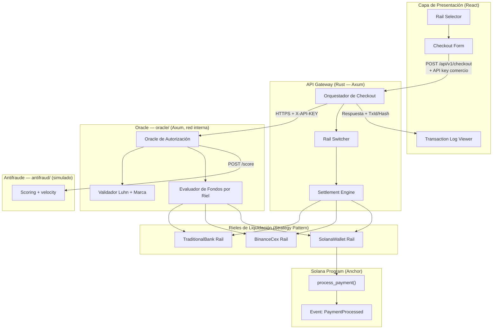
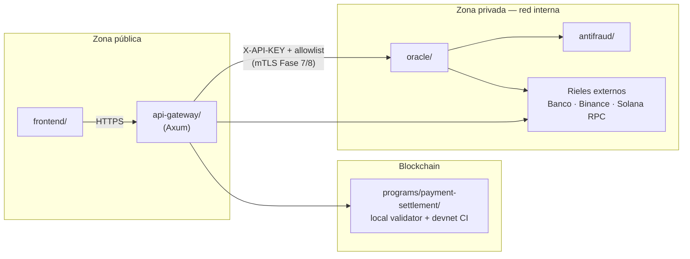
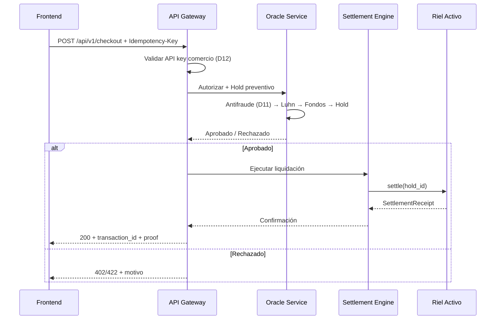
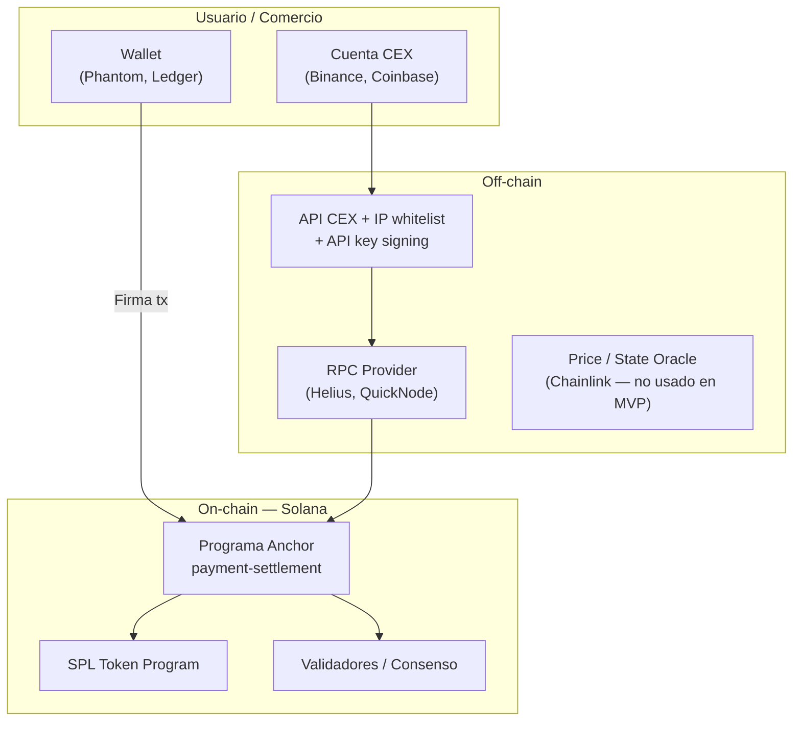
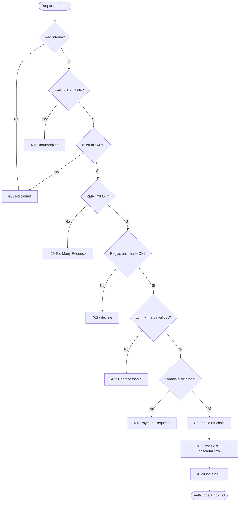

# Arquitectura del Sistema de Pagos Multi-Rail

> Documento de referencia para el diseño e implementación del procesador de pagos agnóstico Web2/Web3 descrito en [Contexto General.md](./Contexto%20General.md).  
> **Decisiones de diseño:** [§12](#12-decisiones-de-diseño--resueltas-fase-0) (cerradas 2026-07-25) · **Plan:** [Plan-de-Implementacion.md](./Plan-de-Implementacion.md)

---

## 1. Visión General

El sistema es un **procesador de pagos con arquitectura de microservicios** que permite autorizar compras con tarjeta y liquidar el fondo de respaldo a través de **múltiples rieles intercambiables** (Multi-Rail):

| Riel | Tipo | Mecanismo de liquidación |
|------|------|--------------------------|
| **TraditionalBank** | Fiat (USD/EUR) | Compensación bancaria simulada (ISO 20022 / ACH) |
| **BinanceCex** | CEX custodial | API simulada de Binance — débito Spot USDC/USDT |
| **SolanaWallet** | Non-custodial on-chain | Programa Anchor — transferencia atómica SPL |

La característica distintiva es la **mutabilidad del riel**: el origen de fondos (`FundingSource`) y el destino de asentamiento (`SettlementRail`) se desacoplan mediante el patrón **Strategy**, permitiendo conmutar el proveedor sin modificar el flujo de checkout.

---

## 2. Principios Arquitectónicos

Estos principios derivan de las directivas definidas en los archivos `.cursorrules` del repositorio.

### 2.1 Rust (Backend)

- **Seguridad primero**: sin bloques `unsafe`; prohibido `.unwrap()` / `.expect()` en código de producción.
- **Manejo de errores**: `thiserror` para errores de librería/dominio; `anyhow` para lógica de aplicación.
- **Tipado explícito**: patrón **Newtype** para tipos de dominio (`TransactionId`, `CardNumber`, `Amount`).
- **Modularidad**: workspace Cargo con crates separados por responsabilidad.
- **TDD**: tests en `tests/` o `mod tests` **antes** de la implementación; `cargo test` obligatorio antes de dar por cerrada una tarea.
- **Documentación**: cada función pública con doc comment (`///`) que especifique propósito, entradas y retornos/errores.

### 2.2 Solana / Anchor (On-Chain)

- **Validación explícita de cuentas**: restricciones en `#[derive(Accounts)]` con `seeds`, `bump`, `owner`, `signer`, `has_one`, `constraint`.
- **Seguridad on-chain**: prevención de Account Substitution, Missing Ownership Check y desbordamientos aritméticos.
- **Errores personalizados**: bloque `#[error_code]`; prohibido `.unwrap()` / `.expect()`.
- **Documentación por instrucción**: bloque de comentarios con `@notice`, `@dev`, `@param`, `@return`.
- **TDD**: tests TypeScript (`anchor test`) o Rust (`program-test`) **antes** de implementar la lógica.
- **Compute Budget**: optimizar instrucciones para permanecer dentro de los límites de compute units.

### 2.3 React (Frontend)

- **Componentes funcionales** con Hooks; TypeScript estricto (sin `any`).
- **Validación de datos**: Zod para props y payloads de API.
- **Gestor de paquetes**: `pnpm`.
- **Estado local mínimo**: Context API solo cuando sea necesario; sin estado global implícito.
- **TDD**: Vitest + React Testing Library; tests de interacción de usuario, no de implementación.
- **Documentación**: JSDoc en cada componente y hook.

### 2.4 QA (Transversal)

- Mínimo **3 casos borde** por función/componente (nulos, arrays vacíos, cargas extremas).
- Revisión de rendimiento (re-renders, latencia de API, cuellos de botella).
- Revisión de seguridad (XSS, rutas no protegidas, exposición de PII).
- Estrategia de tests: Vitest/Jest (unit), Playwright (E2E del checkout).

---

## 3. Diagrama de Componentes



---

## 4. Estructura de Proyectos

El sistema se organiza en **tres unidades de despliegue independientes** dentro del **monorepo** `pasarela/` (decisión **D5**). El Oracle y el servicio antifraude **no forman parte** del workspace Cargo de la pasarela: cada uno tiene su propio `Cargo.toml`, ciclo de build, contenedor y secretos.

### 4.1 Pasarela (Gateway + Dominio + On-Chain + Frontend)

```
pasarela/
├── Doc/                          # Documentación de arquitectura y contexto
├── crates/
│   ├── domain/                   # Traits, structs, enums del dominio (sin dependencias externas)
│   ├── rail-switcher/            # Motor de decisión de riel
│   ├── oracle-client/            # Cliente HTTP tipado hacia el Oracle (solo contrato de API)
│   ├── api-gateway/              # Gateway + Orquestador (Fase 4)
│   └── settlement-adapters/      # Implementaciones concretas de cada riel
├── programs/
│   └── payment-settlement/       # Programa Anchor (Fase 3)
├── frontend/                     # React + Tailwind (Fase 5)
├── tests/
│   ├── integration/              # Tests cross-crate (Gateway ↔ mocks del Oracle)
│   └── e2e/                      # Playwright
├── Cargo.toml                    # Workspace root — NO incluye al Oracle
├── solana.cursorrules
├── rust.cursorrules
├── react.cursorrules
└── qa.cursorrules
```

### 4.2 Oracle de Autorización (entidad separada e independiente)

```
oracle/                           # Fase 2 — Axum (D1)
├── Cargo.toml
├── .env.example
├── src/
│   ├── main.rs
│   ├── config.rs
│   ├── auth/                     # X-API-KEY + allowlist (MVP); mTLS Fase 7/8 (D7)
│   ├── validation/               # Luhn, marca, token hash en memoria (D6)
│   ├── funds/                    # Evaluador por riel; spread vía BINANCE_SPREAD_BUFFER_PCT (D4)
│   ├── antifraud_client/         # Cliente HTTP hacia antifraud/ (D11)
│   └── routes/
├── tests/
├── rust.cursorrules
└── README.md
```

### 4.3 Servicio antifraude simulado (entidad separada)

```
antifraud/                        # Fase 2 — microservicio simulado (D11)
├── Cargo.toml                    # Proyecto Rust autónomo — Axum (D1)
├── .env.example
├── src/
│   ├── main.rs
│   ├── routes/                   # POST /internal/v1/score
│   └── rules/                    # Velocity, monto máximo, scoring básico
└── tests/
```

El Oracle invoca `antifraud/` **después** de UC-11 (auth) y **antes** de crear el hold. Si el servicio no responde → **fail closed** (decline).

### 4.4 Principios de independencia

| Aspecto | Pasarela (Gateway) | Oracle | Antifraude |
|---------|-------------------|--------|------------|
| **Workspace Cargo** | `pasarela/Cargo.toml` | `oracle/Cargo.toml` | `antifraud/Cargo.toml` |
| **Framework HTTP** | Axum (D1) | Axum (D1) | Axum (D1) |
| **Build** | `cargo build` en pasarela | `cargo build` en oracle | `cargo build` en antifraud |
| **Despliegue** | Contenedor propio | Contenedor propio | Contenedor propio |
| **Puerto** | Público (frontend → Gateway) | Solo red interna | Solo red interna |
| **Secretos** | `GATEWAY_*`, claves comercio | `ORACLE_*`, RPC/CEX | `ANTIFRAUD_*` |
| **Persistencia** | Transacciones, settlements, merchants | Holds, audit log | Scoring log (sin PII) |
| **Comunicación** | — | HTTP/JSON; sin imports cruzados | Solo Oracle → Antifraude |

> **Regla de frontera:** el Gateway consume al Oracle exclusivamente a través del crate `oracle-client` (DTOs + cliente HTTP). Ningún otro componente — incluido el frontend — puede invocar al Oracle directamente.

### 4.5 Topología de despliegue



---

## 5. Capa de Dominio (Fase 1)

### 5.1 Traits principales

```rust
/// Procesa una solicitud de pago end-to-end.
trait PaymentProcessor {
    fn process(&self, request: PaymentRequest) -> Result<PaymentResponse, PaymentError>;
}

/// Evalúa liquidez y ejecuta el hold/asentamiento en el riel activo.
trait LiquidityEngine {
    fn evaluate_funds(&self, amount: Amount, rail: FundingType) -> Result<FundStatus, LiquidityError>;
    fn hold(&self, amount: Amount) -> Result<HoldId, LiquidityError>;
    fn settle(&self, hold_id: HoldId) -> Result<SettlementReceipt, LiquidityError>;
}
```

### 5.2 Estructuras de datos

| Tipo | Descripción |
|------|-------------|
| `PaymentRequest` | Monto, moneda, `CardPayload`, `FundingType` seleccionado, metadatos del comercio |
| `CardPayload` | PAN (tokenizado en tránsito), expiry, CVV ficticio, titular |
| `FundingType` | Enum: `TraditionalBank`, `BinanceCex`, `SolanaWallet` |
| `TransactionStatus` | Enum: `Pending`, `Authorized`, `Held`, `Settled`, `Failed`, `Reversed` |
| `PaymentResponse` | `transaction_id`, `status`, `rail_used`, `settlement_proof` (hash bancario o Tx Signature) |

### 5.3 Rail Switcher — Motor de decisión

El **Rail Switcher** selecciona el riel activo según reglas de negocio configurables:

1. **Preferencia explícita** del usuario/comercio (desde el frontend).
2. **Disponibilidad** — el Oracle confirma fondos suficientes en el riel candidato.
3. **Costo** — comisiones/spread por riel (ej. spread buffer en Binance).
4. **Fallback automático** (D3) — si el riel preferido falla, intenta el siguiente según **lista de prioridad** en `RAIL_CONFIG` (no manual).

```
Entrada: PaymentRequest + RailPreference (opcional)
  │
  ├─► Evaluar reglas de negocio
  ├─► Consultar disponibilidad (Oracle)
  └─► Salida: FundingType seleccionado
```

---

## 6. Microservicios

### 6.1 Oracle de Autorización (Fase 2) — Servicio independiente

**Ubicación**: directorio raíz `oracle/`, fuera del workspace `pasarela/`.

**Responsabilidad**: simular la red procesadora (Visa/Mastercard) con validación en tiempo real (~1–3 s). Actúa como **entidad de confianza aislada**: concentra el acceso a datos sensibles de tarjeta y a las fuentes de liquidez, sin exponerse al frontend ni compartir memoria con el Gateway.

| Módulo | Función |
|--------|---------|
| **Validador de tarjeta** | Algoritmo de Luhn + detección de marca (Visa/MC/Amex) |
| **Autenticación** | Middleware `X-API-KEY` + allowlist IP (MVP); mTLS en Fase 7/8 (D7) |
| **Cliente antifraude** | Consulta a `antifraud/` antes del hold; fail closed (D11) |
| **Evaluador de fondos** | Lógica específica por riel (ver tabla abajo) |
| **Tokenización** | Hash en memoria post-Luhn; PAN descartado — no persiste (D6) |
| **Gestor de holds** | Creación, expiración y liberación de holds off-chain |
| **Audit logger** | Registro estructurado sin PII (marca, monto, riel, resultado) |

**Evaluación de fondos por riel:**

| Riel | Fuente de saldo | Lógica de hold |
|------|-----------------|----------------|
| TraditionalBank | Saldo bancario ficticio / límite estático | Hold sobre límite disponible |
| BinanceCex | API simulada Spot | Hold en USDC/USDT − spread buffer (`BINANCE_SPREAD_BUFFER_PCT`, D4) |
| SolanaWallet | RPC Solana (balance on-chain) | Hold sobre balance SPL de la wallet |

**Endpoints internos** (solo Gateway):

| Método | Ruta | Descripción |
|--------|------|-------------|
| `POST` | `/internal/v1/authorize` | Valida tarjeta + evalúa fondos + crea hold |
| `POST` | `/internal/v1/hold/release` | Libera hold en caso de fallo de settlement |
| `GET` | `/health` | Healthcheck para orquestación de contenedores |

**Stack**: Rust + **Axum** (D1), desplegado como microservicio HTTP en red privada.

**Contrato con el Gateway**: el crate `pasarela/crates/oracle-client/` define los DTOs de request/response y el cliente HTTP. El Oracle implementa ese contrato; ambos evolucionan mediante versionado de API (`/internal/v1/...`), no mediante dependencias de código cruzadas.

### 6.1.1 Servicio antifraude simulado (Fase 2)

**Ubicación**: `antifraud/`, monorepo, fuera del workspace pasarela.

| Módulo | Función |
|--------|---------|
| **Scoring** | Evalúa riesgo de la transacción (monto, velocity, token hash) |
| **Reglas** | Decline si supera umbrales configurables |
| **API interna** | `POST /internal/v1/score` — solo Oracle |

Si `antifraud/` no responde en timeout → Oracle rechaza con decline (**fail closed**, D11).

### 6.2 API Gateway y Orquestador (Fase 4)

**Endpoints principales**:

| Método | Ruta | Auth | Descripción |
|--------|------|------|-------------|
| `POST` | `/api/v1/checkout` | API key comercio (D12) + `Idempotency-Key` (D9) | Checkout completo |
| `GET` | `/api/v1/transactions/{id}` | API key comercio | Consulta de estado |

**Flujo del orquestador:**



**Settlement Engine — acciones por riel:**

| Riel | Acción de liquidación | Prueba de asentamiento |
|------|----------------------|------------------------|
| SolanaWallet | Invocar `process_payment` vía `solana-client`; esperar commitment **`finalized`** (D10) | Tx Signature (hash on-chain) |
| BinanceCex | Débito simulado API Binance custodial | ID de orden CEX |
| TraditionalBank | Generar archivo de compensación simulado (ISO 20022 / ACH) | Referencia bancaria |

**Mapeo de errores HTTP:**

| Código | Condición |
|--------|-----------|
| `200` | Pago autorizado y liquidado |
| `402` | Fondos insuficientes |
| `422` | Tarjeta inválida (Luhn fallido) |
| `401` | API Key inválida (Oracle / comercio) |
| `409` | Idempotency-Key duplicada (misma respuesta cacheada) |
| `503` | Riel no disponible / timeout RPC |
| `500` | Error interno no recuperable |

---

## 7. Programa Solana (Fase 3)

**Entorno de desarrollo** (D2): **local validator** en desarrollo diario; **devnet** en pipeline CI.

**Confirmación al cliente** (D10): el Gateway no responde `200` hasta commitment **`finalized`** de la transacción Solana.

### 7.1 Instrucción principal

```rust
/// @notice Procesa un pago on-chain transferiendo tokens SPL al comercio.
/// @dev Emite evento PaymentProcessed sin PII.
/// @param amount Cantidad de tokens SPL a transferir.
/// @param brand_code Código numérico de la marca de tarjeta (sin PAN).
/// @param settlement_rail_id Identificador del riel de liquidación.
pub fn process_payment(
    ctx: Context<ProcessPayment>,
    amount: u64,
    brand_code: u8,
    settlement_rail_id: u64,
) -> Result<()>
```

### 7.2 Cuentas involucradas

| Cuenta | Rol |
|--------|-----|
| `payer_token_account` | Cuenta SPL del pagador/custodia (signer) |
| `merchant_token_account` | Cuenta SPL del comercio |
| `settlement_state` | PDA con seeds `[b"settlement", merchant.key()]` |
| `token_program` | Programa SPL Token |
| `system_program` | System Program |

### 7.3 Evento de auditoría

```rust
#[event]
pub struct PaymentProcessed {
    pub amount: u64,
    pub brand_code: u8,
    pub settlement_rail_id: u64,
    pub timestamp: i64,
    // Sin PII: no PAN, no nombre, no dirección
}
```

### 7.4 Tests obligatorios (TDD)

- Firma por usuario no autorizado → debe fallar.
- Cuenta con espacio insuficiente → debe fallar.
- Desbordamiento aritmético en `amount` → debe fallar.
- Transferencia exitosa → verificar balances y emisión de evento.

---

## 8. Capa de Presentación (Fase 5)

### 8.1 Componentes

| Componente | Responsabilidad |
|------------|-----------------|
| `CardForm` | Entrada de datos ficticios de tarjeta; validación con Zod |
| `RailSelector` | Dropdown/switch para elegir riel de liquidación |
| `TransactionViewer` | Log en tiempo real: riel usado, status, Tx Signature o ref. bancaria |
| `CheckoutPage` | Orquesta el flujo completo; llama `POST /api/v1/checkout` |

### 8.2 Flujo de datos en el frontend

```
Usuario ingresa tarjeta + selecciona riel
  │
  ├─► Validación local (Zod)
  ├─► POST /api/v1/checkout
  └─► TransactionViewer muestra respuesta en tiempo real
```

### 8.3 Stack frontend

- **React** (componentes funcionales + Hooks)
- **TypeScript** estricto
- **Tailwind CSS**
- **Zod** para validación
- **Vitest + React Testing Library** para tests
- **pnpm** como gestor de paquetes

---

## 9. Seguridad

Este capítulo describe las **estructuras de seguridad del mundo real** en banca comercial y Web3, y cómo se traducen al diseño de la pasarela. El proyecto simula varios componentes (red procesadora, core bancario, API CEX); la tabla de alcance (§9.6) distingue qué está implementado en el MVP y qué correspondería en producción.

### 9.1 Banca comercial — estructuras reales

En un procesador de pagos fiat real, la seguridad no es un solo servicio: es un **ecosistema de capas** reguladas, físicas y lógicas.

#### 9.1.1 Marco regulatorio y gobernanza

| Estructura | Qué exige en la vida real | Rol en la pasarela |
|------------|---------------------------|-------------------|
| **PCI-DSS** | Nunca almacenar CVV; minimizar exposición del PAN; segmentar CDE (Cardholder Data Environment) | Oracle = zona CDE simulada; PAN solo en tránsito hacia el Oracle; sin persistencia de CVV |
| **PSD2 / SCA** | Autenticación fuerte del titular (3-D Secure 2.x) antes de debitar | **Post-MVP** (D8); sin 3DS en este proyecto |
| **KYC / AML** | Identidad verificada del comercio y del titular; screening contra listas (OFAC, PEP) | MVP: datos ficticios; producción: integración con proveedor KYC/AML antes del checkout |
| **Basilea / riesgo operacional** | Controles sobre fallos de liquidación, fraude y continuidad | Holds + fallback de riel + reconciliación off-chain |
| **Auditoría (SOX, IFRS)** | Trazabilidad inmutable de autorizaciones y settlements | Audit log del Oracle + comprobantes por riel (ref. bancaria, ID CEX, Tx Signature) |

#### 9.1.2 Arquitectura operativa bancaria

```mermaid
flowchart TB
    subgraph Public["Zona pública"]
        Browser["Checkout / 3DS"]
        GW["Payment Gateway"]
    end

    subgraph CDE["CDE — Cardholder Data Environment"]
        Auth["Authorization Host\n(simula Visa/MC)"]
        TokenVault["Token Vault / HSM"]
    end

    subgraph Internal["Red interna bancaria"]
        Fraud["Motor antifraude\n(antifraud/)"]
        Core["Core bancario"]
        ACH["Clearing ACH / SWIFT / ISO 20022"]
    end

    Browser -->|TLS 1.2+| GW
    GW -->|X-API-KEY + allowlist\n(mTLS Fase 7/8)| Auth
    Auth --> Fraud
    Auth --> TokenVault
    GW --> ACH
    ACH --> Core
```

| Componente real | Función | Equivalente en el proyecto |
|-----------------|---------|---------------------------|
| **Payment Gateway (comercio)** | Recibe checkout; nunca toca el core bancario | `api-gateway/` |
| **Authorization Host / Processor** | Valida tarjeta, consulta emisor, crea auth code | `oracle/` (simula red procesadora) |
| **Token Vault + HSM** | Genera y resguarda tokens de PAN; claves en hardware | Tokenización en memoria en Oracle (MVP); HSM externo en producción |
| **Motor antifraude** | Scoring, velocity checks, geolocalización, device fingerprint | **`antifraud/`** microservicio simulado (D11); Oracle lo consulta pre-hold |
| **Core bancario** | Libro mayor de cuentas; débitos/créditos definitivos | Simulado en riel `TraditionalBank` |
| **Clearing / Settlement** | Compensación batch (T+1/T+2) vía ACH, Fedwire, SEPA, ISO 20022 | Generación de mensaje ISO 20022 / ACH simulado |
| **Chargeback / disputas** | Reversión hasta 120 días post-transacción | MVP: `Reversed` en enum; sin flujo de disputa completo |

#### 9.1.3 Controles técnicos bancarios estándar

| Control | Estándar de industria | Implementación MVP | Producción real |
|---------|----------------------|-------------------|-----------------|
| Cifrado en tránsito | TLS 1.2+ (preferible 1.3) | TLS entre FE ↔ GW ↔ Oracle | Certificados gestionados (Let's Encrypt / ACM) + HSTS |
| Cifrado en reposo | AES-256 | No aplica (sin persistencia de PAN) | BD cifrada; columnas sensibles con envelope encryption |
| Autenticación servicio-a-servicio | mTLS + OAuth2 client credentials | MVP: `X-API-KEY` + allowlist (D7); **mTLS Fase 7/8** |
| Tokenización PAN | PCI token vault (format-preserving o random) | Hash en memoria post-Luhn (D6); HSM post-MVP |
| Idempotencia | `Idempotency-Key` en autorizaciones | **Fase 4** Gateway (D9) |
| Reconciliación | Batch diario Gateway ↔ procesador ↔ banco | Log estructurado | Jobs de reconciliación + alertas de mismatch |
| Retención de logs | 7 años (varía por jurisdicción) | Logs estructurados sin PII | SIEM + WORM storage |

---

### 9.2 Web3 — estructuras reales

En Web3 la confianza se traslada de la institución al **protocolo criptográfico** y a la **custodia de claves**. No hay chargeback nativo: la seguridad prioriza integridad on-chain e irreversibilidad.

#### 9.2.1 Capas del ecosistema Web3



| Estructura | Qué protege en la vida real | Equivalente en el proyecto |
|------------|----------------------------|---------------------------|
| **Clave privada / seed phrase** | Propiedad de fondos; pérdida = pérdida irreversible | Riel Solana: `payer_token_account` debe firmar; usuario custodia su wallet |
| **Wallet hardware (Ledger/Trezor)** | Clave nunca sale del dispositivo | Recomendado en producción para montos altos |
| **Multisig / MPC** | M-of-N firmantes para tesorería corporativa | MVP: single signer; producción: Squads Protocol o Fireblocks |
| **CEX custodial** | API keys con permisos mínimos, 2FA, withdrawal whitelist | Riel `BinanceCex`: API simulada; producción: IP whitelist + HMAC signing + subcuentas |
| **Smart contract audit** | Vulnerabilidades antes del deploy mainnet | Tests TDD + auditoría externa pre-mainnet |
| **Upgrade authority** | Quién puede modificar el programa desplegado | MVP: authority fija; producción: multisig o programa inmutable |
| **RPC confiable** | Evitar respuestas falsas de balance o estado | MVP: RPC público/devnet; producción: proveedor dedicado + fallback |
| **Compute budget / priority fees** | Evitar fallos por CU insuficiente o tx expirada | Optimización de instrucciones Anchor (§2.2) |

#### 9.2.2 Vectores de ataque Web3 y mitigaciones reales

| Vector | Impacto real | Mitigación en industria | En el programa Anchor |
|--------|-------------|------------------------|----------------------|
| **Phishing de seed / API key** | Robo total de fondos | Educación + hardware wallet + permisos API mínimos | Documentar en frontend: nunca pedir seed |
| **Account Substitution** | Transferencia a cuenta incorrecta | Validar `owner`, `signer`, mint del token | `#[derive(Accounts)]` con constraints |
| **Reentrancy** | Drenaje en contratos complejos | Checks-effects-interactions | Transferencia SPL atómica; sin callbacks |
| **Integer overflow** | Montos incorrectos | Checked math | `checked_add` / `checked_sub` |
| **Front-running / MEV** | Reordenamiento de txs | Private mempool, Jito bundles | MVP: aceptable en devnet; producción: evaluar |
| **Oracle manipulation** | Precios/estados falsos | Chainlink, TWAP, múltiples fuentes | No aplica en MVP (sin price oracle) |
| **Bridge exploits** | Pérdidas multimillonarias | Auditorías, límites, monitoreo | No aplica (single-chain Solana) |
| **PII on-chain** | GDPR imposible de borrar | Zero PII en eventos/logs | `PaymentProcessed` sin PAN ni nombre |

#### 9.2.3 CEX vs non-custodial — diferencias de seguridad

| Dimensión | CEX (BinanceCex) | Non-custodial (SolanaWallet) |
|-----------|------------------|------------------------------|
| **Custodia** | Exchange retiene fondos | Usuario retiene claves |
| **Autenticación** | API key + HMAC + IP whitelist + 2FA | Firma criptográfica de la transacción |
| **Reversibilidad** | Soporte CEX puede congelar/revertir internamente | Irreversible on-chain |
| **Cumplimiento** | KYC del exchange, Travel Rule en retiros | Pseudonimato; KYC off-ramp separado |
| **Punto de fallo** | Compromiso de API key o hack del exchange | Pérdida de seed o bug en contrato |
| **Prueba de pago** | ID de orden / withdrawal hash | Tx Signature verificable en explorer |

---

### 9.3 Comparación transversal Web2 vs Web3

| Dimensión | Banca comercial | Web3 |
|-----------|-----------------|------|
| **Fuente de confianza** | Institución regulada + estado | Criptografía + consenso + código |
| **Identidad** | KYC obligatorio, documento legal | Dirección pública (pseudónimo) |
| **Autorización** | Auth code + hold off-chain | Firma de transacción on-chain |
| **Liquidación** | Batch T+1/T+2 (ACH, SEPA, SWIFT) | Finality en segundos (Solana ~400 ms) |
| **Disputas** | Chargeback hasta 120 días | Sin reversión nativa |
| **Datos sensibles** | PAN, CVV, PII → PCI-DSS | Clave privada, seed phrase |
| **Auditoría** | Logs centralizados + regulador | Explorer público + eventos indexados |
| **Fraude** | Motor centralizado + reglas + ML | Exploits de contrato, phishing, rug pulls |

---

### 9.4 Oracle — frontera de confianza (servicio independiente)

El Oracle concentra datos sensibles (PAN en tránsito, evaluación de liquidez) y replica el rol de un **Authorization Host** bancario o procesador de tarjetas. Opera aislado del Gateway, como exige PCI-DSS para la CDE.

| Control | Referente real | Implementación MVP |
|---------|---------------|-------------------|
| **Aislamiento de red** | CDE separada de DMZ pública | Oracle solo en red interna (VPC); frontend **nunca** lo contacta |
| **Autenticación mutua** | mTLS entre adquirente y procesador | `X-API-KEY` (`ORACLE_API_KEY`); producción: mTLS adicional |
| **Allowlist de origen** | IP fija del Gateway en contrato comercial | Middleware `ORACLE_ALLOWED_CALLERS` |
| **Superficie mínima** | Solo APIs de autorización; sin admin público | Rutas `/internal/v1/`; `GET /health` sin PII |
| **Rate limiting** | Protección contra credential stuffing / abuso | 100 req/min por API key e IP |
| **Secretos** | HSM / AWS Secrets Manager / Vault | Variables de entorno; `.env` en `.gitignore` |
| **Tokenización PAN** | Vault PCI nivel 1 | Token en memoria post-Luhn; PAN no persiste ni en logs |
| **Motor antifraude** | FICO, SAS, servicios del procesador | **`antifraud/`** simulado (D11); fail closed |
| **3-D Secure** | ACS del emisor (Visa Secure, Mastercard ID Check) | **Post-MVP** (D8) |
| **Logs seguros** | PCI: prohibido loguear PAN/CVV | Solo `request_id`, marca, monto, riel, resultado |
| **Timeouts estrictos** | SLA procesador ~2–3 s | Timeout por consulta RPC/CEX |
| **Fail closed** | Estándar industria: decline si hay duda | `401`/`403`/`422` inmediato; nunca autorizar por defecto |
| **Despliegue independiente** | Procesador en infra distinta al merchant | Binario y CI separados del Gateway |



---

### 9.5 Seguridad por riel de liquidación

#### 9.5.1 TraditionalBank (fiat)

| Fase real | Mecanismo | En el proyecto |
|-----------|-----------|----------------|
| Autorización | Auth code del emisor vía red Visa/MC | Oracle simula aprobación post-Luhn + fondos |
| Captura / settlement | Batch ACH (US), SEPA (EU), ISO 20022 pacs.008 | Generación de mensaje de compensación simulado |
| Reconciliación | Archivo de clearing diario | `settlement_proof` = referencia bancaria ficticia |
| Seguridad | SWIFT CSP, segregación de cuentas, firmas bancarias | Hold off-chain + log de auditoría |

#### 9.5.2 BinanceCex (custodial)

| Control real Binance | En el proyecto |
|---------------------|----------------|
| API key con permiso **Spot Trading** únicamente (sin withdrawal) | API simulada con scope mínimo |
| IP whitelist en panel Binance | Configurable vía env |
| HMAC-SHA256 firma de requests | Simular en adapter; obligatorio en producción |
| 2FA en cuenta CEX | Fuera de scope MVP (operador) |
| Spread buffer / slippage protection | Hold = monto; saldo efectivo = balance × (1 − `BINANCE_SPREAD_BUFFER_PCT`) (D4) |
| Prueba de pago | `orderId` o `clientOrderId` de la API |

#### 9.5.3 SolanaWallet (non-custodial)

| Control real | En el proyecto |
|-------------|----------------|
| Usuario firma con wallet (Phantom, etc.) | `payer_token_account` = signer |
| Verificación de mint (USDC oficial) | Constraint sobre mint del SPL token |
| PDA para estado de settlement | `settlement_state` con seeds documentadas |
| Finality antes de confirmar al cliente | Esperar commitment **`finalized`** (D10) |
| Prueba de pago | Tx Signature verificable en Solscan/Explorer |
| Zero PII on-chain | Evento `PaymentProcessed` sin PAN ni nombre |

---

### 9.6 Off-chain (Gateway y Frontend)

| Vector | Referente real | Mitigación MVP |
|--------|---------------|----------------|
| PAN en tránsito | PCI: cifrado punto a punto | TLS; Gateway reenvía PAN solo al Oracle, no persiste |
| Frontend → Oracle | Violación PCI si el browser toca la CDE | **Prohibido** — solo Gateway → Oracle |
| Idempotencia | Stripe, Adyen exigen `Idempotency-Key` | **Fase 4** (D9) |
| PII en logs | GDPR / PCI | Solo `transaction_id`, status, riel |
| XSS / inyección | OWASP Top 10 | Zod en frontend; sanitización en Gateway |
| CSP / CORS | Restringir orígenes del checkout | Configurar en Gateway para dominio del comercio |
| Rutas públicas | API key del comercio (Stripe-style) | **`sk_test_...` / `sk_live_...`** por comercio (D12) |

---

### 9.7 On-chain (programa Anchor)

| Vector | Referente real (Solana/Anchor) | Mitigación |
|--------|-------------------------------|------------|
| Account Substitution | OWASP Smart Contract Top 10 | `owner` + `signer` en Accounts |
| Missing Ownership Check | Anchor security guidelines | `has_one`, `constraint` |
| Integer Overflow | Historial de exploits DeFi | Checked arithmetic + tests |
| PDA collision | Solana program security | Seeds documentadas + `find_program_address` |
| Exposición de PII | GDPR + irreversibilidad on-chain | Evento sin datos personales |
| Upgrade authority abuse | Rug pull vector | Authority documentada; multisig en producción |

---

### 9.8 Alcance MVP vs producción

| Área | MVP (este proyecto) | Producción real |
|------|---------------------|-----------------|
| Red procesadora | Luhn + simulación | Integración adquirente (Stripe, Adyen, Fiserv) |
| 3-D Secure | **Post-MVP** (D8) | ACS del emisor obligatorio en UE (PSD2) |
| Token vault | Hash en memoria Oracle (D6) | HSM + vault PCI nivel 1 |
| Antifraude | Servicio `antifraud/` simulado (D11) | Motor ML dedicado |
| Core bancario | Simulado | Integración bancaria real (open banking / correspondent) |
| CEX | API simulada | Binance API con HMAC + IP whitelist |
| Solana | local validator + devnet CI (D2) | mainnet + auditoría de contrato + RPC dedicado |
| KYC/AML | Datos ficticios | Onfido, Sumsub, Chainalysis |
| mTLS | Fase 7/8 (D7) | Obligatorio entre servicios internos |
| SOC / SIEM | Logs estructurados | Datadog, Splunk, alertas 24/7 |

---

## 10. Estrategia de Testing

| Capa | Herramienta | Enfoque |
|------|-------------|---------|
| Dominio Rust | `cargo test` + `mod tests` | Traits, Rail Switcher, structs — TDD |
| Oracle (aislado) | `oracle/tests/` | HTTP, auth, Luhn, fondos, antifraude client |
| Antifraude | `antifraud/tests/` | Scoring, decline rules, fail closed |
| Gateway + oracle-client | `pasarela/tests/integration/` | Gateway con mock/stub del Oracle |
| Gateway ↔ Oracle (E2E interno) | `tests/integration/` cross-service | Contrato HTTP real entre ambos servicios |
| Solana Program | `anchor test` (TS) + `program-test` (Rust) | local validator (dev) + **devnet** (CI, D2) |
| Frontend | Vitest + RTL | Interacción de usuario, Rail Selector |
| E2E | Playwright | Flujo completo checkout → confirmación |
| QA | Checklists manuales | 3+ edge cases por función, seguridad, rendimiento |

---

## 11. Fases de Implementación

El desarrollo es **secuencial y modular**. No se avanza a la siguiente fase sin confirmación explícita.

| Fase | Nombre | Entregables clave | Dependencias |
|------|--------|-------------------|--------------|
| **0** | Planificación | Docs, decisiones D1–D12, esqueleto Oracle | — ✅ |
| **1** | Dominio y Abstracción de Rieles | Traits, structs, enums, Rail Switcher (fallback D3) | Fase 0 |
| **2** | Oracle + Antifraude | `oracle/` completo + `antifraud/` simulado (D11) | Contrato API; paralelo con Fase 3 |
| **3** | Motor de Liquidación On-Chain | Programa Anchor; local validator + devnet CI (D2) | Fase 1 |
| **4** | API Gateway y Orquestación | Axum Gateway, Settlement, idempotencia (D9), auth comercio (D12) | Fases 1, 2, 3 |
| **5** | Frontend (Dashboard & Checkout) | React + Tailwind, conexión al Gateway | Fase 4 |
| **7/8** | Staging / Producción | mTLS (D7), TLS, secretos, monitoreo | Fases 5–6 |

---

## 12. Decisiones de Diseño — Resueltas (Fase 0)

> Cerradas en Fase 0 — paso 0.7 ([Plan-de-Implementacion.md](./Plan-de-Implementacion.md)).  
> Fecha: 2026-07-25.

| ID | Decisión | Resolución |
|----|----------|------------|
| **D1** | Framework HTTP Rust | **Axum** en Gateway y Oracle |
| **D2** | Red Solana (dev/CI) | **Local validator** en desarrollo + **devnet** en CI |
| **D3** | Política de fallback | **Automático** por lista de prioridad configurable |
| **D4** | Spread buffer BinanceCex | **Configurable** vía variable de entorno (`BINANCE_SPREAD_BUFFER_PCT`); sin valor fijo en código |
| **D5** | Repositorio Oracle | **Monorepo** — `oracle/` dentro de `pasarela/` |
| **D6** | Tokenización PAN | **Hash en memoria** en Oracle; PAN descartado tras validación Luhn (MVP) |
| **D7** | mTLS Gateway ↔ Oracle | **MVP**: `X-API-KEY` + allowlist; **mTLS en Fase 7/8** (staging/producción) |
| **D8** | 3-D Secure (SCA) | **Fuera de scope MVP** — documentado como post-MVP |
| **D9** | Idempotency-Key | **Implementar en Fase 4** (Gateway), obligatorio antes de staging |
| **D10** | Commitment level Solana | **`finalized`** antes de confirmar éxito al cliente |
| **D11** | Motor antifraude | **Servicio externo simulado** (microservicio aparte; Oracle lo invoca) |
| **D12** | Auth comercio en Gateway | **API key por comercio** (estilo `sk_test_...` / `sk_live_...`) en Fase 4 |

### Implicaciones de las decisiones

**D4 — Spread buffer configurable**

```bash
# Oracle / settlement-adapters
BINANCE_SPREAD_BUFFER_PCT=0.02   # ejemplo: 2%; ajustable por entorno
```

**D11 — Servicio antifraude simulado**

Nuevo componente opcional en arquitectura (Fase 2/4):

```
antifraud/                    # Microservicio simulado (futuro)
├── Cargo.toml
└── src/                      # Scoring, velocity, reglas de decline
```

El Oracle consulta al servicio antifraude **antes** de autorizar el hold. Si el servicio no responde → **fail closed** (decline).

**D10 — Commitment `finalized`**

El adapter Solana del Gateway esperará `finalized` antes de responder `200` al checkout. Implica mayor latencia (~15–30 s en mainnet; menor en devnet) a cambio de irreversibilidad.

**D12 — API key por comercio**

El Gateway validará `Authorization: Bearer sk_test_...` (o header dedicado) en `POST /api/v1/checkout`. Cada comercio tendrá clave propia en persistencia.

### Decisiones post-MVP (sin cerrar aún)

Estas se resolverán al abordar producción real:

- Integración adquirente real (Stripe, Adyen, Fiserv)
- Token vault con HSM / PCI nivel 1
- 3-D Secure con ACS del emisor
- Solana mainnet + auditoría externa del contrato
- KYC/AML (Onfido, Sumsub, Chainalysis)

---

## Referencias

- [Contexto General.md](./Contexto%20General.md) — Prompt maestro y fases del proyecto
- [Plan-de-Implementacion.md](./Plan-de-Implementacion.md) — Hoja de ruta hasta producción
- [Acta-Cierre-Fase-0.md](./Acta-Cierre-Fase-0.md) — Gate Fase 0 (2026-07-25)
- [Casos-de-Uso-ER-Flujos.md](./Casos-de-Uso-ER-Flujos.md) — UC, ER y flujos operativos
- `rust.cursorrules` — Directivas de desarrollo Rust
- `solana.cursorrules` — Directivas Anchor y seguridad on-chain
- `react.cursorrules` — Directivas frontend
- `qa.cursorrules` — Directivas de calidad y testing
