# Use Cases, Entity-Relationship Model, and Flows

> Supplementary document to [Arquitectura-en.md](./Arquitectura-en.md). Describes the functional behavior, data model, and operational flows of the multi-rail payment system.  
> **Design decisions:** aligned with [Arquitectura §12](./Arquitectura-en.md#12-design-decisions--resolved-phase-0) (D1–D12, 2026-07-25).

---

## 1. System Actors

| Actor | Type | Description |
|-------|------|-------------|
| **Buyer** | Human | User who enters card details and confirms payment at checkout. |
| **Merchant** | Human / System | Entity that receives the payment; may configure a default rail preference. |
| **Frontend (Checkout)** | System | React interface that captures data, validates with Zod, and displays the result. |
| **API Gateway** | System | Axum orchestrator (D1); exposes checkout with merchant auth (D12) and idempotency (D9). |
| **Authorization Oracle** | Independent system | Axum service in `oracle/`; simulates processor network; accessible only by the Gateway on the internal network. |
| **Antifraud Service** | Independent system | Simulated microservice in `antifraud/` (D11); Oracle consults it pre-hold; fail closed. |
| **Rail Switcher** | System | Decision engine that selects the active rail according to business rules. |
| **Settlement Engine** | System | Executes settlement on the chosen rail. |
| **Traditional Rail** | External system | Generates simulated bank clearing (ISO 20022 / ACH). |
| **Binance CEX Rail** | External system | Simulated Binance API for custodial Spot debit. |
| **Solana Rail** | External system | Anchor program + Solana RPC for on-chain SPL transfer. |

### Actor diagram and deployment zones

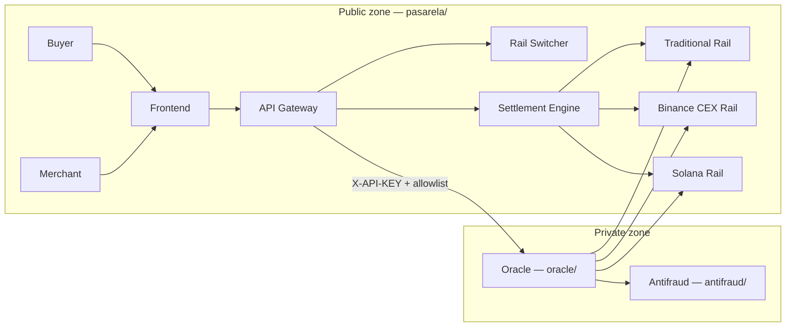

> **Boundary rule:** the Frontend and the Merchant **never** invoke the Oracle. All communication goes through the Gateway via the `oracle-client` crate.

---

## 2. Use Cases

### 2.1 General diagram

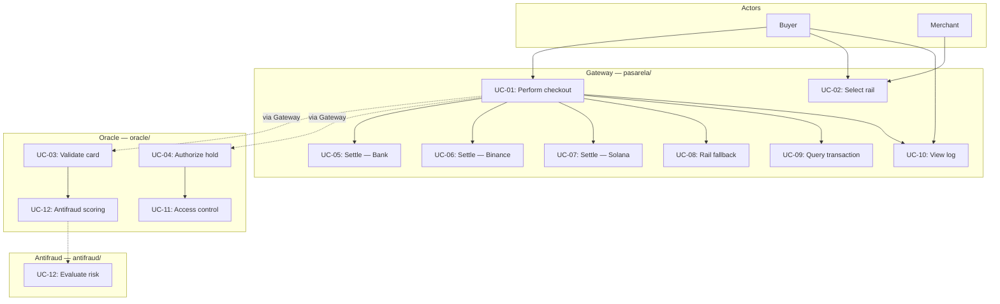

---

### UC-01: Perform card checkout

| Field | Detail |
|-------|--------|
| **ID** | UC-01 |
| **Primary actor** | Buyer |
| **Secondary actors** | Frontend, API Gateway, Oracle, Settlement Engine |
| **Description** | The buyer enters fictitious card data, selects a settlement rail, and confirms payment. The system authorizes, holds funds, and settles on the active rail. |
| **Preconditions** | Frontend available; Gateway and Oracle operational; valid merchant API key (D12); at least one rail enabled. |
| **Postconditions (success)** | Transaction in `Settled` state; receipt generated (Tx Signature, CEX ID, or bank reference). |
| **Postconditions (failure)** | Transaction in `Failed` state; hold released if one existed. |

**Main flow:**

1. The buyer enters amount, card data, and selects rail (UC-02).
2. The frontend validates locally with Zod.
3. The frontend sends `POST /api/v1/checkout` with header `Authorization: Bearer sk_test_...` (D12).
4. The Gateway validates merchant API key and `Idempotency-Key` (D9).
5. The Gateway invokes UC-03 + UC-04 + UC-12 via `oracle-client` → `POST /internal/v1/authorize`.
6. The Gateway executes settlement according to rail: UC-05, UC-06, or UC-07 (Solana waits for `finalized`, D10).
7. The Gateway responds with `transaction_id`, `status`, and `settlement_proof`.
8. The frontend displays the result in the transaction viewer (UC-10).

**Alternative flows:**

| ID | Condition | Action |
|----|-----------|--------|
| 1a | Zod validation fails on frontend | Show field errors; do not send request. |
| 1b | Invalid merchant API key | Gateway responds `401`. |
| 1c | Duplicate Idempotency-Key | Gateway returns cached response (`409` or idempotent `200`). |
| 4a | Invalid Luhn or unrecognized brand | Oracle rejects → Gateway responds `422`. |
| 4b | Antifraud decline (UC-12) | Oracle rejects → Gateway responds `402`. |
| 5a | Insufficient funds on selected rail | Oracle rejects → Gateway responds `402`; evaluate UC-08 (automatic fallback D3). |
| 6a | Rail unavailable (RPC/API timeout) | Gateway responds `503`; evaluate UC-08. |
| 6b | Internal settlement error | Gateway responds `500`; transaction → `Failed`. |

---

### UC-02: Select settlement rail

| Field | Detail |
|-------|--------|
| **ID** | UC-02 |
| **Primary actor** | Buyer / Merchant |
| **Description** | The user explicitly chooses the settlement method: Traditional Bank, Binance Account, or Solana Wallet. |
| **Preconditions** | `RailSelector` component rendered; rails enabled in configuration. |
| **Postconditions** | `FundingType` is associated with the `PaymentRequest` sent to the Gateway. |

**Main flow:**

1. The user opens the rail selector at checkout.
2. The system displays available options with a brief description.
3. The user selects a rail.
4. The frontend includes `funding_type` in the checkout payload.

**Alternative flows:**

| ID | Condition | Action |
|----|-----------|--------|
| 3a | User does not select a rail | Use merchant default rail or `TraditionalBank`. |
| 3b | Selected rail disabled | Show warning; prevent submit until another is chosen. |

---

### UC-03: Validate card (Luhn + brand)

| Field | Detail |
|-------|--------|
| **ID** | UC-03 |
| **Primary actor** | Authorization Oracle |
| **Description** | Validates the PAN with the Luhn algorithm and detects the brand (Visa, Mastercard, Amex). |
| **Preconditions** | Request from internal network; UC-11 approved (`X-API-KEY` + IP on allowlist). |
| **Location** | Independent service in `oracle/src/validation/` |
| **Postconditions (success)** | Brand detected; PAN tokenized in memory; validation recorded in audit log. |
| **Postconditions (failure)** | Rejection with code `INVALID_CARD`. |

**Main flow:**

1. Oracle receives `CardPayload` (PAN, expiry, fictitious CVV) in `POST /internal/v1/authorize`.
2. UC-11 validates authentication and origin (fail closed).
3. Runs Luhn algorithm on the PAN.
4. Detects brand by prefix (4=Visa, 51–55=MC, 34/37=Amex).
5. Tokenizes PAN in memory; discards full PAN before responding.
6. Returns `CardValidationResult { valid: true, brand, brand_code }`.

**Alternative flows:**

| ID | Condition | Action |
|----|-----------|--------|
| 2a | UC-11 rejects (API Key, IP, rate limit) | `401` / `403` / `429`; do not process card. |
| 3a | Luhn fails | Return `valid: false`, error `INVALID_CARD`. |
| 4a | Unrecognized brand | Return `valid: false`, error `UNKNOWN_BRAND`. |

---

### UC-04: Authorize fund hold

| Field | Detail |
|-------|--------|
| **ID** | UC-04 |
| **Primary actor** | Authorization Oracle |
| **Description** | Evaluates fund availability on the active rail and creates a preventive hold on the requested amount. |
| **Preconditions** | UC-03 completed successfully; UC-11 approved; selected rail enabled. |
| **Postconditions (success)** | Hold created with `HoldId`; funds temporarily reserved in Oracle persistence. |
| **Postconditions (failure)** | No hold; funds unchanged. |
| **Location** | Independent service in `oracle/src/funds/` |

**Main flow:**

1. Oracle receives amount, currency, and `FundingType` (same authorization request).
2. Queries balance/limit according to rail:
   - **TraditionalBank**: static limit or fictitious bank balance.
   - **BinanceCex**: simulated Spot balance × (1 − `BINANCE_SPREAD_BUFFER_PCT`) — configurable (D4).
   - **SolanaWallet**: SPL balance via RPC.
3. If funds ≥ amount + fees, creates hold and returns `HoldId`.
4. Records hold in Oracle persistence (`oracle/` — `HOLD` entity).
5. Records event in `ORACLE_AUDIT_LOG` without PII.

**Alternative flows:**

| ID | Condition | Action |
|----|-----------|--------|
| 3a | Insufficient funds | Return error `INSUFFICIENT_FUNDS`. |
| 2a | Rail RPC/API does not respond | Return error `RAIL_UNAVAILABLE`. |
| 2b | Spread buffer leaves balance below amount (Binance) | Return `INSUFFICIENT_FUNDS`. |

---

### UC-11: Oracle access control

| Field | Detail |
|-------|--------|
| **ID** | UC-11 |
| **Primary actor** | Authorization Oracle |
| **Secondary actors** | API Gateway (sole authorized caller) |
| **Description** | Validates that each Oracle request comes from the authorized Gateway, on the internal network, with valid credentials and within rate limits. Replicates access control between acquirer and card processor (PCI-DSS CDE). See [Arquitectura-en.md §9](./Arquitectura-en.md#9-security). |
| **Preconditions** | Oracle deployed on private network; `ORACLE_API_KEY` and `ORACLE_ALLOWED_CALLERS` configured. |
| **Postconditions (success)** | Request passes to business handler (UC-03 / UC-04). |
| **Postconditions (failure)** | Immediate error response; **fail closed** — card and funds are not processed. |
| **Location** | `oracle/src/auth/` |

**Main flow:**

1. Request arrives at route `/internal/v1/*`.
2. Middleware verifies header `X-API-KEY` against `ORACLE_API_KEY`.
3. Middleware verifies caller IP/host against `ORACLE_ALLOWED_CALLERS`.
4. Middleware verifies rate limit per caller.
5. If all OK, delegates to handler; otherwise, rejects.

**Alternative flows:**

| ID | Condition | Action |
|----|-----------|--------|
| 2a | API Key missing or incorrect | `401 Unauthorized`. |
| 3a | IP not on allowlist | `403 Forbidden`. |
| 4a | Rate limit exceeded | `429 Too Many Requests`. |
| 1a | Route outside `/internal/v1/` (except `/health`) | `404 Not Found`. |

---

### UC-12: Evaluate antifraud risk

| Field | Detail |
|-------|--------|
| **ID** | UC-12 |
| **Primary actor** | Antifraud Service (`antifraud/`) |
| **Secondary actors** | Authorization Oracle |
| **Description** | Evaluates risk scoring (velocity, amount, token hash) before authorizing the hold. Decision D11. |
| **Preconditions** | UC-11 approved; UC-03 completed (token hash available); `antifraud/` operational. |
| **Postconditions (success)** | Score approved; Oracle continues with UC-04. |
| **Postconditions (failure)** | Decline; Oracle rejects without creating hold (**fail closed**). |
| **Location** | `antifraud/src/rules/`; client in `oracle/src/antifraud_client/` |

**Main flow:**

1. Oracle sends `POST /internal/v1/score` with amount, token hash, rail, and metadata.
2. Antifraud applies rules (velocity, maximum amount, basic lists).
3. Returns `{ approved: true, score, reasons: [] }`.
4. Oracle proceeds to UC-04.

**Alternative flows:**

| ID | Condition | Action |
|----|-----------|--------|
| 2a | Score below threshold | `{ approved: false }` → Oracle responds `402` to Gateway. |
| 1a | Antifraud does not respond (timeout) | **Fail closed** → decline; Oracle responds `503` or `402`. |
| 1b | Invalid antifraud API key | Oracle logs error; fail closed → decline. |

---

### UC-05: Settle payment — Traditional Rail

| Field | Detail |
|-------|--------|
| **ID** | UC-05 |
| **Primary actor** | Settlement Engine |
| **Description** | Generates simulated bank clearing file (ISO 20022 / ACH) and confirms fiat settlement. |
| **Preconditions** | Active hold (UC-04); `FundingType = TraditionalBank`. |
| **Postconditions** | Settlement with bank reference; hold consumed; transaction → `Settled`. |

**Main flow:**

1. Settlement Engine receives `hold_id` and transaction data.
2. Generates simulated clearing file with amount, currency, and reference.
3. Marks hold as `Consumed`.
4. Persists `SettlementReceipt { type: Bank, reference_id }`.
5. Updates transaction to `Settled`.

---

### UC-06: Settle payment — Binance CEX Rail

| Field | Detail |
|-------|--------|
| **ID** | UC-06 |
| **Primary actor** | Settlement Engine |
| **Description** | Debits custodial Spot balance (USDC/USDT) via simulated Binance API. |
| **Preconditions** | Active hold; `FundingType = BinanceCex`. |
| **Postconditions** | Settlement with `cex_order_id`; hold consumed; transaction → `Settled`. |

**Main flow:**

1. Settlement Engine invokes simulated Binance API with amount and USDC/USDT pair.
2. API returns debit confirmation with `order_id`.
3. Hold → `Consumed`; transaction → `Settled`.
4. Returns `SettlementReceipt { type: BinanceCex, order_id }`.

**Alternative flows:**

| ID | Condition | Action |
|----|-----------|--------|
| 1a | Binance API timeout | Release hold; transaction → `Failed`; error `503`. |
| 1b | Balance changed between hold and settle | Reject settle; release hold; error `402`. |

---

### UC-07: Settle payment — Solana Rail (On-Chain)

| Field | Detail |
|-------|--------|
| **ID** | UC-07 |
| **Primary actor** | Settlement Engine |
| **Description** | Invokes `process_payment` on the Anchor program; waits for **`finalized`** commitment (D10) before confirming. |
| **Preconditions** | Active hold; `FundingType = SolanaWallet`; wallet with SOL for fees. |
| **Postconditions** | Tx confirmed on-chain; `PaymentProcessed` event emitted; transaction → `Settled`. |

**Main flow:**

1. Settlement Engine builds transaction with `solana-client`.
2. Invokes `process_payment(amount, brand_code, settlement_rail_id)`.
3. Program transfers SPL tokens from payer to merchant.
4. Emits `PaymentProcessed` event (no PII).
5. Waits for **`finalized`** confirmation on RPC (D10; higher latency, irreversibility).
6. Persists `SettlementReceipt { type: Solana, tx_signature }`.
7. Hold → `Consumed`; transaction → `Settled`.

**Alternative flows:**

| ID | Condition | Action |
|----|-----------|--------|
| 2a | Account without valid signer | Tx rejected; hold released; on-chain error. |
| 2b | Integer overflow on amount | Program returns error; hold released. |
| 5a | Tx does not reach `finalized` within timeout | Transaction → `Pending`; configurable retry; hold not consumed until confirmation. |

---

### UC-08: Automatically switch rail (Fallback)

| Field | Detail |
|-------|--------|
| **ID** | UC-08 |
| **Primary actor** | Rail Switcher |
| **Description** | If the preferred rail fails, automatically selects the next one according to **priority** in `RAIL_CONFIG` (D3). |
| **Preconditions** | Fallback enabled in configuration; at least one alternative rail enabled. |
| **Postconditions** | New rail selected and authorization flow retried; or final rejection if no rail is viable. |

**Main flow:**

1. Rail Switcher receives failure from preferred rail (funds, timeout, disabled).
2. Queries list of rails ordered by priority.
3. For each candidate: queries availability via Oracle.
4. Selects the first viable rail.
5. Retries UC-04 and settlement with the new rail.

**Alternative flows:**

| ID | Condition | Action |
|----|-----------|--------|
| 4a | No viable rail | Reject checkout; transaction → `Failed`. |

---

### UC-09: Query transaction status

| Field | Detail |
|-------|--------|
| **ID** | UC-09 |
| **Primary actor** | Buyer / Merchant |
| **Description** | Queries the current status of a transaction by its `transaction_id`. |
| **Preconditions** | Transaction exists in persistence. |
| **Postconditions** | Returns `TransactionStatus`, rail used, and settlement proof if applicable. |

**Main flow:**

1. Client sends `GET /api/v1/transactions/{id}`.
2. Gateway queries transaction repository.
3. Returns DTO with status, rail, proof, and timestamps.

---

### UC-10: View transaction log

| Field | Detail |
|-------|--------|
| **ID** | UC-10 |
| **Primary actor** | Buyer |
| **Description** | Displays checkout progress in real time: validation, hold, rail used, and final receipt. |
| **Preconditions** | Checkout started. |
| **Postconditions** | Log visible with each documented flow stage. |

**Main flow:**

1. On checkout submit, `TransactionViewer` shows "Validating card…".
2. After partial or final response, updates: detected brand, selected rail, hold OK/FAIL.
3. Displays receipt: Tx Signature (Solana), order ID (Binance), or bank reference.

---

## 3. Entity-Relationship Diagrams

Off-chain models are **partitioned by service**: the Gateway (`pasarela/`) manages transactions and settlements; the Oracle (`oracle/`) manages holds and authorization audit. They communicate via `hold_id` through the API, not via direct FK in a shared database.

### 3.1 Off-chain model — Gateway (`pasarela/`)

Entities managed by the API Gateway and Settlement Engine.

```mermaid
erDiagram
    MERCHANT ||--o{ TRANSACTION : "receives"
    MERCHANT ||--o| RAIL_PREFERENCE : "has default"
    TRANSACTION ||--|| PAYMENT_REQUEST : "originates"
    TRANSACTION ||--o| SETTLEMENT : "settles"
    TRANSACTION ||--o{ GATEWAY_AUDIT_LOG : "audits"
    PAYMENT_REQUEST ||--|| CARD_TOKEN : "references"
    PAYMENT_REQUEST }o--|| FUNDING_TYPE : "uses"
    SETTLEMENT }o--|| FUNDING_TYPE : "executes on"
    RAIL_CONFIG ||--|| FUNDING_TYPE : "configures"
    TRANSACTION ||--o| ORACLE_HOLD_REF : "references hold_id"

    MERCHANT {
        uuid id PK
        string name
        string default_currency
        string api_key_hash "sk_test_... / sk_live_... (D12)"
        enum api_key_env "test|live"
        timestamp created_at
    }

    TRANSACTION {
        uuid id PK
        uuid merchant_id FK
        enum status "Pending|Authorized|Held|Settled|Failed|Reversed"
        decimal amount
        string currency
        enum funding_type
        string settlement_proof
        uuid oracle_hold_id "logical reference to Oracle"
        timestamp created_at
        timestamp updated_at
    }

    PAYMENT_REQUEST {
        uuid id PK
        uuid transaction_id FK
        uuid card_token_id FK
        enum funding_type
        decimal amount
        string currency
        json metadata
    }

    CARD_TOKEN {
        uuid id PK
        string token "PAN hash, never full PAN"
        enum brand "Visa|Mastercard|Amex|Unknown"
        smallint brand_code
        string last_four
        string expiry_month
        string expiry_year
    }

    SETTLEMENT {
        uuid id PK
        uuid transaction_id FK
        enum rail_type
        string proof "tx_signature|order_id|bank_ref"
        enum status "Completed|Failed"
        timestamp settled_at
    }

    ORACLE_HOLD_REF {
        uuid hold_id "ID returned by Oracle API"
        uuid transaction_id FK
    }

    FUNDING_TYPE {
        enum value "TraditionalBank|BinanceCex|SolanaWallet"
    }

    RAIL_CONFIG {
        uuid id PK
        enum funding_type
        boolean enabled
        int priority
        decimal fee_percent
        decimal spread_buffer
        json connection_params
    }

    RAIL_PREFERENCE {
        uuid id PK
        uuid merchant_id FK
        enum preferred_rail
        boolean fallback_enabled
    }

    GATEWAY_AUDIT_LOG {
        uuid id PK
        uuid transaction_id FK
        string event_type
        string detail "no PII"
        timestamp occurred_at
    }
```

---

### 3.2 Off-chain model — Oracle (`oracle/`)

Entities managed exclusively by the independent authorization service.

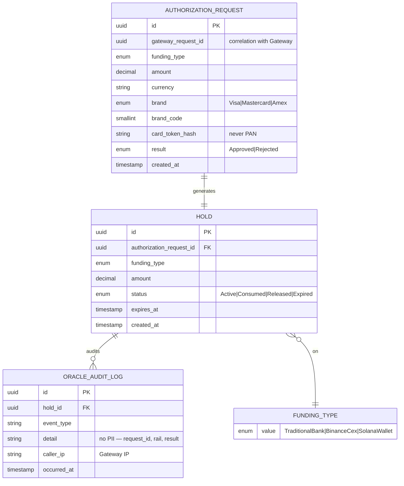

#### Entity description by service

| Entity | Service | Responsibility |
|--------|---------|----------------|
| **TRANSACTION** | Gateway | Root aggregate of the payment lifecycle |
| **SETTLEMENT** | Gateway | Settlement record with verifiable proof |
| **ORACLE_HOLD_REF** | Gateway | Logical reference to Oracle `hold_id` (no DB FK) |
| **HOLD** | Oracle | Temporary fund reservation before settlement |
| **AUTHORIZATION_REQUEST** | Oracle | Record of each authorization attempt (no PAN) |
| **ORACLE_AUDIT_LOG** | Oracle | Traceability of auth, holds, and access rejections |
| **GATEWAY_AUDIT_LOG** | Gateway | Traceability of checkout and settlement |

---

### 3.2.1 Off-chain model — Antifraud (`antifraud/`)

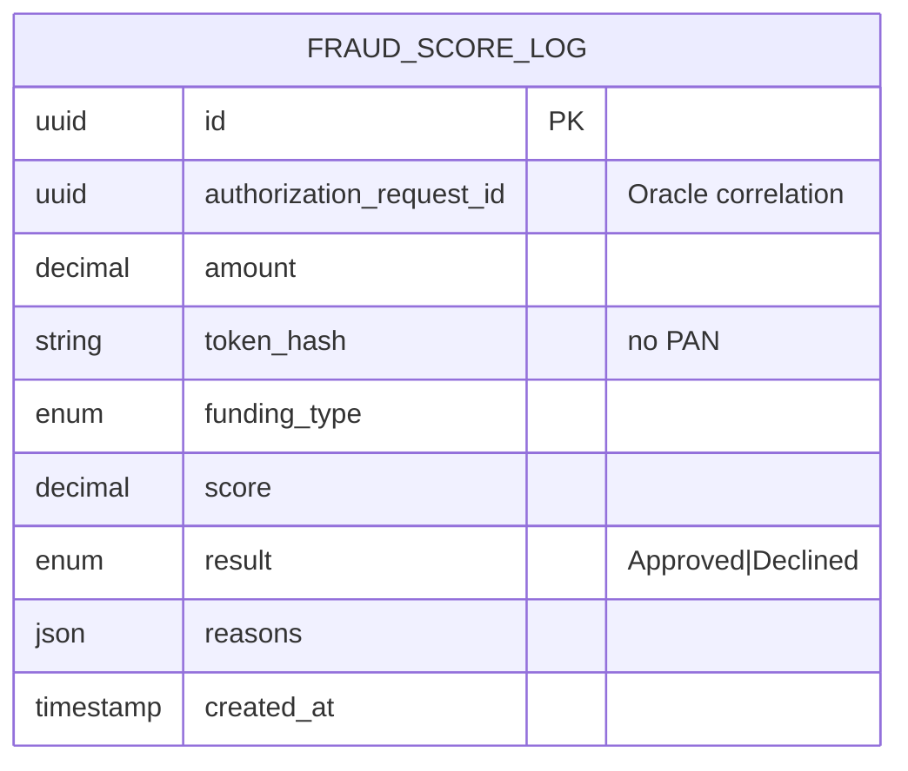

---

### 3.3 Unified Gateway ↔ Oracle view (logical reference)

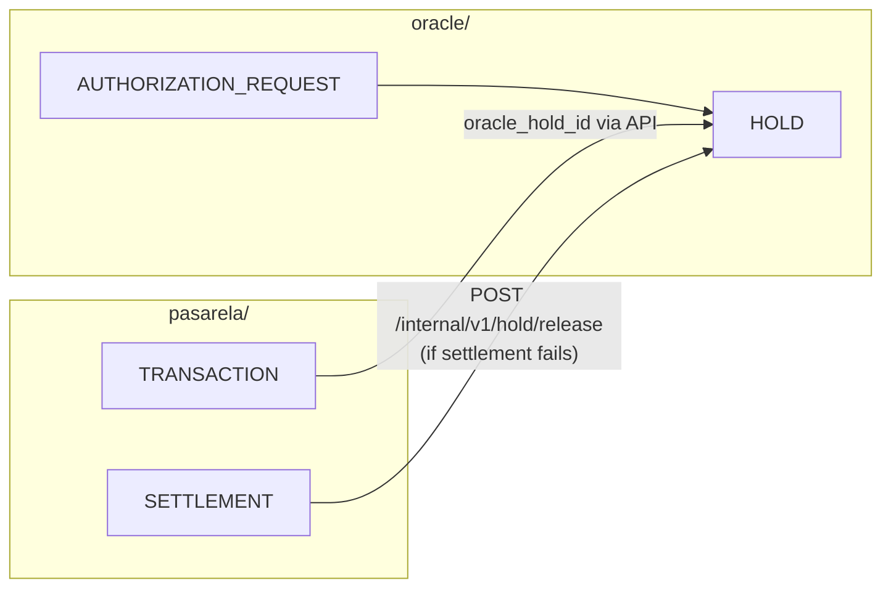

| Gateway field | Oracle field | Mechanism |
|---------------|--------------|-----------|
| `TRANSACTION.oracle_hold_id` | `HOLD.id` | Response from `POST /internal/v1/authorize` |
| `TRANSACTION.id` | `AUTHORIZATION_REQUEST.gateway_request_id` | Correlation in request |
| `SETTLEMENT.status = Failed` | `HOLD.status → Released` | `POST /internal/v1/hold/release` |

---

### 3.4 On-chain model (Anchor program — Solana)

On-chain accounts do not store PII. The immutable ledger records amounts, brand codes, and rail references.

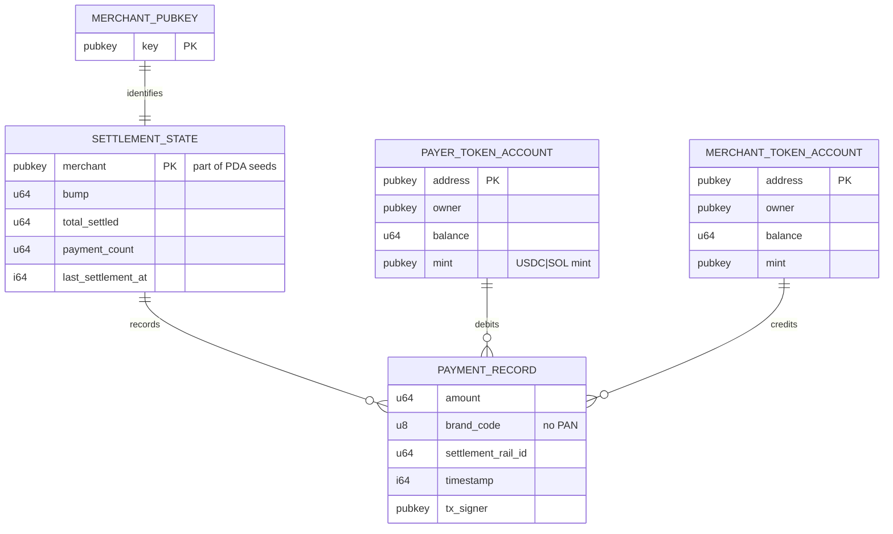

#### PDA relationship

```
Seeds: ["settlement", merchant_pubkey.as_ref()]
Program: payment-settlement
Account: SettlementState (PDA)
```

#### On-chain event (not persisted as entity, emitted in logs)

| Field | Type | Description |
|-------|------|-------------|
| `amount` | u64 | Amount transferred in SPL tokens |
| `brand_code` | u8 | Numeric brand code (Visa=1, MC=2, Amex=3) |
| `settlement_rail_id` | u64 | Rail identifier |
| `timestamp` | i64 | Block Unix timestamp |

---

### 3.5 Unified off-chain ↔ on-chain view

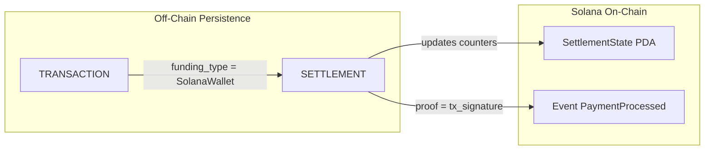

| Off-chain field | On-chain equivalent |
|-----------------|----------------------|
| `SETTLEMENT.proof` | Solana transaction Tx Signature |
| `TRANSACTION.amount` | `PaymentProcessed.amount` |
| `CARD_TOKEN.brand_code` | `PaymentProcessed.brand_code` |
| `RAIL_CONFIG.id` | `PaymentProcessed.settlement_rail_id` |

---

## 4. Flows

### 4.1 Main checkout flow (activity diagram)

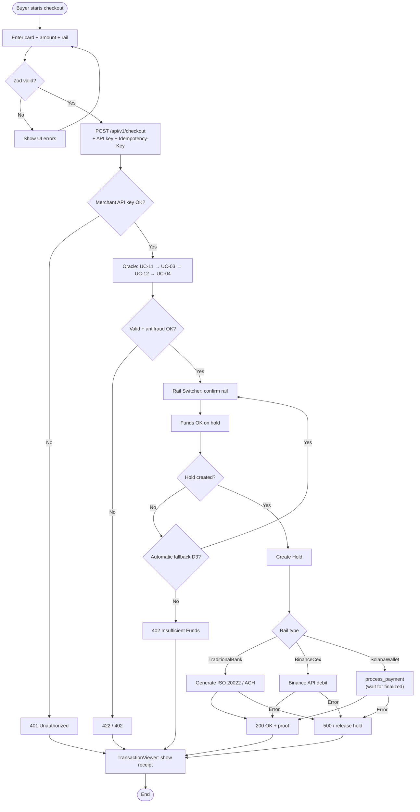

---

### 4.2 Oracle authorization flow (sequence)

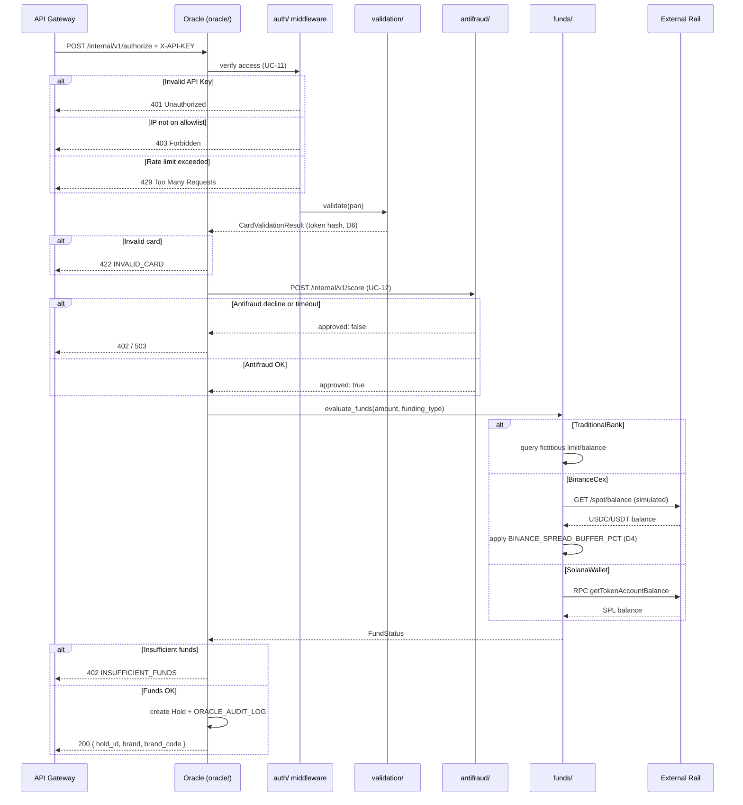

---

### 4.3 Rail Switcher decision flow

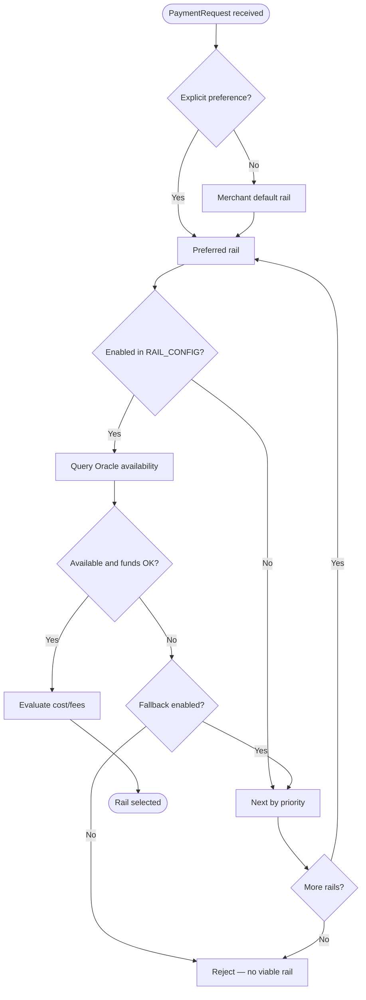

---

### 4.4 Settlement flows by rail

#### 4.4.1 Traditional Rail

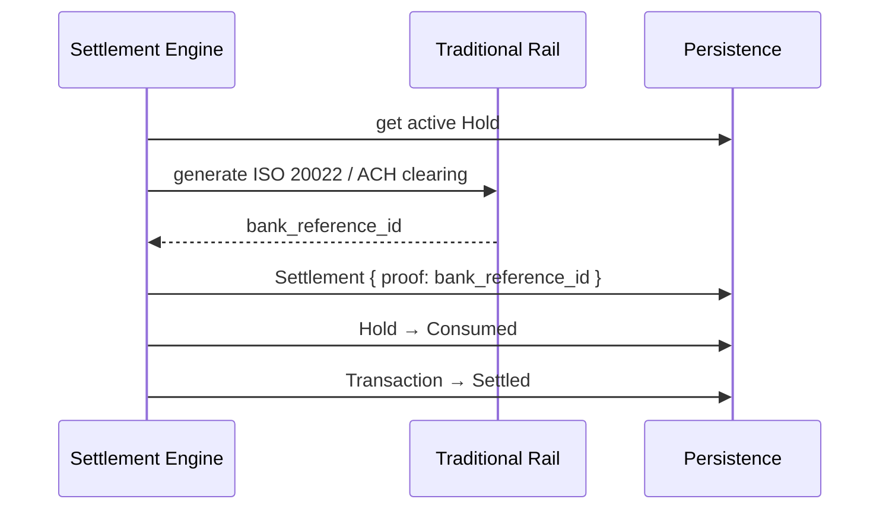

#### 4.4.2 Binance CEX Rail

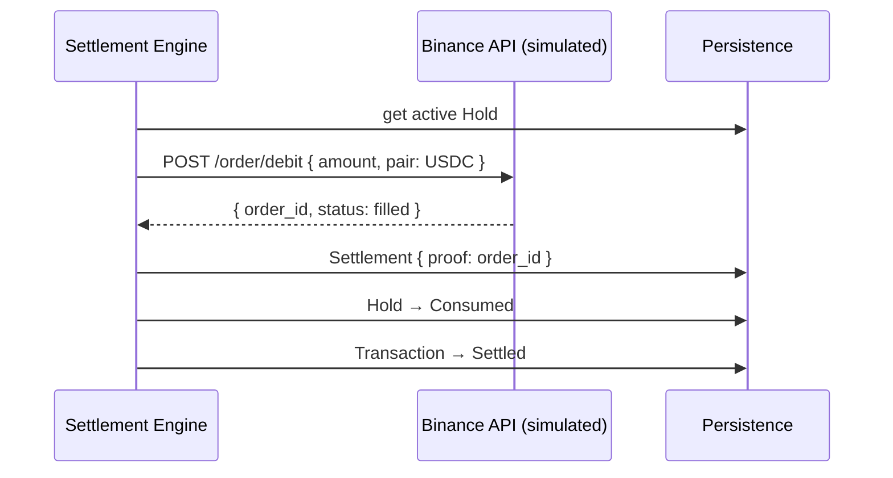

#### 4.4.3 Solana On-Chain Rail

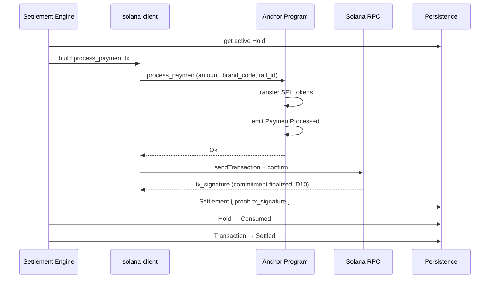

---

### 4.5 Transaction state machine

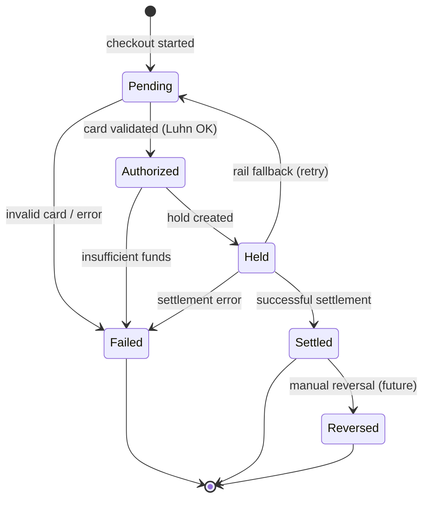

| Transition | Trigger | Actor |
|------------|---------|-------|
| Pending → Authorized | Oracle validates card | Oracle |
| Authorized → Held | Hold created with funds OK | Oracle |
| Held → Settled | Settlement completed | Settlement Engine |
| Held → Failed | Rail error / timeout | Settlement Engine |
| Held → Pending | Fallback activates new rail | Rail Switcher |
| Settled → Reversed | Administrative reversal (future scope) | Merchant / Admin |

---

### 4.6 Error handling flow

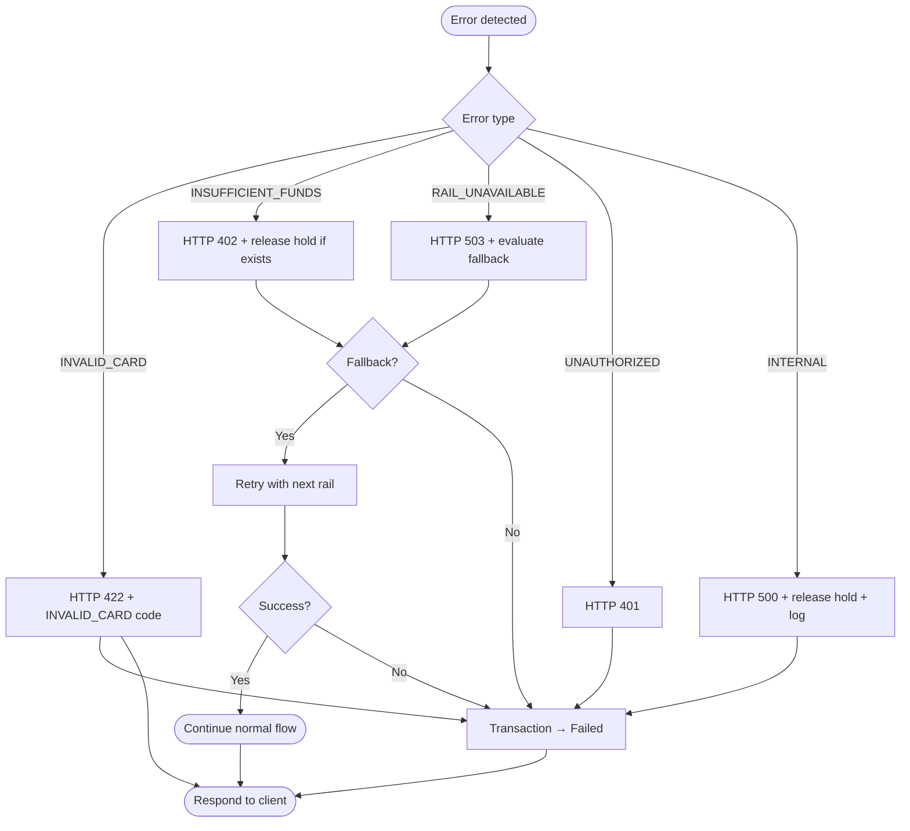

---

### 4.7 Frontend flow (checkout UI)

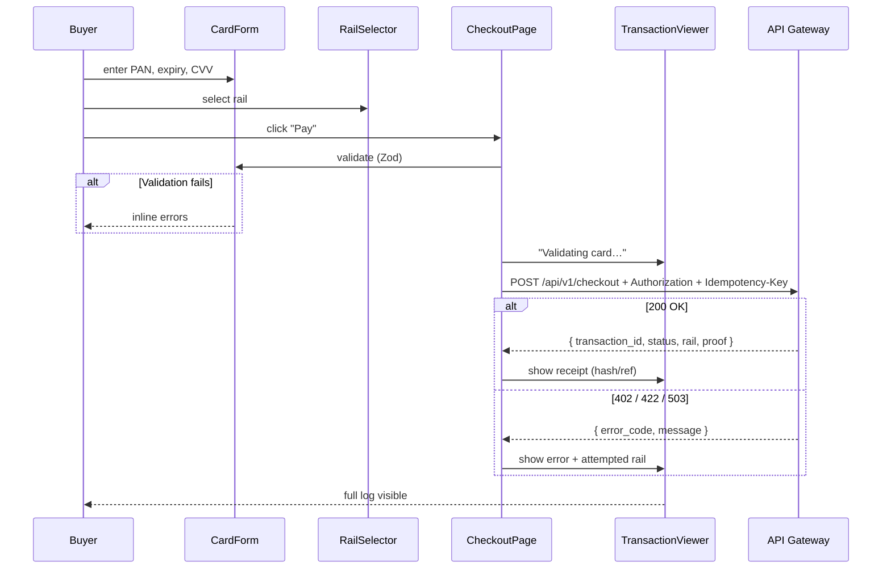

---

## 5. Use Case ↔ Entity ↔ Flow Matrix

| Use case | Service | Main entities | Reference flow |
|----------|---------|---------------|----------------|
| UC-01 Checkout | Gateway | TRANSACTION, PAYMENT_REQUEST, SETTLEMENT, MERCHANT | §4.1, §4.7 |
| UC-02 Select rail | Gateway | RAIL_PREFERENCE, FUNDING_TYPE, RAIL_CONFIG | §4.3 |
| UC-03 Validate card | Oracle | AUTHORIZATION_REQUEST, ORACLE_AUDIT_LOG | §4.2 |
| UC-04 Authorize hold | Oracle | HOLD, AUTHORIZATION_REQUEST | §4.2 |
| UC-05 Settle Bank | Gateway | SETTLEMENT | §4.4.1 |
| UC-06 Settle Binance | Gateway | SETTLEMENT | §4.4.2 |
| UC-07 Settle Solana | Gateway | SETTLEMENT, SETTLEMENT_STATE, PaymentProcessed | §4.4.3 |
| UC-08 Fallback (D3) | Gateway | RAIL_CONFIG, RAIL_PREFERENCE | §4.3, §4.6 |
| UC-09 Query tx | Gateway | TRANSACTION, SETTLEMENT | §4.5 |
| UC-10 View log | Gateway | GATEWAY_AUDIT_LOG, TRANSACTION | §4.7 |
| UC-11 Access control | Oracle | ORACLE_AUDIT_LOG | §4.2 |
| UC-12 Antifraud (D11) | Antifraud | FRAUD_SCORE_LOG | §4.2 |

---

## 6. Applied Decisions Table (D1–D12)

| ID | Decision | Impact on use cases / flows |
|----|----------|----------------------------|
| D1 | Axum | All Rust microservices |
| D2 | local validator + devnet CI | UC-07, Anchor tests |
| D3 | Automatic fallback | UC-08, §4.1, §4.3 |
| D4 | Configurable spread | UC-04, UC-06 |
| D5 | Monorepo | Structure `oracle/`, `antifraud/` |
| D6 | In-memory token | UC-03; PAN not persisted |
| D7 | mTLS Phase 7/8 | UC-11 (MVP: API key) |
| D8 | 3DS post-MVP | Not applicable in current UCs |
| D9 | Idempotency-Key | UC-01 step 4 |
| D10 | Commitment finalized | UC-07, §4.4.3 |
| D11 | External antifraud | UC-12, §4.2 |
| D12 | Merchant API key | UC-01 steps 3–4, MERCHANT entity |

See detail: [Arquitectura §12](./Arquitectura-en.md#12-design-decisions--resolved-phase-0).

---

## References

- [Arquitectura-en.md](./Arquitectura-en.md) — Components, traits, phases, decisions D1–D12 (§12), Web2/Web3 security (§9)
- [Plan-de-Implementacion-en.md](./Plan-de-Implementacion-en.md) — Roadmap to production
- [Acta-Cierre-Fase-0-en.md](./Acta-Cierre-Fase-0-en.md) — Phase 0 gate closed (2026-07-25)
- [Acta-Cierre-Fase-5-en.md](./Acta-Cierre-Fase-5-en.md) — Phase 5 gate closed (2026-07-26)
- [Revision-Seguridad-Fase-6-en.md](./Revision-Seguridad-Fase-6-en.md) — OWASP/PCI review (Phase 6.4)
- [Checklist-QA-Fase-6-en.md](./Checklist-QA-Fase-6-en.md) — QA UC-01–UC-11 (Phase 6.3)
- [Acta-Cierre-Fase-4-en.md](./Acta-Cierre-Fase-4-en.md) — Phase 4 gate closed (2026-07-26)
- [Contexto General-en.md](./Contexto%20General-en.md) — Project master prompt
