# Casos de Uso, Modelo Entidad-Relación y Flujos

> Documento complementario de [Arquitectura.md](./Arquitectura.md). Describe el comportamiento funcional, el modelo de datos y los flujos operativos del sistema de pagos multi-rail.  
> **Decisiones de diseño:** alineado con [Arquitectura §12](./Arquitectura.md#12-decisiones-de-diseño--resueltas-fase-0) (D1–D12, 2026-07-25).

---

## 1. Actores del Sistema

| Actor | Tipo | Descripción |
|-------|------|-------------|
| **Comprador** | Humano | Usuario que ingresa datos de tarjeta y confirma el pago en el checkout. |
| **Comercio** | Humano / Sistema | Entidad que recibe el pago; puede configurar preferencia de riel por defecto. |
| **Frontend (Checkout)** | Sistema | Interfaz React que captura datos, valida con Zod y muestra el resultado. |
| **API Gateway** | Sistema | Orquestador Axum (D1); expone checkout con auth comercio (D12) e idempotencia (D9). |
| **Oracle de Autorización** | Sistema independiente | Servicio Axum en `oracle/`; simula red procesadora; solo accesible por Gateway en red interna. |
| **Servicio Antifraude** | Sistema independiente | Microservicio simulado en `antifraud/` (D11); Oracle lo consulta pre-hold; fail closed. |
| **Rail Switcher** | Sistema | Motor de decisión que selecciona el riel activo según reglas de negocio. |
| **Settlement Engine** | Sistema | Ejecuta la liquidación en el riel elegido. |
| **Riel Tradicional** | Sistema externo | Genera compensación bancaria simulada (ISO 20022 / ACH). |
| **Riel Binance CEX** | Sistema externo | API simulada de Binance para débito custodial Spot. |
| **Riel Solana** | Sistema externo | Programa Anchor + RPC Solana para transferencia SPL on-chain. |

### Diagrama de actores y zonas de despliegue

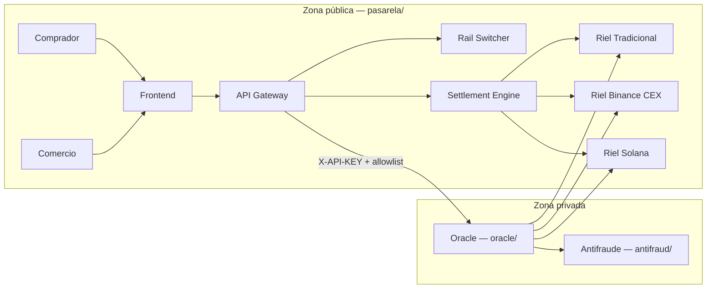

> **Regla de frontera:** el Frontend y el Comercio **nunca** invocan al Oracle. Toda comunicación pasa por el Gateway mediante el crate `oracle-client`.

---

## 2. Casos de Uso

### 2.1 Diagrama general

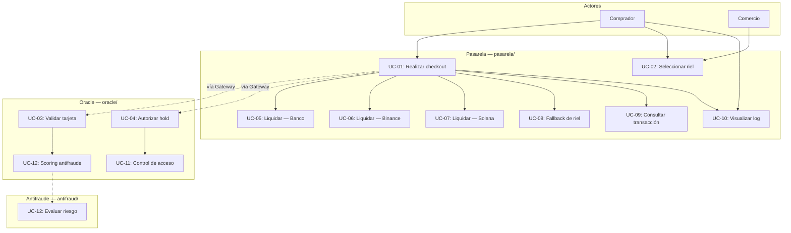

---

### UC-01: Realizar checkout con tarjeta

| Campo | Detalle |
|-------|---------|
| **ID** | UC-01 |
| **Actor principal** | Comprador |
| **Actores secundarios** | Frontend, API Gateway, Oracle, Settlement Engine |
| **Descripción** | El comprador ingresa datos ficticios de tarjeta, selecciona un riel de liquidación y confirma el pago. El sistema autoriza, retiene fondos y liquida en el riel activo. |
| **Precondiciones** | Frontend disponible; Gateway y Oracle operativos; API key comercio válida (D12); al menos un riel habilitado. |
| **Postcondiciones (éxito)** | Transacción en estado `Settled`; comprobante generado (Tx Signature, ID CEX o ref. bancaria). |
| **Postcondiciones (fallo)** | Transacción en estado `Failed`; hold liberado si existía. |

**Flujo principal:**

1. El comprador ingresa monto, datos de tarjeta y selecciona riel (UC-02).
2. El frontend valida localmente con Zod.
3. El frontend envía `POST /api/v1/checkout` con header `Authorization: Bearer sk_test_...` (D12).
4. El Gateway valida API key del comercio e `Idempotency-Key` (D9).
5. El Gateway invoca UC-03 + UC-04 + UC-12 vía `oracle-client` → `POST /internal/v1/authorize`.
6. El Gateway ejecuta liquidación según riel: UC-05, UC-06 o UC-07 (Solana espera `finalized`, D10).
7. El Gateway responde con `transaction_id`, `status` y `settlement_proof`.
8. El frontend muestra el resultado en el visor de transacciones (UC-10).

**Flujos alternativos:**

| ID | Condición | Acción |
|----|-----------|--------|
| 1a | Validación Zod falla en frontend | Mostrar errores de campo; no enviar request. |
| 1b | API key comercio inválida | Gateway responde `401`. |
| 1c | Idempotency-Key duplicada | Gateway retorna respuesta cacheada (`409` o `200` idempotente). |
| 4a | Luhn inválido o marca no reconocida | Oracle rechaza → Gateway responde `422`. |
| 4b | Antifraude decline (UC-12) | Oracle rechaza → Gateway responde `402`. |
| 5a | Fondos insuficientes en riel seleccionado | Oracle rechaza → Gateway responde `402`; evaluar UC-08 (fallback automático D3). |
| 6a | Riel no disponible (timeout RPC/API) | Gateway responde `503`; evaluar UC-08. |
| 6b | Error interno en liquidación | Gateway responde `500`; transacción → `Failed`. |

---

### UC-02: Seleccionar riel de liquidación

| Campo | Detalle |
|-------|---------|
| **ID** | UC-02 |
| **Actor principal** | Comprador / Comercio |
| **Descripción** | El usuario elige explícitamente el método de liquidación: Banco Tradicional, Binance Account o Solana Wallet. |
| **Precondiciones** | Componente `RailSelector` renderizado; rieles habilitados en configuración. |
| **Postcondiciones** | `FundingType` queda asociado al `PaymentRequest` enviado al Gateway. |

**Flujo principal:**

1. El usuario abre el selector de riel en el checkout.
2. El sistema muestra opciones disponibles con descripción breve.
3. El usuario selecciona un riel.
4. El frontend incluye `funding_type` en el payload del checkout.

**Flujos alternativos:**

| ID | Condición | Acción |
|----|-----------|--------|
| 3a | Usuario no selecciona riel | Usar riel por defecto del comercio o `TraditionalBank`. |
| 3b | Riel seleccionado deshabilitado | Mostrar aviso; impedir submit hasta elegir otro. |

---

### UC-03: Validar tarjeta (Luhn + marca)

| Campo | Detalle |
|-------|---------|
| **ID** | UC-03 |
| **Actor principal** | Oracle de Autorización |
| **Descripción** | Valida el PAN con algoritmo de Luhn y detecta la marca (Visa, Mastercard, Amex). |
| **Precondiciones** | Request desde red interna; UC-11 aprobado (`X-API-KEY` + IP en allowlist). |
| **Ubicación** | Servicio independiente en `oracle/src/validation/` |
| **Postcondiciones (éxito)** | Marca detectada; PAN tokenizado en memoria; validación registrada en audit log. |
| **Postcondiciones (fallo)** | Rechazo con código `INVALID_CARD`. |

**Flujo principal:**

1. Oracle recibe `CardPayload` (PAN, expiry, CVV ficticio) en `POST /internal/v1/authorize`.
2. UC-11 valida autenticación y origen (fail closed).
3. Ejecuta algoritmo de Luhn sobre el PAN.
4. Detecta marca según prefijos (4=Visa, 51–55=MC, 34/37=Amex).
5. Tokeniza PAN en memoria; descarta PAN completo antes de responder.
6. Retorna `CardValidationResult { valid: true, brand, brand_code }`.

**Flujos alternativos:**

| ID | Condición | Acción |
|----|-----------|--------|
| 2a | UC-11 rechaza (API Key, IP, rate limit) | `401` / `403` / `429`; no procesar tarjeta. |
| 3a | Luhn falla | Retornar `valid: false`, error `INVALID_CARD`. |
| 4a | Marca no reconocida | Retornar `valid: false`, error `UNKNOWN_BRAND`. |

---

### UC-04: Autorizar hold de fondos

| Campo | Detalle |
|-------|---------|
| **ID** | UC-04 |
| **Actor principal** | Oracle de Autorización |
| **Descripción** | Evalúa disponibilidad de fondos en el riel activo y crea un hold preventivo sobre el monto solicitado. |
| **Precondiciones** | UC-03 completado con éxito; UC-11 aprobado; riel seleccionado y habilitado. |
| **Postcondiciones (éxito)** | Hold creado con `HoldId`; fondos reservados temporalmente en persistencia del Oracle. |
| **Postcondiciones (fallo)** | Sin hold; fondos no modificados. |
| **Ubicación** | Servicio independiente en `oracle/src/funds/` |

**Flujo principal:**

1. Oracle recibe monto, moneda y `FundingType` (misma request de autorización).
2. Consulta saldo/límite según riel:
   - **TraditionalBank**: límite estático o saldo bancario ficticio.
   - **BinanceCex**: saldo Spot simulado × (1 − `BINANCE_SPREAD_BUFFER_PCT`) — configurable (D4).
   - **SolanaWallet**: balance SPL vía RPC.
3. Si fondos ≥ monto + fees, crea hold y retorna `HoldId`.
4. Registra hold en persistencia del Oracle (`oracle/` — entidad `HOLD`).
5. Registra evento en `ORACLE_AUDIT_LOG` sin PII.

**Flujos alternativos:**

| ID | Condición | Acción |
|----|-----------|--------|
| 3a | Fondos insuficientes | Retornar error `INSUFFICIENT_FUNDS`. |
| 2a | RPC/API del riel no responde | Retornar error `RAIL_UNAVAILABLE`. |
| 2b | Spread buffer deja saldo por debajo del monto (Binance) | Retornar `INSUFFICIENT_FUNDS`. |

---

### UC-11: Control de acceso al Oracle

| Campo | Detalle |
|-------|---------|
| **ID** | UC-11 |
| **Actor principal** | Oracle de Autorización |
| **Actores secundarios** | API Gateway (único caller autorizado) |
| **Descripción** | Valida que cada request al Oracle provenga del Gateway autorizado, en red interna, con credenciales válidas y dentro de límites de tasa. Replica el control de acceso entre adquirente y procesador de tarjetas (CDE PCI-DSS). Ver [Arquitectura.md §9](./Arquitectura.md#9-seguridad). |
| **Precondiciones** | Oracle desplegado en red privada; `ORACLE_API_KEY` y `ORACLE_ALLOWED_CALLERS` configurados. |
| **Postcondiciones (éxito)** | Request pasa al handler de negocio (UC-03 / UC-04). |
| **Postcondiciones (fallo)** | Respuesta inmediata de error; **fail closed** — no se procesa tarjeta ni fondos. |
| **Ubicación** | `oracle/src/auth/` |

**Flujo principal:**

1. Request llega a ruta `/internal/v1/*`.
2. Middleware verifica header `X-API-KEY` contra `ORACLE_API_KEY`.
3. Middleware verifica IP/host del caller contra `ORACLE_ALLOWED_CALLERS`.
4. Middleware verifica rate limit por caller.
5. Si todo OK, delega al handler; si no, rechaza.

**Flujos alternativos:**

| ID | Condición | Acción |
|----|-----------|--------|
| 2a | API Key ausente o incorrecta | `401 Unauthorized`. |
| 3a | IP no está en allowlist | `403 Forbidden`. |
| 4a | Rate limit excedido | `429 Too Many Requests`. |
| 1a | Ruta fuera de `/internal/v1/` (excepto `/health`) | `404 Not Found`. |

---

### UC-12: Evaluar riesgo antifraude

| Campo | Detalle |
|-------|---------|
| **ID** | UC-12 |
| **Actor principal** | Servicio Antifraude (`antifraud/`) |
| **Actores secundarios** | Oracle de Autorización |
| **Descripción** | Evalúa scoring de riesgo (velocity, monto, token hash) antes de autorizar el hold. Decisión D11. |
| **Precondiciones** | UC-11 aprobado; UC-03 completado (token hash disponible); `antifraud/` operativo. |
| **Postcondiciones (éxito)** | Score aprobado; Oracle continúa con UC-04. |
| **Postcondiciones (fallo)** | Decline; Oracle rechaza sin crear hold (**fail closed**). |
| **Ubicación** | `antifraud/src/rules/`; cliente en `oracle/src/antifraud_client/` |

**Flujo principal:**

1. Oracle envía `POST /internal/v1/score` con monto, token hash, riel y metadata.
2. Antifraude aplica reglas (velocity, monto máximo, listas básicas).
3. Retorna `{ approved: true, score, reasons: [] }`.
4. Oracle procede a UC-04.

**Flujos alternativos:**

| ID | Condición | Acción |
|----|-----------|--------|
| 2a | Score bajo umbral | `{ approved: false }` → Oracle responde `402` al Gateway. |
| 1a | Antifraude no responde (timeout) | **Fail closed** → decline; Oracle responde `503` o `402`. |
| 1b | API key antifraude inválida | Oracle registra error; fail closed → decline. |

---

### UC-05: Liquidar pago — Riel Tradicional

| Campo | Detalle |
|-------|---------|
| **ID** | UC-05 |
| **Actor principal** | Settlement Engine |
| **Descripción** | Genera archivo de compensación bancaria simulado (ISO 20022 / ACH) y confirma el asentamiento fiat. |
| **Precondiciones** | Hold activo (UC-04); `FundingType = TraditionalBank`. |
| **Postcondiciones** | Settlement con referencia bancaria; hold consumido; transacción → `Settled`. |

**Flujo principal:**

1. Settlement Engine recibe `hold_id` y datos de la transacción.
2. Genera archivo de compensación simulado con monto, moneda y referencia.
3. Marca hold como `Consumed`.
4. Persiste `SettlementReceipt { type: Bank, reference_id }`.
5. Actualiza transacción a `Settled`.

---

### UC-06: Liquidar pago — Riel Binance CEX

| Campo | Detalle |
|-------|---------|
| **ID** | UC-06 |
| **Actor principal** | Settlement Engine |
| **Descripción** | Debita saldo custodial Spot (USDC/USDT) mediante API simulada de Binance. |
| **Precondiciones** | Hold activo; `FundingType = BinanceCex`. |
| **Postcondiciones** | Settlement con `cex_order_id`; hold consumido; transacción → `Settled`. |

**Flujo principal:**

1. Settlement Engine invoca API simulada de Binance con monto y par USDC/USDT.
2. API retorna confirmación de débito con `order_id`.
3. Hold → `Consumed`; transacción → `Settled`.
4. Retorna `SettlementReceipt { type: BinanceCex, order_id }`.

**Flujos alternativos:**

| ID | Condición | Acción |
|----|-----------|--------|
| 1a | API Binance timeout | Liberar hold; transacción → `Failed`; error `503`. |
| 1b | Saldo cambió entre hold y settle | Rechazar settle; liberar hold; error `402`. |

---

### UC-07: Liquidar pago — Riel Solana (On-Chain)

| Campo | Detalle |
|-------|---------|
| **ID** | UC-07 |
| **Actor principal** | Settlement Engine |
| **Descripción** | Invoca `process_payment` en el programa Anchor; espera commitment **`finalized`** (D10) antes de confirmar. |
| **Precondiciones** | Hold activo; `FundingType = SolanaWallet`; wallet con SOL para fees. |
| **Postcondiciones** | Tx confirmada on-chain; evento `PaymentProcessed` emitido; transacción → `Settled`. |

**Flujo principal:**

1. Settlement Engine construye transacción con `solana-client`.
2. Invoca `process_payment(amount, brand_code, settlement_rail_id)`.
3. Programa transfiere tokens SPL de pagador a comercio.
4. Emite evento `PaymentProcessed` (sin PII).
5. Espera confirmación **`finalized`** en RPC (D10; mayor latencia, irreversibilidad).
6. Persiste `SettlementReceipt { type: Solana, tx_signature }`.
7. Hold → `Consumed`; transacción → `Settled`.

**Flujos alternativos:**

| ID | Condición | Acción |
|----|-----------|--------|
| 2a | Cuenta sin signer válido | Tx rechazada; hold liberado; error on-chain. |
| 2b | Integer overflow en amount | Programa retorna error; hold liberado. |
| 5a | Tx no alcanza `finalized` en timeout | Transacción → `Pending`; reintento configurable; hold no consumido hasta confirmación. |

---

### UC-08: Conmutar riel automáticamente (Fallback)

| Campo | Detalle |
|-------|---------|
| **ID** | UC-08 |
| **Actor principal** | Rail Switcher |
| **Descripción** | Si el riel preferido falla, selecciona automáticamente el siguiente según **prioridad** en `RAIL_CONFIG` (D3). |
| **Precondiciones** | Fallback habilitado en configuración; existe al menos un riel alternativo habilitado. |
| **Postcondiciones** | Nuevo riel seleccionado y flujo de autorización reintentado; o rechazo final si ningún riel es viable. |

**Flujo principal:**

1. Rail Switcher recibe fallo del riel preferido (fondos, timeout, deshabilitado).
2. Consulta lista de rieles ordenados por prioridad.
3. Para cada candidato: consulta disponibilidad vía Oracle.
4. Selecciona el primer riel viable.
5. Reintenta UC-04 y liquidación con el nuevo riel.

**Flujos alternativos:**

| ID | Condición | Acción |
|----|-----------|--------|
| 4a | Ningún riel viable | Rechazar checkout; transacción → `Failed`. |

---

### UC-09: Consultar estado de transacción

| Campo | Detalle |
|-------|---------|
| **ID** | UC-09 |
| **Actor principal** | Comprador / Comercio |
| **Descripción** | Consulta el estado actual de una transacción por su `transaction_id`. |
| **Precondiciones** | Transacción existente en persistencia. |
| **Postcondiciones** | Retorna `TransactionStatus`, riel usado y prueba de asentamiento si aplica. |

**Flujo principal:**

1. Cliente envía `GET /api/v1/transactions/{id}`.
2. Gateway consulta repositorio de transacciones.
3. Retorna DTO con status, rail, proof y timestamps.

---

### UC-10: Visualizar log de transacción

| Campo | Detalle |
|-------|---------|
| **ID** | UC-10 |
| **Actor principal** | Comprador |
| **Descripción** | Muestra en tiempo real el progreso del checkout: validación, hold, riel usado y comprobante final. |
| **Precondiciones** | Checkout iniciado. |
| **Postcondiciones** | Log visible con cada etapa del flujo documentada. |

**Flujo principal:**

1. Al enviar checkout, `TransactionViewer` muestra "Validando tarjeta…".
2. Tras respuesta parcial o final, actualiza: marca detectada, riel seleccionado, hold OK/FAIL.
3. Muestra comprobante: Tx Signature (Solana), order ID (Binance) o ref. bancaria.

---

## 3. Diagramas Entidad-Relación

Los modelos off-chain se **particionan por servicio**: el Gateway (`pasarela/`) gestiona transacciones y settlements; el Oracle (`oracle/`) gestiona holds y auditoría de autorización. Se comunican por `hold_id` vía API, no por FK directa en base de datos compartida.

### 3.1 Modelo off-chain — Pasarela (`pasarela/`)

Entidades gestionadas por el API Gateway y el Settlement Engine.

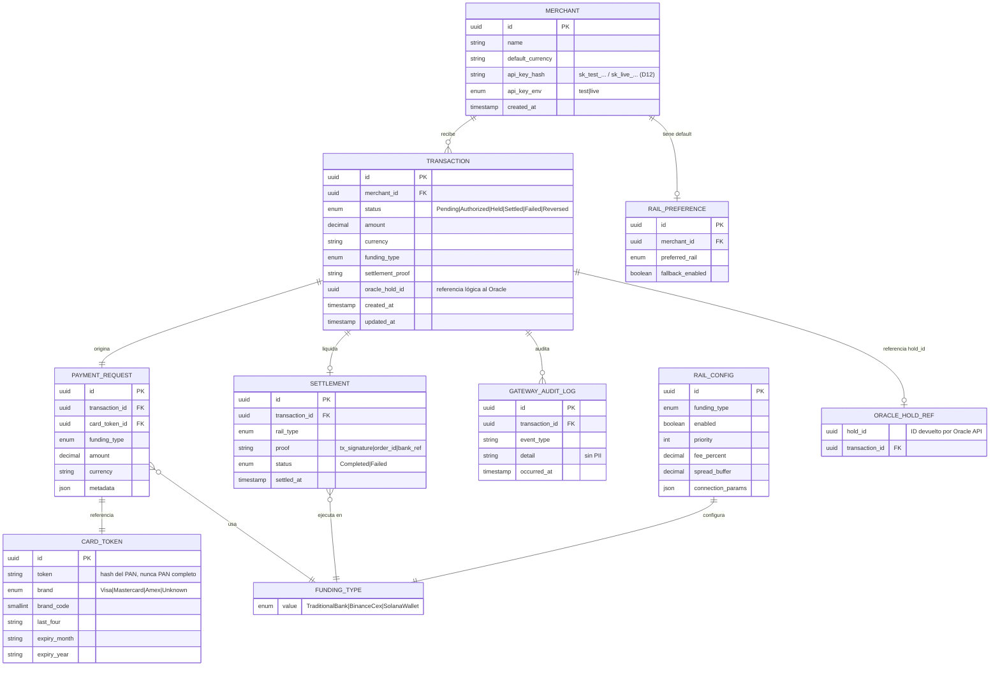

---

### 3.2 Modelo off-chain — Oracle (`oracle/`)

Entidades gestionadas exclusivamente por el servicio independiente de autorización.

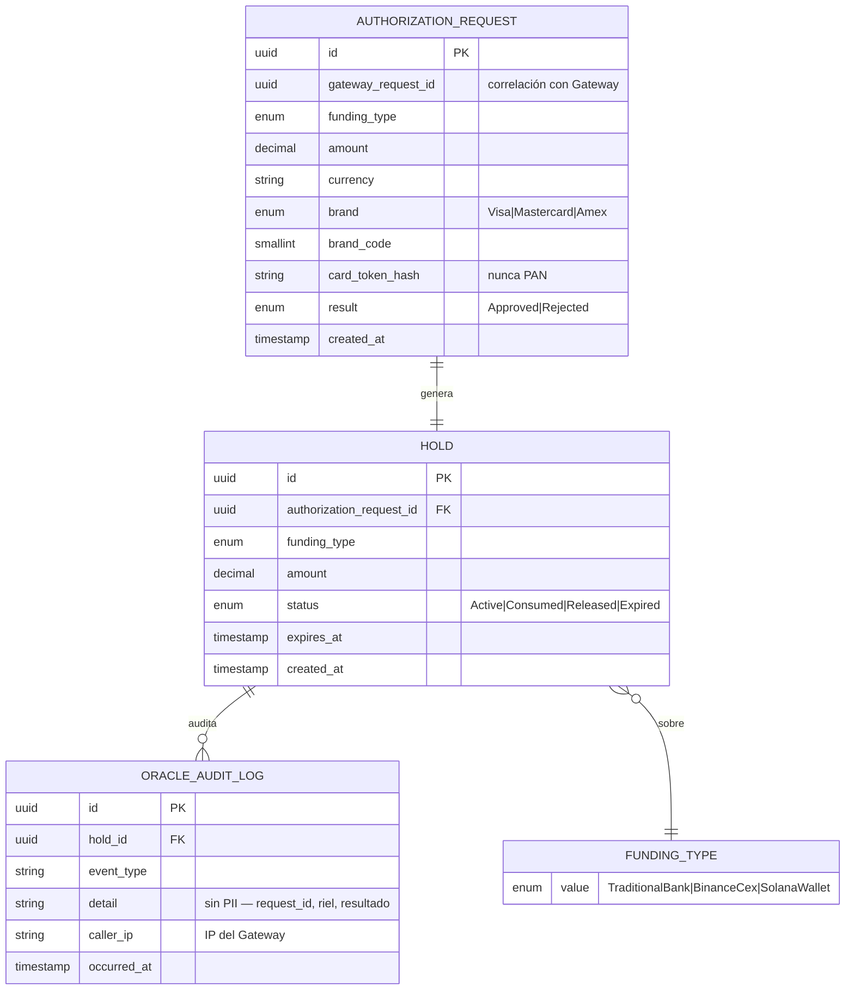

#### Descripción de entidades por servicio

| Entidad | Servicio | Responsabilidad |
|---------|----------|-----------------|
| **TRANSACTION** | Pasarela | Agregado raíz del ciclo de vida del pago |
| **SETTLEMENT** | Pasarela | Registro del asentamiento con prueba verificable |
| **ORACLE_HOLD_REF** | Pasarela | Referencia lógica al `hold_id` del Oracle (sin FK DB) |
| **HOLD** | Oracle | Reserva temporal de fondos antes de liquidación |
| **AUTHORIZATION_REQUEST** | Oracle | Registro de cada intento de autorización (sin PAN) |
| **ORACLE_AUDIT_LOG** | Oracle | Trazabilidad de auth, holds y rechazos de acceso |
| **GATEWAY_AUDIT_LOG** | Pasarela | Trazabilidad de checkout y settlement |

---

### 3.2.1 Modelo off-chain — Antifraude (`antifraud/`)

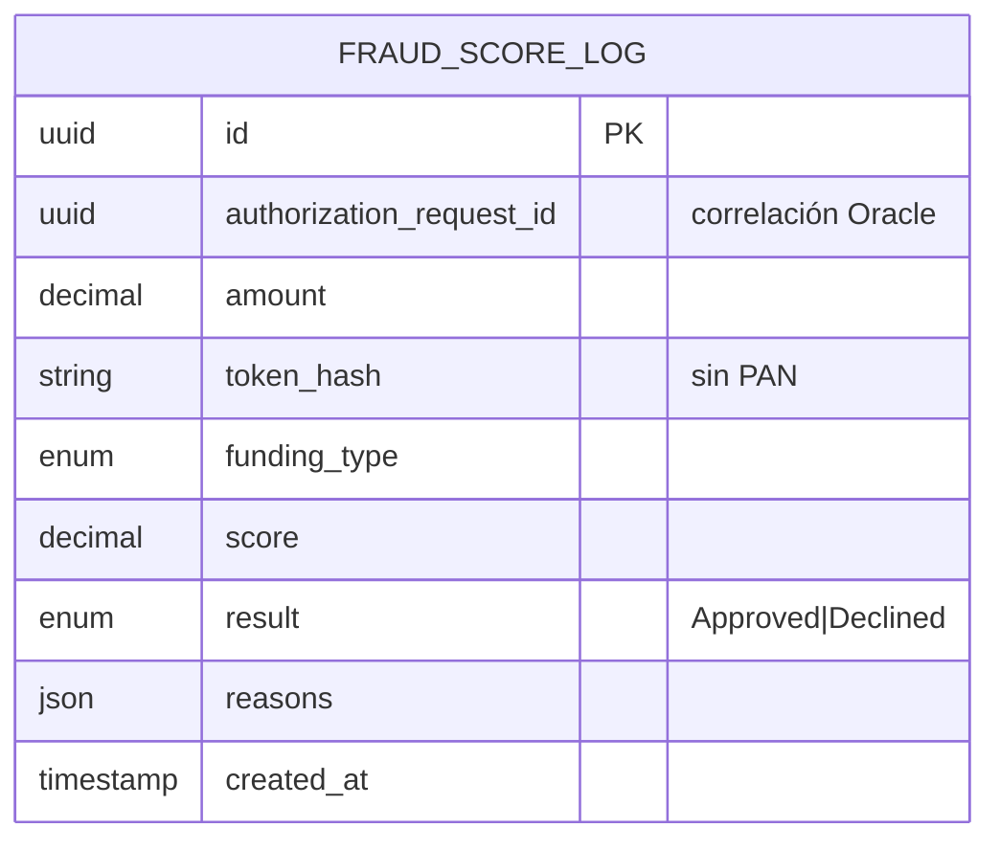

---

### 3.3 Vista unificada Pasarela ↔ Oracle (referencia lógica)

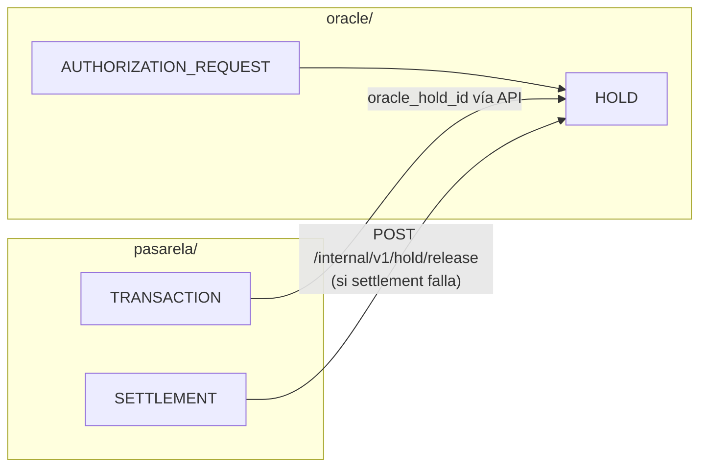

| Campo Pasarela | Campo Oracle | Mecanismo |
|----------------|--------------|-----------|
| `TRANSACTION.oracle_hold_id` | `HOLD.id` | Respuesta de `POST /internal/v1/authorize` |
| `TRANSACTION.id` | `AUTHORIZATION_REQUEST.gateway_request_id` | Correlación en request |
| `SETTLEMENT.status = Failed` | `HOLD.status → Released` | `POST /internal/v1/hold/release` |

---

### 3.4 Modelo on-chain (programa Anchor — Solana)

Las cuentas on-chain no almacenan PII. El libro mayor inmutable registra montos, códigos de marca y referencias de riel.

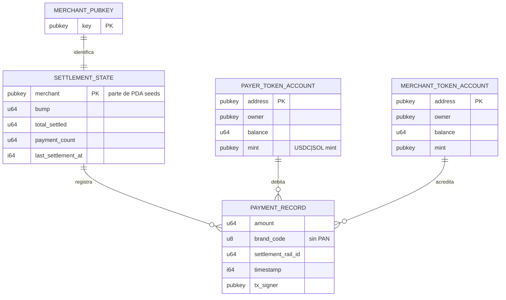

#### Relación PDA

```
Seeds: ["settlement", merchant_pubkey.as_ref()]
Program: payment-settlement
Account: SettlementState (PDA)
```

#### Evento on-chain (no persistido como entidad, emitido en logs)

| Campo | Tipo | Descripción |
|-------|------|-------------|
| `amount` | u64 | Monto transferido en tokens SPL |
| `brand_code` | u8 | Código numérico de marca (Visa=1, MC=2, Amex=3) |
| `settlement_rail_id` | u64 | Identificador del riel |
| `timestamp` | i64 | Unix timestamp del bloque |

---

### 3.5 Vista unificada off-chain ↔ on-chain

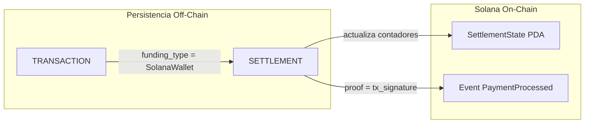

| Campo off-chain | Equivalente on-chain |
|-----------------|----------------------|
| `SETTLEMENT.proof` | Tx Signature de la transacción Solana |
| `TRANSACTION.amount` | `PaymentProcessed.amount` |
| `CARD_TOKEN.brand_code` | `PaymentProcessed.brand_code` |
| `RAIL_CONFIG.id` | `PaymentProcessed.settlement_rail_id` |

---

## 4. Flujos

### 4.1 Flujo principal de checkout (diagrama de actividad)

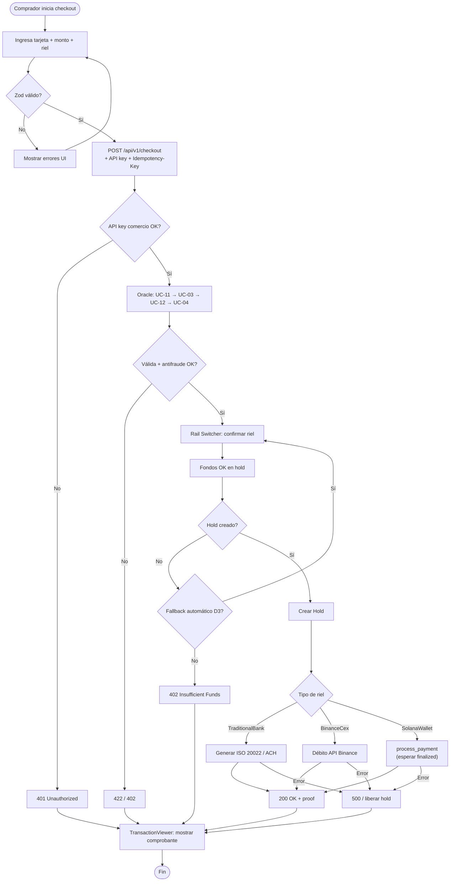

---

### 4.2 Flujo de autorización del Oracle (secuencia)

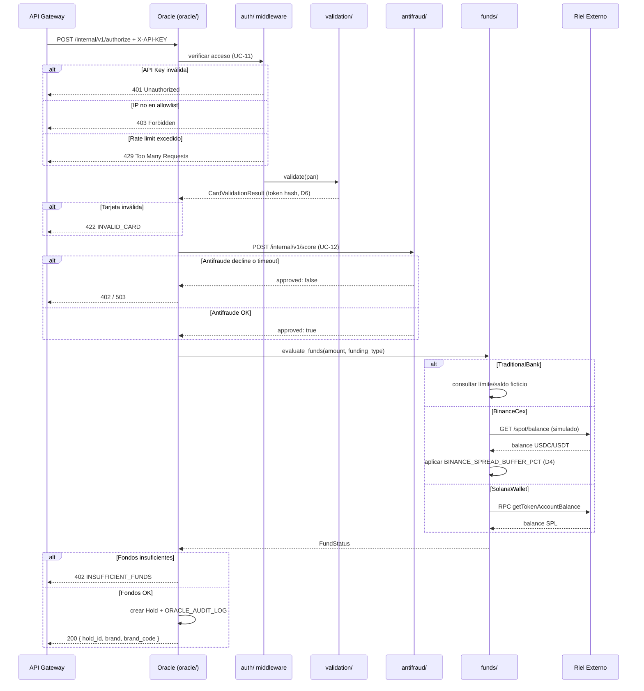

---

### 4.3 Flujo de decisión del Rail Switcher

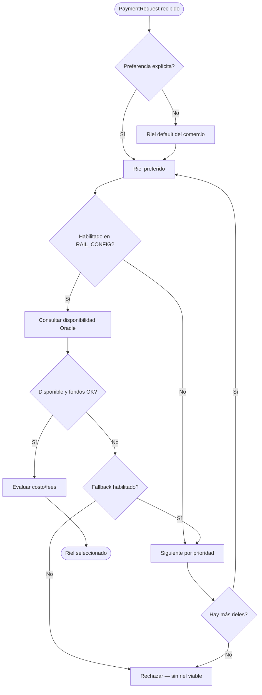

---

### 4.4 Flujos de liquidación por riel

#### 4.4.1 Riel Tradicional

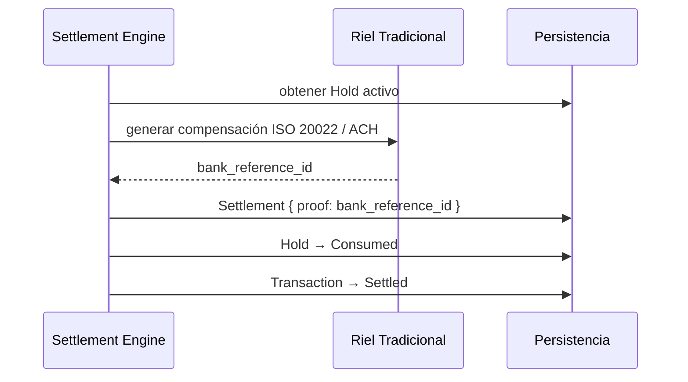

#### 4.4.2 Riel Binance CEX

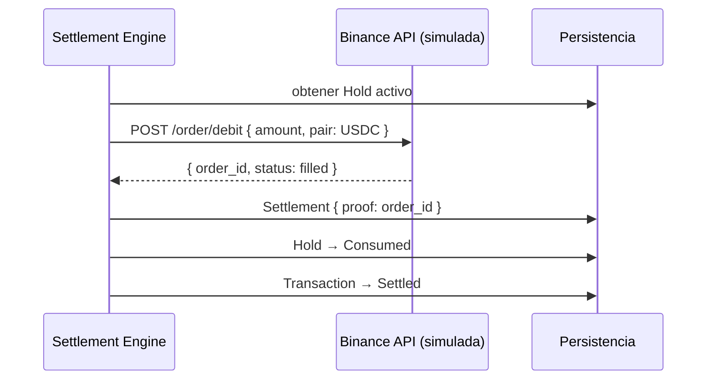

#### 4.4.3 Riel Solana On-Chain

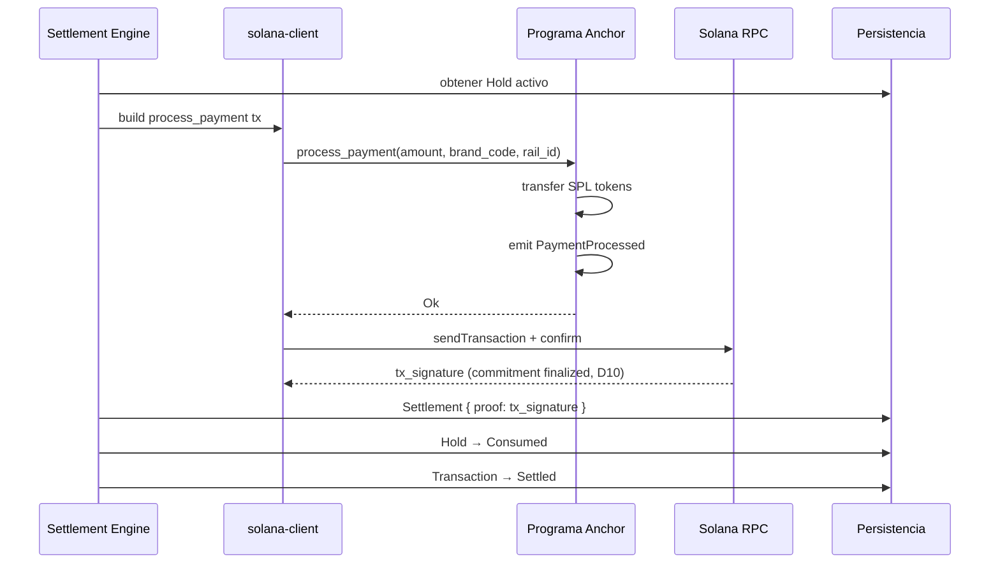

---

### 4.5 Máquina de estados de la transacción

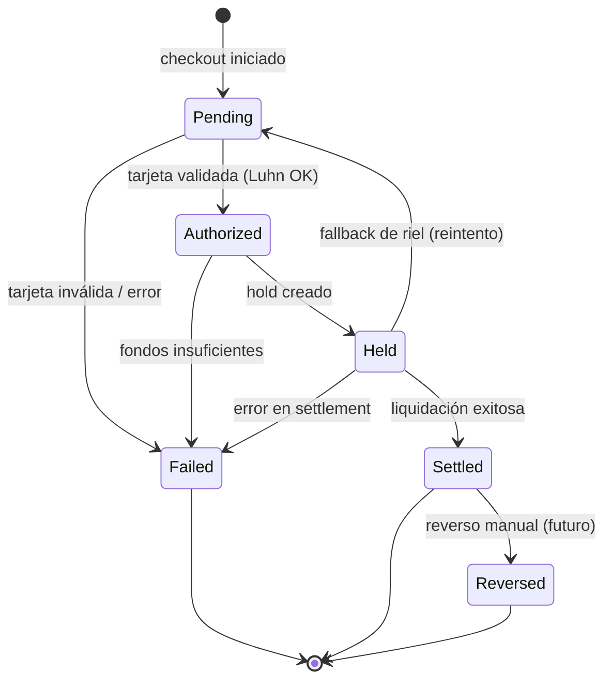

| Transición | Disparador | Actor |
|------------|-----------|-------|
| Pending → Authorized | Oracle valida tarjeta | Oracle |
| Authorized → Held | Hold creado con fondos OK | Oracle |
| Held → Settled | Settlement completado | Settlement Engine |
| Held → Failed | Error en riel / timeout | Settlement Engine |
| Held → Pending | Fallback activa nuevo riel | Rail Switcher |
| Settled → Reversed | Reverso administrativo (scope futuro) | Comercio / Admin |

---

### 4.6 Flujo de manejo de errores

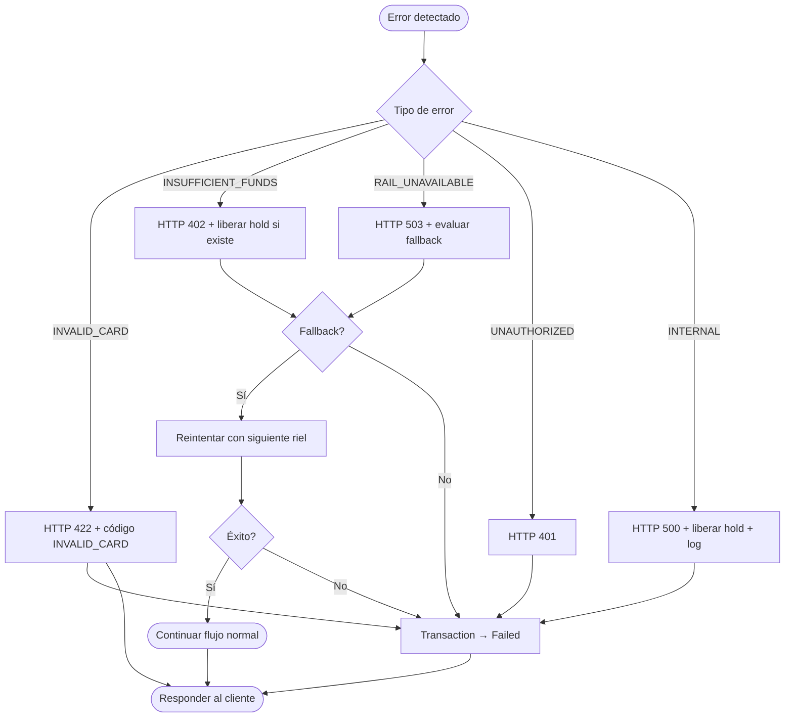

---

### 4.7 Flujo del frontend (checkout UI)

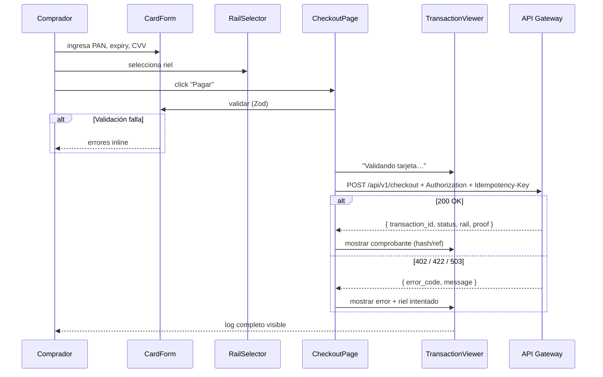

---

## 5. Matriz Caso de Uso ↔ Entidad ↔ Flujo

| Caso de uso | Servicio | Entidades principales | Flujo de referencia |
|-------------|----------|----------------------|---------------------|
| UC-01 Checkout | Pasarela | TRANSACTION, PAYMENT_REQUEST, SETTLEMENT, MERCHANT | §4.1, §4.7 |
| UC-02 Seleccionar riel | Pasarela | RAIL_PREFERENCE, FUNDING_TYPE, RAIL_CONFIG | §4.3 |
| UC-03 Validar tarjeta | Oracle | AUTHORIZATION_REQUEST, ORACLE_AUDIT_LOG | §4.2 |
| UC-04 Autorizar hold | Oracle | HOLD, AUTHORIZATION_REQUEST | §4.2 |
| UC-05 Liquidar Banco | Pasarela | SETTLEMENT | §4.4.1 |
| UC-06 Liquidar Binance | Pasarela | SETTLEMENT | §4.4.2 |
| UC-07 Liquidar Solana | Pasarela | SETTLEMENT, SETTLEMENT_STATE, PaymentProcessed | §4.4.3 |
| UC-08 Fallback (D3) | Pasarela | RAIL_CONFIG, RAIL_PREFERENCE | §4.3, §4.6 |
| UC-09 Consultar tx | Pasarela | TRANSACTION, SETTLEMENT | §4.5 |
| UC-10 Visualizar log | Pasarela | GATEWAY_AUDIT_LOG, TRANSACTION | §4.7 |
| UC-11 Control de acceso | Oracle | ORACLE_AUDIT_LOG | §4.2 |
| UC-12 Antifraude (D11) | Antifraude | FRAUD_SCORE_LOG | §4.2 |

---

## 6. Tabla de decisiones aplicadas (D1–D12)

| ID | Decisión | Impacto en casos de uso / flujos |
|----|----------|--------------------------------|
| D1 | Axum | Todos los microservicios Rust |
| D2 | local validator + devnet CI | UC-07, tests Anchor |
| D3 | Fallback automático | UC-08, §4.1, §4.3 |
| D4 | Spread configurable | UC-04, UC-06 |
| D5 | Monorepo | Estructura `oracle/`, `antifraud/` |
| D6 | Token en memoria | UC-03; PAN no persiste |
| D7 | mTLS Fase 7/8 | UC-11 (MVP: API key) |
| D8 | 3DS post-MVP | No aplica en UC actuales |
| D9 | Idempotency-Key | UC-01 paso 4 |
| D10 | Commitment finalized | UC-07, §4.4.3 |
| D11 | Antifraude externo | UC-12, §4.2 |
| D12 | API key comercio | UC-01 paso 3–4, entidad MERCHANT |

Ver detalle: [Arquitectura §12](./Arquitectura.md#12-decisiones-de-diseño--resueltas-fase-0).

---

## Referencias

- [Arquitectura.md](./Arquitectura.md) — Componentes, traits, fases, decisiones D1–D12 (§12), seguridad Web2/Web3 (§9)
- [Plan-de-Implementacion.md](./Plan-de-Implementacion.md) — Hoja de ruta hasta producción
- [Acta-Cierre-Fase-0.md](./Acta-Cierre-Fase-0.md) — Gate Fase 0 cerrado (2026-07-25)
- [Contexto General.md](./Contexto%20General.md) — Prompt maestro del proyecto
