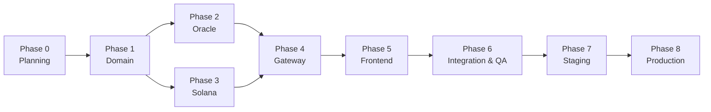
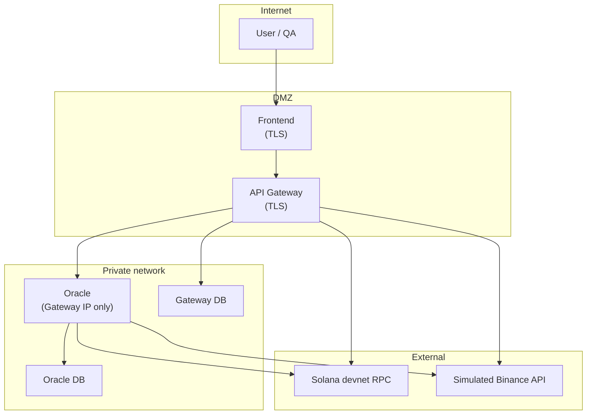

# Implementation Plan — From Planning to Production

> Operational roadmap for the multi-rail payment system (Web2/Web3).  
> Based on [Arquitectura-en.md](./Arquitectura-en.md), [Casos-de-Uso-ER-Flujos-en.md](./Casos-de-Uso-ER-Flujos-en.md) and [Contexto General-en.md](./Contexto%20General-en.md).

---

## 1. Executive summary

| Field | Value |
|-------|-------|
| **Objective** | Payment processor with card payments and mutable settlement across three rails (Bank, Binance CEX, Solana) |
| **Approach** | Sequential development by phases; explicit confirmation before advancing |
| **Deployment units** | `pasarela/` + `oracle/` + `antifraud/` (monorepo D5) |
| **Current phase** | **Phase 7 — Staging** |
| **Last closed phase** | **Phase 6 — Integration, QA and hardening** *(local gate verified 2026-07-26)* |

### Current repository status

| Element | Status |
|---------|--------|
| Architecture documentation | ✅ Complete |
| Use cases, ER and flows | ✅ Complete |
| `oracle/` skeleton | ✅ Complete (67 tests, persistence, security) |
| `pasarela/` workspace (crates, programs, frontend) | ✅ Backend + `programs/payment-settlement/` devnet + **`frontend/`** React checkout |
| CI/CD | ✅ `ci.yml` (Rust + frontend + Playwright) · ✅ `programs-anchor-test.yml` |
| Production deployment | ⬜ Pending |
| Staging (Docker Compose) | ✅ Artifacts + local/devnet validation (2026-07-27) |

---

## 2. Phase map (global view)



| Phase | Name | Estimated duration* | Exit gate |
|-------|------|---------------------|-----------|
| **0** | Planning | 1–2 weeks | Documentation approved |
| **1** | Domain and rails | 1–2 weeks | Green `cargo test` in `domain` + `rail-switcher` |
| **2** | Oracle | 2–3 weeks | Isolated service with persistence and security tests |
| **3** | Solana program | 2–3 weeks | Green `anchor test` on devnet/local |
| **4** | API Gateway | 2–4 weeks | Functional backend checkout E2E (no UI) |
| **5** | Frontend | 1–2 weeks | Checkout UI connected to Gateway |
| **6** | Integration and QA | 1–2 weeks | Playwright E2E + QA checklist |
| **7** | Staging | 1 week | Smoke tests in pre-prod environment |
| **8** | Production | 1 week | Controlled go-live + monitoring |

\*Indicative estimates for a small team (1–2 devs). Adjust according to capacity.

---

## 3. Cross-cutting rules (apply to all phases)

These rules come from `.cursorrules` and [Arquitectura-en.md §2](./Arquitectura-en.md#2-architectural-principles):

1. **TDD**: write tests before or alongside implementation; do not close a task without a green suite.
2. **No `.unwrap()` / `.expect()`** in production code (Rust and Anchor).
3. **Mandatory documentation**: doc comments in Rust; JSDoc in React; `@notice/@param/@return` in Anchor instructions.
4. **Phase confirmation**: do not start phase N+1 until explicit approval from the project owner.
5. **Fail-closed security**: when in doubt about auth, funds or validation → reject.
6. **Oracle boundary**: only the Gateway invokes the Oracle; the frontend never accesses it directly.
7. **Zero PII on-chain**: Solana events without PAN, CVV or name.
8. **QA**: minimum 3 edge cases per critical function/component.

---

## 4. Phase 0 — Planning ✅ *(closed 2026-07-25)*

### Objective

Define what is built, how it is decomposed, what constraints apply and how it is deployed, before writing business code in the gateway.

### Steps

| # | Step | Status | Owner |
|---|------|--------|-------|
| 0.1 | Draft context and MVP scope | ✅ | Architecture |
| 0.2 | Document component and deployment architecture | ✅ | Architecture |
| 0.3 | Document use cases, ER and flows | ✅ | Architecture |
| 0.4 | Define Oracle as an independent service (`oracle/`) | ✅ | Architecture |
| 0.5 | Create Oracle skeleton with auth and base validation | ✅ | Dev |
| 0.6 | Prepare implementation plan (this document) | ✅ | Architecture |
| 0.7 | **Resolve priority design decisions** (see §12 Architecture) | ✅ | Product + Architecture |
| 0.8 | Validate and approve documentation (Phase 0 gate) | ✅ | Stakeholder |

### Closed decisions (2026-07-25)

| # | Decision | Resolution |
|---|----------|------------|
| D1 | Rust HTTP framework | **Axum** (Gateway + Oracle) |
| D2 | Solana development network | **Local validator** + **devnet** in CI |
| D3 | Rail fallback policy | **Automatic** by configurable priority |
| D4 | Binance spread buffer | **Configurable** via `BINANCE_SPREAD_BUFFER_PCT` (env) |
| D5 | Oracle repository | **Monorepo** (`oracle/` in pasarela) |
| D6 | PAN tokenization | **In-memory hash**; PAN discarded post-Luhn |
| D7 | mTLS | **Phase 7/8**; MVP with X-API-KEY + allowlist |
| D8 | 3-D Secure | **Post-MVP** (out of scope) |
| D9 | Idempotency-Key | ✅ **Implemented** — Gateway (Phase 4) |
| D10 | Solana commitment | **`finalized`** |
| D11 | Antifraud | **Simulated external service** (`antifraud/`) |
| D12 | Merchant auth | ✅ **API key per merchant** — Gateway (Phase 4) |

Details and implications: [Architecture §12](./Arquitectura-en.md#12-design-decisions--resolved-phase-0).

### Phase 0 deliverables

- [x] `Doc/Contexto General-en.md`
- [x] `Doc/Arquitectura-en.md`
- [x] `Doc/Casos-de-Uso-ER-Flujos-en.md`
- [x] `Doc/Plan-de-Implementacion-en.md` (this file)
- [x] `oracle/` — functional skeleton
- [x] [Acta-Cierre-Fase-0-en.md](./Acta-Cierre-Fase-0-en.md) — gate 0.8

### Acceptance criteria (gate)

- [x] Documentation reviewed and coherent with each other
- [x] Decisions D1–D12 recorded in Architecture §12
- [x] Explicit stakeholder confirmation to advance (2026-07-25)

---

## 5. Phase 1 — Domain and rail abstraction

### Objective

Create the shared domain layer in Rust: traits, types, enums and the Rail Switcher, without infrastructure dependencies.

### Steps

| # | Step | Detail |
|---|------|--------|
| 1.1 | Initialize Cargo workspace at `pasarela/` root | `Cargo.toml` workspace; includes simulators and Oracle with dep rules (§4 Architecture) |
| 1.2 | Create crate `crates/domain/` | Newtypes: `TransactionId`, `Amount`, `CardNumber`, etc. |
| 1.3 | Define traits `PaymentProcessor` and `LiquidityEngine` | See [Architecture §5.1](./Arquitectura-en.md#51-main-traits) |
| 1.4 | Define domain structs/enums | `PaymentRequest`, `CardPayload`, `FundingType`, `TransactionStatus`, `PaymentResponse` |
| 1.5 | Define errors with `thiserror` | `PaymentError`, `LiquidityError`, `RailError` |
| 1.6 | Create crate `crates/rail-switcher/` | Decision engine: preference → availability → cost → fallback |
| 1.7 | Write unit tests (TDD) | Cases: preferred rail OK, fallback, no viable rail |
| 1.8 | Document public API with `///` | All public functions and types |
| 1.9 | Run `cargo test` + `cargo clippy` in workspace | Green suite, no critical warnings |

### Deliverables

```
pasarela/
├── Cargo.toml              # workspace
└── crates/
    ├── domain/
    └── rail-switcher/
```

### Acceptance criteria (gate)

- [x] Green `cargo test` in `domain` and `rail-switcher`
- [x] Rail Switcher covers: explicit preference, merchant default, fallback, rejection
- [x] No HTTP, DB or Solana dependencies in `domain`
- [ ] Explicit confirmation for Phase 2 and/or Phase 3

> Closure record: [Acta-Cierre-Fase-1-en.md](./Acta-Cierre-Fase-1-en.md) (2026-07-25)

---

## 6. Phase 2 — Authorization Oracle (independent service)

### Objective

Complete the microservice in `oracle/` as an isolated entity: authorization, persistent holds, audit log and production security (MVP).

### Initial state

Existing skeleton with: auth middleware, Luhn, simulated funds, endpoints `/internal/v1/authorize`, `/health`, 15 tests.

### Steps

| # | Step | Detail |
|---|------|--------|
| 2.1 | Define API v1 contract (OpenAPI or markdown) | Aligned with future `oracle-client` DTOs |
| 2.2 | Implement hold persistence | Entities `HOLD`, `AUTHORIZATION_REQUEST`, `ORACLE_AUDIT_LOG` |
| 2.3 | Implement hold expiration (TTL) | `ORACLE_HOLD_TTL_SECS`; job or check on each request |
| 2.4 | Complete `POST /internal/v1/hold/release` | Real release in DB |
| 2.5 | Implement full rate limiting | Sliding window per API key + IP |
| 2.6 | Integrate real/simulated queries per rail | Fictitious bank, simulated Binance, Solana RPC |
| 2.7 | Integrate simulated antifraud service | Query to `antifraud/` before hold; fail closed if no response |
| 2.8 | Structured logging without PII | `tracing` with allowed fields |
| 2.9 | Expand security tests | IP allowlist, rate limit, fail closed |
| 2.10 | Create crate `pasarela/crates/oracle-client/` | DTOs + typed HTTP client (shared contract) |
| 2.11 | Gateway ↔ Oracle contract tests | Mock server or cross-service tests |

### Deliverables

- Oracle with persistence and audit log
- `oracle-client` in pasarela
- Environment variable documentation (updated `.env.example`)

### Acceptance criteria (gate)

- [x] Green `cargo test` in `oracle/` (unit + integration + security)
- [x] PAN never persists; audited logs without PII
- [x] Requests without API key / invalid IP → 401/403
- [x] Hold created and released correctly *(consumes HTTP → Phase 4)*
- [x] Explicit confirmation for Phase 4 (may overlap with Phase 3)

> Closure record: [Acta-Cierre-Fase-2-en.md](./Acta-Cierre-Fase-2-en.md) (2026-07-25)

---

## 7. Phase 3 — On-chain settlement engine (Solana / Anchor)

### Objective

Anchor program `payment-settlement` with `process_payment` instruction, SPL transfer and `PaymentProcessed` event without PII.

### Steps

| # | Step | Detail |
|---|------|--------|
| 3.1 | Initialize Anchor project in `programs/payment-settlement/` | ✅ `Anchor.toml`, standard structure, bootstrap `initialize`, 2 TS tests |
| 3.2 | Write TypeScript tests **before** logic | ✅ 4 cases §7.4 + SPL/PDA helpers (RED until 3.4–3.6) |
| 3.3 | Define `SettlementState` PDA | ✅ Seeds `["settlement", merchant]`, init + 6 PDA tests |
| 3.4 | Implement `process_payment` | ✅ SPL transfer + PDA counters + event |
| 3.5 | Emit `PaymentProcessed` event | ✅ No PII (included in 3.4) |
| 3.6 | Explicit `#[derive(Accounts)]` validations | ✅ signer, owner, seeds, bump, mint, balance |
| 3.7 | Custom errors `#[error_code]` | ✅ Unauthorized, InvalidMint, AmountOverflow, etc. |
| 3.8 | Run `anchor test` on local validator | ✅ 17/17 green + CI workflow |
| 3.9 | Deploy on devnet (optional MVP) | ✅ Program ID `4cKoeammHN8UjAbiJRw2DqxBPL1Mb1EaPQeJFFuo564B` — see `deploy/devnet.json` |
| 3.10 | Document instructions with `@notice/@param/@return` | ✅ 5 instructions + `npm run lint:docs` gate |

### Deliverables

```
programs/payment-settlement/
├── programs/payment-settlement/src/lib.rs
├── tests/payment-settlement.ts
├── Anchor.toml
└── deploy/devnet.json
```

### Acceptance criteria (gate)

- [x] Green `anchor test` (OK transfer + failure cases) — 17 tests, local validator
- [x] Integer overflow rejected
- [x] Unauthorized signature rejected
- [x] Event emitted without PII
- [x] Explicit confirmation for Phase 4

> Phase 3 closure record: pending formalization; Solana technical gate verified (17 Anchor tests).

---

## 8. Phase 4 — API Gateway and orchestration

> **Status: CLOSED** · Record: [Acta-Cierre-Fase-4-en.md](./Acta-Cierre-Fase-4-en.md) (2026-07-26)

### Objective

Main backend: receives checkout, orchestrates Oracle, executes settlement on the active rail and responds with receipt.

### Steps

| # | Step | Detail |
|---|------|--------|
| 4.1 | Create crate `crates/settlement-adapters/` | ✅ Strategy per rail: Bank, Binance, Solana |
| 4.2 | Implement `TraditionalBank` adapter | ✅ Simulated ISO 20022 / ACH generation |
| 4.3 | Implement `BinanceCex` adapter | ✅ Simulated API + spread buffer |
| 4.4 | Implement `SolanaWallet` adapter | ✅ `solana-client` → `process_payment`; commitment **`finalized`** |
| 4.5 | Create crate `crates/api-gateway/` | ✅ Axum, config, routes |
| 4.6 | Implement `POST /api/v1/checkout` | ✅ Full orchestrator |
| 4.7 | Integrate `rail-switcher` + `oracle-client` | ✅ Rail selection + authorization |
| 4.8 | Implement `GET /api/v1/transactions/{id}` | ✅ Status query (UC-09) |
| 4.9 | HTTP error mapping | ✅ 200, 402, 422, 401, 503, 500 (§6.2) |
| 4.10 | Idempotency (`Idempotency-Key`) | ✅ Mandatory (decision D9) |
| 4.11 | API key auth per merchant | ✅ Decision D12: `sk_test_...` / `sk_live_...` |
| 4.12 | Gateway persistence | ✅ TRANSACTION, SETTLEMENT, GATEWAY_AUDIT_LOG, MERCHANT |
| 4.13 | Release hold in Oracle if settlement fails | ✅ `POST /internal/v1/hold/release` |
| 4.14 | Integration tests | ✅ Gateway + mock Oracle + mock rails |

### Flow to validate

```
Frontend → POST /api/v1/checkout
  → Rail Switcher
  → Oracle /authorize
  → Settlement Engine (active rail)
  → Response { transaction_id, status, settlement_proof }
```

### Acceptance criteria (gate)

- [x] Full checkout functional via curl/Postman (no frontend)
- [x] All three rails settle and return distinct proof
- [x] Rail fallback operational (if enabled)
- [x] Hold released if settlement fails
- [x] Green `cargo test` + integration tests
- [x] Explicit confirmation for Phase 5

> Closure record: [Acta-Cierre-Fase-4-en.md](./Acta-Cierre-Fase-4-en.md) (2026-07-26)

---

## 9. Phase 5 — Frontend (Dashboard & Checkout)

> **Status: CLOSED** · Record: [Acta-Cierre-Fase-5-en.md](./Acta-Cierre-Fase-5-en.md) (2026-07-26)

### Objective

React interface demonstrating rail mutability: card form, rail selector and transaction viewer.

### Steps

| # | Step | Detail |
|---|------|--------|
| 5.1 | Initialize `frontend/` with Vite + React + TS + Tailwind | ✅ `pnpm` as package manager |
| 5.2 | Configure Vitest + React Testing Library | ✅ TDD in components |
| 5.3 | Implement `CardForm` | ✅ Zod validation; fictitious data |
| 5.4 | Implement `RailSelector` | ✅ TraditionalBank / BinanceCex / SolanaWallet |
| 5.5 | Implement `TransactionViewer` | ✅ Real-time flow log |
| 5.6 | Implement `CheckoutPage` | ✅ Orchestrates components; calls Gateway |
| 5.7 | Zod schemas aligned with API Gateway | ✅ Typed request/response |
| 5.8 | UX error handling | ✅ 402, 422, 503 with clear messages |
| 5.9 | Environment variables | ✅ `VITE_API_BASE_URL` pointing to Gateway |
| 5.10 | Interaction tests | ✅ Submit, rail selector, validation errors |
| 5.11 | JSDoc in components and hooks | ✅ Per `react.cursorrules` |

### Acceptance criteria (gate)

- [x] Manual checkout functional in browser
- [x] Rail change reflected in response (distinct proof)
- [x] Green `pnpm test` (77 tests)
- [x] Frontend does **not** call Oracle directly
- [x] Explicit confirmation for Phase 6

> Closure record: [Acta-Cierre-Fase-5-en.md](./Acta-Cierre-Fase-5-en.md) (2026-07-26)

---

## 10. Phase 6 — Integration, QA and hardening

> **Status: IN PROGRESS** · Start: 2026-07-26 · Debt: [Deuda-Tecnica-en.md](./Deuda-Tecnica-en.md)

### Objective

Validate the complete system, close MVP security gaps and prepare deployment artifacts.

### Steps

| # | Step | Detail |
|---|------|--------|
| 6.1 | E2E tests with Playwright | Full checkout flow per rail | ✅ 6/6 local ([Pruebas-en.md](./Pruebas-en.md)); CI: UI only |
| 6.2 | Cross-service tests | Gateway + real Oracle in local processes | ✅ `cross_service_integration.rs` |
| 6.3 | QA checklist per use case | UC-01 to UC-11 ([Checklist-QA-Fase-6-en.md](./Checklist-QA-Fase-6-en.md)) | ✅ Documented |
| 6.4 | Security review | OWASP, simulated PCI, Oracle boundary (§9 Architecture) | ✅ [Revision-Seguridad-Fase-6-en.md](./Revision-Seguridad-Fase-6-en.md) |
| 6.5 | Performance review | Checkout latency ~1–3 s; no obvious bottlenecks | ✅ [Revision-Rendimiento-Fase-6-en.md](./Revision-Rendimiento-Fase-6-en.md) |
| 6.6 | CI pipeline | `cargo test`, `anchor test`, `pnpm test`, Playwright | ✅ [`ci.yml`](../.github/workflows/ci.yml) + [`Doc/CI-en.md`](./CI-en.md) |
| 6.7 | Document development runbook | How to start the full stack locally (`cargo run`, services in terminal) | ✅ [Runbook-Desarrollo-en.md](./Runbook-Desarrollo-en.md) + [`scripts/check-env.sh`](../scripts/check-env.sh) |
| 6.8 | Resolve critical technical debt | Prioritized list — [Deuda-Tecnica-en.md](./Deuda-Tecnica-en.md) | ✅ [Cierre-Deuda-Fase-6.8-en.md](./Cierre-Deuda-Fase-6.8-en.md) |

### Minimum QA checklist (excerpt)

| Area | Cases to verify |
|------|-----------------|
| Card | Invalid Luhn PAN, unknown brand, empty fields |
| Funds | Amount > balance, Binance spread buffer, Solana RPC timeout |
| Security | No API key → 401, IP not on allowlist → 403, rate limit → 429 |
| Rails | Successful settlement on all 3; correct proof per type |
| Fallback | Preferred rail fails → next rail; none → Failed |
| On-chain | Unauthorized tx, overflow, OK transfer + event |

### Acceptance criteria (gate)

- [x] Green Playwright E2E on all 3 rails — verified locally 2026-07-26 ([Pruebas-en.md](./Pruebas-en.md))
- [ ] Local stack startable per runbook (without containers)
- [ ] Green CI on main branch — see [`Doc/CI-en.md`](./CI-en.md) and [`.github/workflows/ci.yml`](../.github/workflows/ci.yml)
- [ ] QA checklist signed / approved — see [Checklist-QA-Fase-6-en.md §16](./Checklist-QA-Fase-6-en.md#16-approval-gate-phase-6)
- [ ] Explicit confirmation for Phase 7

---

## 11. Phase 7 — Staging (pre-production)

**Status:** 🔄 In progress (2026-07-27) — Blocks 2–3: local + devnet validated; VPS pending.

| Block | Scope | Status |
|-------|-------|--------|
| **1** | Compose, Dockerfiles, Caddy TLS, `.env.example`, smoke, runbook | ✅ Delivered in repo |
| **2** | Real VPS deploy, Let's Encrypt TLS, secrets on server | ✅ Scripts + workflow; VPS deploy ⬜ |
| **3** | Smoke 3 rails on staging, Oracle not exposed | ✅ Local + devnet · VPS ⬜ |
| **4** | Centralized logs, alerts, light load (7.9–7.12) | ⬜ Pending |

### Objective

Deploy in an environment identical to production for final tests with simulated data and monitoring.

### Steps

| # | Step | Detail |
|---|------|--------|
| 7.1 | Provision staging infrastructure | ✅ `provision-vps.sh` + [Provision-VPS-Fase-7-en.md](./Provision-VPS-Fase-7-en.md) |
| 7.2 | Configure private network | Oracle **without** public exposure — ✅ in `docker-compose.yml` |
| 7.3 | TLS on Gateway and Frontend | ✅ Caddy + `Dockerfile.caddy` |
| 7.4 | Secrets in secure manager | ✅ `generate-staging-secrets.sh`; Vault/SM in Phase 8 |
| 7.5 | Deploy Oracle | ✅ Rust image; internal `backend` network |
| 7.6 | Deploy Gateway | ✅ Rust image; Caddy proxy `/api` |
| 7.7 | Deploy Frontend | ✅ Vite build embedded in Caddy |
| 7.8 | Solana devnet (staging) | Program deployed; dedicated RPC recommended |
| 7.9 | Configure centralized logs | Aggregation without PII |
| 7.10 | Configure healthchecks and alerts | ✅ Compose healthchecks; alerts ⬜ |
| 7.11 | Smoke tests on staging | ✅ `scripts/smoke-staging.sh` |
| 7.12 | Light load test | Verify rate limits and timeouts |

### Staging topology



### Acceptance criteria (gate)

- [ ] Green smoke tests on staging
- [ ] Oracle not accessible from Internet (verified)
- [ ] Logs without PAN/CVV
- [ ] Rollback documented and tested
- [ ] Explicit confirmation for go-live

---

## 12. Phase 8 — Production

### Objective

Controlled MVP launch in production with monitoring, incident response and measurable success criteria.

### Pre-go-live steps

| # | Step | Detail |
|---|------|--------|
| 8.1 | Go/no-go checklist | See §12.1 |
| 8.2 | Rotate all secrets | `ORACLE_API_KEY`, RPC keys, etc. |
| 8.3 | Backup and restore tested | Gateway and Oracle DB |
| 8.4 | Incident runbook | Oracle outage, Solana timeout, rail failure |
| 8.5 | Rollback plan | Previous container version + migrations |
| 8.6 | Agreed deployment window | Stakeholder communication |

### Go-live steps

| # | Step | Detail |
|---|------|--------|
| 8.7 | Deploy Oracle in production | Private network; rotated secrets |
| 8.8 | Deploy Gateway | Verify connectivity → Oracle |
| 8.9 | Deploy Frontend | CORS/CSP configured for prod domain |
| 8.10 | Deploy Solana program | mainnet **only** if audit completed; otherwise keep devnet/simulated |
| 8.11 | Production smoke tests | Test transaction per rail |
| 8.12 | Enable monitoring and alerts | Latency, error rate, healthchecks |
| 8.13 | Hypercare (48–72 h) | Reinforced monitoring post-launch |

### 12.1 Go/no-go checklist

| # | Criterion | ⬜ |
|---|-----------|---|
| 1 | Green CI on release commit | |
| 2 | E2E tests passed on staging | |
| 3 | Oracle isolated on private network | |
| 4 | Secrets rotated and out of repo | |
| 5 | TLS active on public endpoints | |
| 6 | Audited logs without PII | |
| 7 | Incident runbook documented | |
| 8 | Rollback tested | |
| 9 | Healthchecks configured | |
| 10 | Final stakeholder confirmation | |

### Post-production success criteria (30 days)

| Metric | MVP target |
|--------|------------|
| Gateway availability | ≥ 99% |
| Checkout p95 latency | ≤ 5 s |
| 5xx error rate | < 1% |
| Security incidents | 0 |
| Successful checkout transactions (demo) | Flows verified on 3 rails |

### Post-MVP evolution (outside initial scope)

Per [Architecture §9.8](./Arquitectura-en.md#98-mvp-scope-vs-production):

- Real acquirer integration (Stripe, Adyen)
- 3-D Secure (PSD2 / SCA)
- Token vault with HSM
- ML antifraud engine
- Mandatory mTLS Gateway ↔ Oracle
- Solana mainnet with external contract audit
- KYC/AML
- SOC / SIEM 24/7

---

## 13. Infrastructure and CI/CD (cross-cutting)

### 13.1 Recommended CI pipeline

| Trigger | Jobs |
|---------|------|
| PR / push | `oracle: cargo test && clippy` |
| PR / push | `pasarela: cargo test && clippy` (when workspace exists) |
| PR / push | `programs: anchor test` | ✅ `.github/workflows/programs-anchor-test.yml` |
| PR / push | `frontend: pnpm test && lint` (when it exists) |
| Pre-release | Playwright E2E against local stack |

### 13.2 Deployment artifacts

| Service | Artifact | Port | Exposure |
|---------|----------|------|----------|
| Oracle | Rust binary (`cargo build --release`) | 8081 | Internal network only |
| API Gateway | Rust binary (`cargo build --release`) | 8080 | Public (TLS) |
| Frontend | Static build (Vite) | 443 | Public (TLS) |
| Solana validator | dev/staging only | 8899 | Internal |

### 13.3 Critical environment variables

| Service | Variable | Description |
|---------|----------|-------------|
| Oracle | `ORACLE_API_KEY` | Shared key with Gateway |
| Oracle | `ORACLE_ALLOWED_CALLERS` | Gateway IP/CIDR |
| Gateway | `ORACLE_BASE_URL` | Internal Oracle URL |
| Gateway | `ORACLE_API_KEY` | Same key as Oracle |
| Gateway | `DATABASE_URL` | Transaction persistence |
| Gateway | `SOLANA_RPC_URL` | RPC for Solana rail |
| Gateway | `PAYMENT_SETTLEMENT_PROGRAM_ID` | Anchor Program ID (`4cKoeammHN8UjAbiJRw2DqxBPL1Mb1EaPQeJFFuo564B` on devnet) |
| Frontend | `VITE_API_BASE_URL` | Public Gateway URL |

---

## 14. Phase transition confirmation management

Each transition requires **explicit confirmation** (per Contexto General):

```
[Phase N completed]
  → Review acceptance criteria (gate)
  → Optional demo / walkthrough
  → Stakeholder responds: "Confirmed — advance to Phase N+1"
  → Record date and approved phase (issue, changelog or brief record)
```

| Transition | Requires |
|------------|----------|
| 0 → 1 | Documentation approved + decisions D1–D5 |
| 1 → 2, 1 → 3 | Stable domain; Phases 2 and 3 can be parallelized |
| 2, 3 → 4 | Oracle + client contract; tested Anchor program |
| 4 → 5 | Functional backend checkout |
| 5 → 6 | Connected UI |
| 6 → 7 | Green E2E + CI |
| 7 → 8 | Validated staging + go/no-go checklist |

---

## 15. Risks and mitigations

| Risk | Impact | Mitigation |
|------|--------|------------|
| Accidental Oracle exposure | Critical | Private network, allowlist, staging review |
| PAN leak in logs | Critical | Log audit; tests verifying absence of PAN |
| Oracle contract ↔ client desync | High | Contract tests; versioning `/internal/v1/` |
| Bug in Solana contract | High | TDD + edge tests; no mainnet without audit |
| Double charge from retries | High | Idempotency-Key in Gateway |
| Scope creep (3DS, real KYC) | Medium | Maintain MVP vs production (§9.8 Architecture) |

---

## 16. References

| Document | Use |
|----------|-----|
| [`README.md`](../README.md) | Project entry point, components, quick start |
| [Arquitectura-en.md](./Arquitectura-en.md) | Components, security, technical phases |
| [Casos-de-Uso-ER-Flujos-en.md](./Casos-de-Uso-ER-Flujos-en.md) | UCs, ER, flows for QA |
| [Contexto General-en.md](./Contexto%20General-en.md) | Master prompt and confirmation rule |
| `oracle/README.md` | Oracle service operation |
| `crates/api-gateway/README.md` | Gateway operation, curl/Postman |
| [Doc/CI-en.md](./CI-en.md) | GitHub Actions pipelines (Phase 6.6) |
| [Pruebas-en.md](./Pruebas-en.md) | Unified testing guide (Phase 6) |
| [Runbook-Desarrollo-en.md](./Runbook-Desarrollo-en.md) | Local stack without containers (Phase 6.7) |
| [Runbook-Staging-en.md](./Runbook-Staging-en.md) | Docker + Caddy staging deploy (Phase 7) |
| [Provision-VPS-Fase-7-en.md](./Provision-VPS-Fase-7-en.md) | VPS provisioning checklist + first deploy (Phase 7.2) |
| [Publicacion-LinkedIn-en.md](./Publicacion-LinkedIn-en.md) | LinkedIn post draft for repo release |
| [Revision-Rendimiento-Fase-6-en.md](./Revision-Rendimiento-Fase-6-en.md) | Phase 6.5 checkout performance |
| [Revision-Seguridad-Fase-6-en.md](./Revision-Seguridad-Fase-6-en.md) | Phase 6.4 OWASP/PCI review |
| [Checklist-QA-Fase-6-en.md](./Checklist-QA-Fase-6-en.md) | QA UC-01–UC-11 (Phase 6.3) |
| [Deuda-Tecnica-en.md](./Deuda-Tecnica-en.md) | P0–P3 debt register (2026-07-26) |
| [Cierre-Deuda-Fase-6.8-en.md](./Cierre-Deuda-Fase-6.8-en.md) | Phase 6.8 critical debt closure |
| [Acta-Cierre-Fase-5-en.md](./Acta-Cierre-Fase-5-en.md) | Phase 5 gate (2026-07-26) |
| [Acta-Cierre-Fase-4-en.md](./Acta-Cierre-Fase-4-en.md) | Phase 4 gate (2026-07-26) |
| `frontend/README.md` | React checkout operation |
| `rust.cursorrules` / `solana.cursorrules` / `react.cursorrules` / `qa.cursorrules` | Code standards |

---

## 17. Immediate next action

1. ~~**Close Phase 0**~~ ✅ See [Acta-Cierre-Fase-0-en.md](./Acta-Cierre-Fase-0-en.md).
2. ~~**Phases 1–5**~~ ✅ Domain, Oracle, Solana, Gateway, Frontend — see closure records.
3. ~~**Phase 6 — local gate**~~ ✅ E2E 3 rails verified locally ([Pruebas-en.md](./Pruebas-en.md)).
4. **Phase 7 — Blocks 2–3 local** ✅ native stack, frontend, smoke 3 rails + devnet; **next**: VPS ([Provision-VPS-Fase-7-en.md](./Provision-VPS-Fase-7-en.md)), repo publication ([README.md](../README.md)).
