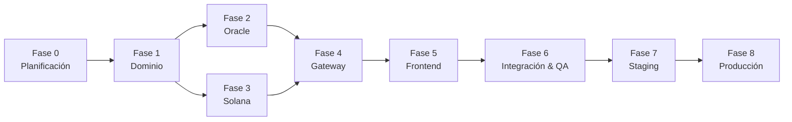
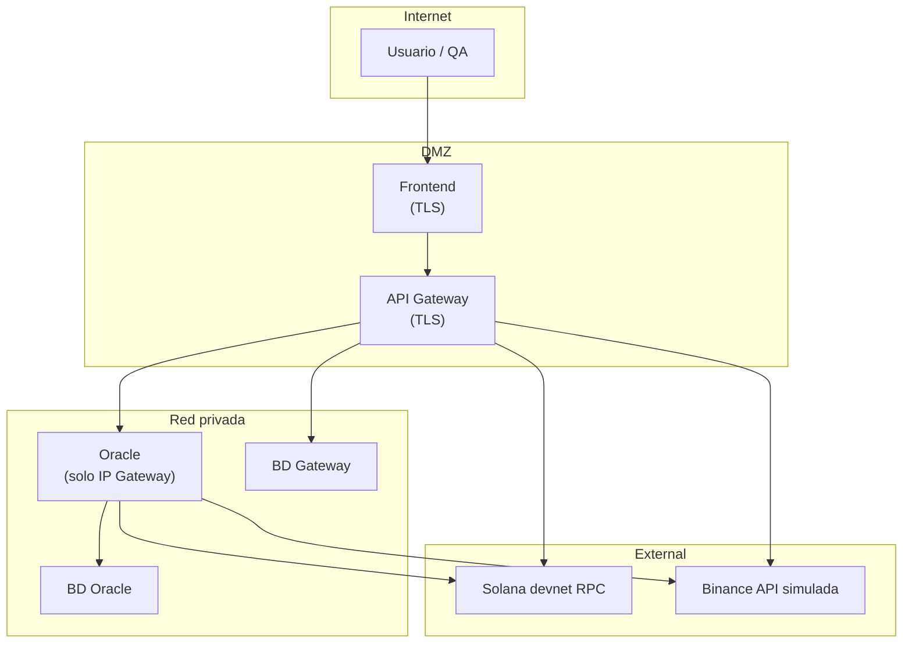

# Plan de Implementación — De Planificación a Producción

> Hoja de ruta operativa del sistema de pagos multi-rail (Web2/Web3).  
> Basado en [Arquitectura.md](./Arquitectura.md), [Casos-de-Uso-ER-Flujos.md](./Casos-de-Uso-ER-Flujos.md) y [Contexto General.md](./Contexto%20General.md).

---

## 1. Resumen ejecutivo

| Campo | Valor |
|-------|-------|
| **Objetivo** | Procesador de pagos con tarjeta y liquidación mutable en tres rieles (Banco, Binance CEX, Solana) |
| **Enfoque** | Desarrollo secuencial por fases; confirmación explícita antes de avanzar |
| **Unidades de despliegue** | `pasarela/` + `oracle/` + `antifraud/` (monorepo D5) |
| **Fase actual** | **Fase 1 — Dominio** *(Fase 0 cerrada 2026-07-25)* |
| **Próximo hito** | Workspace Cargo + crates `domain` y `rail-switcher` |

### Estado actual del repositorio

| Elemento | Estado |
|----------|--------|
| Documentación de arquitectura | ✅ Completada |
| Casos de uso, ER y flujos | ✅ Completados |
| Esqueleto `oracle/` | ✅ Creado (auth, Luhn, holds simulados, 15 tests) |
| Workspace `pasarela/` (crates, programs, frontend) | ⬜ Pendiente |
| CI/CD | ⬜ Pendiente |
| Despliegue producción | ⬜ Pendiente |

---

## 2. Mapa de fases (visión global)



| Fase | Nombre | Duración estimada* | Gate de salida |
|------|--------|-------------------|----------------|
| **0** | Planificación | 1–2 semanas | Documentación aprobada |
| **1** | Dominio y rieles | 1–2 semanas | `cargo test` verde en `domain` + `rail-switcher` |
| **2** | Oracle | 2–3 semanas | Servicio aislado con persistencia y tests de seguridad |
| **3** | Programa Solana | 2–3 semanas | `anchor test` verde en devnet/local |
| **4** | API Gateway | 2–4 semanas | Checkout E2E backend (sin UI) funcional |
| **5** | Frontend | 1–2 semanas | Checkout UI conectado al Gateway |
| **6** | Integración y QA | 1–2 semanas | E2E Playwright + checklist QA |
| **7** | Staging | 1 semana | Smoke tests en entorno pre-prod |
| **8** | Producción | 1 semana | Go-live controlado + monitoreo |

\*Estimaciones orientativas para un equipo pequeño (1–2 devs). Ajustar según capacidad.

---

## 3. Reglas transversales (aplican a todas las fases)

Estas reglas provienen de los `.cursorrules` y de [Arquitectura.md §2](./Arquitectura.md#2-principios-arquitectónicos):

1. **TDD**: escribir tests antes o junto con la implementación; no cerrar tarea sin suite verde.
2. **Sin `.unwrap()` / `.expect()`** en código de producción (Rust y Anchor).
3. **Documentación obligatoria**: doc comments en Rust; JSDoc en React; `@notice/@param/@return` en instrucciones Anchor.
4. **Confirmación de fase**: no iniciar la fase N+1 hasta aprobación explícita del responsable del proyecto.
5. **Seguridad fail closed**: ante duda en auth, fondos o validación → rechazar.
6. **Frontera Oracle**: solo el Gateway invoca al Oracle; el frontend nunca accede directamente.
7. **Zero PII on-chain**: eventos Solana sin PAN, CVV ni nombre.
8. **QA**: mínimo 3 casos borde por función/componente crítico.

---

## 4. Fase 0 — Planificación ✅ *(cerrada 2026-07-25)*

### Objetivo

Definir qué se construye, cómo se descompone, qué restricciones aplican y cómo se despliega, antes de escribir código de negocio en la pasarela.

### Pasos

| # | Paso | Estado | Responsable |
|---|------|--------|-------------|
| 0.1 | Redactar contexto y alcance del MVP | ✅ | Arquitectura |
| 0.2 | Documentar arquitectura de componentes y despliegue | ✅ | Arquitectura |
| 0.3 | Documentar casos de uso, ER y flujos | ✅ | Arquitectura |
| 0.4 | Definir Oracle como servicio independiente (`oracle/`) | ✅ | Arquitectura |
| 0.5 | Crear esqueleto del Oracle con auth y validación base | ✅ | Dev |
| 0.6 | Elaborar plan de implementación (este documento) | ✅ | Arquitectura |
| 0.7 | **Resolver decisiones de diseño prioritarias** (ver §12 Arquitectura) | ✅ | Producto + Arquitectura |
| 0.8 | Validar y aprobar documentación (gate Fase 0) | ✅ | Stakeholder |

### Decisiones cerradas (2026-07-25)

| # | Decisión | Resolución |
|---|----------|------------|
| D1 | Framework HTTP Rust | **Axum** (Gateway + Oracle) |
| D2 | Red Solana desarrollo | **Local validator** + **devnet** en CI |
| D3 | Política de fallback de riel | **Automático** por prioridad configurable |
| D4 | Spread buffer Binance | **Configurable** vía `BINANCE_SPREAD_BUFFER_PCT` (env) |
| D5 | Repositorio Oracle | **Monorepo** (`oracle/` en pasarela) |
| D6 | Tokenización PAN | **Hash en memoria**; PAN descartado post-Luhn |
| D7 | mTLS | **Fase 7/8**; MVP con X-API-KEY + allowlist |
| D8 | 3-D Secure | **Post-MVP** (fuera de scope) |
| D9 | Idempotency-Key | **Fase 4** (Gateway) |
| D10 | Commitment Solana | **`finalized`** |
| D11 | Antifraude | **Servicio externo simulado** (`antifraud/`) |
| D12 | Auth comercio | **API key por comercio** en Fase 4 |

Detalle e implicaciones: [Arquitectura §12](./Arquitectura.md#12-decisiones-de-diseño--resueltas-fase-0).

### Entregables Fase 0

- [x] `Doc/Contexto General.md`
- [x] `Doc/Arquitectura.md`
- [x] `Doc/Casos-de-Uso-ER-Flujos.md`
- [x] `Doc/Plan-de-Implementacion.md` (este archivo)
- [x] `oracle/` — esqueleto funcional
- [x] [Acta-Cierre-Fase-0.md](./Acta-Cierre-Fase-0.md) — gate 0.8

### Criterios de aceptación (gate)

- [x] Documentación revisada y coherente entre sí
- [x] Decisiones D1–D12 registradas en Arquitectura §12
- [x] Confirmación explícita del stakeholder para avanzar (2026-07-25)

---

## 5. Fase 1 — Dominio y abstracción de rieles

### Objetivo

Crear la capa de dominio compartida en Rust: traits, tipos, enums y el Rail Switcher, sin dependencias de infraestructura.

### Pasos

| # | Paso | Detalle |
|---|------|---------|
| 1.1 | Inicializar workspace Cargo en raíz `pasarela/` | `Cargo.toml` workspace; **no** incluir `oracle/` |
| 1.2 | Crear crate `crates/domain/` | Newtypes: `TransactionId`, `Amount`, `CardNumber`, etc. |
| 1.3 | Definir traits `PaymentProcessor` y `LiquidityEngine` | Ver [Arquitectura §5.1](./Arquitectura.md#51-traits-principales) |
| 1.4 | Definir structs/enums de dominio | `PaymentRequest`, `CardPayload`, `FundingType`, `TransactionStatus`, `PaymentResponse` |
| 1.5 | Definir errores con `thiserror` | `PaymentError`, `LiquidityError`, `RailError` |
| 1.6 | Crear crate `crates/rail-switcher/` | Motor de decisión: preferencia → disponibilidad → costo → fallback |
| 1.7 | Escribir tests unitarios (TDD) | Casos: riel preferido OK, fallback, ningún riel viable |
| 1.8 | Documentar API pública con `///` | Todas las funciones y tipos públicos |
| 1.9 | Ejecutar `cargo test` + `cargo clippy` en workspace | Suite verde, sin warnings críticos |

### Entregables

```
pasarela/
├── Cargo.toml              # workspace
└── crates/
    ├── domain/
    └── rail-switcher/
```

### Criterios de aceptación (gate)

- [ ] `cargo test` verde en `domain` y `rail-switcher`
- [ ] Rail Switcher cubre: preferencia explícita, default comercio, fallback, rechazo
- [ ] Sin dependencias HTTP, DB ni Solana en `domain`
- [ ] Confirmación explícita para Fase 2 y/o Fase 3

---

## 6. Fase 2 — Oracle de autorización (servicio independiente)

### Objetivo

Completar el microservicio en `oracle/` como entidad aislada: autorización, holds persistentes, audit log y seguridad de producción (MVP).

### Estado inicial

Esqueleto existente con: auth middleware, Luhn, fondos simulados, endpoints `/internal/v1/authorize`, `/health`, 15 tests.

### Pasos

| # | Paso | Detalle |
|---|------|---------|
| 2.1 | Definir contrato API v1 (OpenAPI o markdown) | Alineado con DTOs futuros de `oracle-client` |
| 2.2 | Implementar persistencia de holds | Entidades `HOLD`, `AUTHORIZATION_REQUEST`, `ORACLE_AUDIT_LOG` |
| 2.3 | Implementar expiración de holds (TTL) | `ORACLE_HOLD_TTL_SECS`; job o chequeo en cada request |
| 2.4 | Completar `POST /internal/v1/hold/release` | Liberación real en DB |
| 2.5 | Implementar rate limiting completo | Ventana deslizante por API key + IP |
| 2.6 | Integrar consultas reales/simuladas por riel | Banco ficticio, Binance simulada, RPC Solana |
| 2.7 | Integrar servicio antifraude simulado | Consulta a `antifraud/` antes del hold; fail closed si no responde |
| 2.8 | Logging estructurado sin PII | `tracing` con campos permitidos |
| 2.9 | Ampliar tests de seguridad | Allowlist IP, rate limit, fail closed |
| 2.10 | Crear crate `pasarela/crates/oracle-client/` | DTOs + cliente HTTP tipado (contrato compartido) |
| 2.11 | Tests de contrato Gateway ↔ Oracle | Mock server o tests cross-service |

### Entregables

- Oracle con persistencia y audit log
- `oracle-client` en pasarela
- Documentación de variables de entorno (`.env.example` actualizado)
- Dockerfile probado localmente

### Criterios de aceptación (gate)

- [ ] `cargo test` verde en `oracle/` (unit + integration + security)
- [ ] PAN nunca persiste; logs auditados sin PII
- [ ] Requests sin API key / IP inválida → 401/403
- [ ] Hold se crea, consume y libera correctamente
- [ ] Confirmación explícita para Fase 4 (puede overlap con Fase 3)

---

## 7. Fase 3 — Motor de liquidación on-chain (Solana / Anchor)

### Objetivo

Programa Anchor `payment-settlement` con instrucción `process_payment`, transferencia SPL y evento `PaymentProcessed` sin PII.

### Pasos

| # | Paso | Detalle |
|---|------|---------|
| 3.1 | Inicializar proyecto Anchor en `programs/payment-settlement/` | `Anchor.toml`, estructura estándar |
| 3.2 | Escribir tests TypeScript **antes** de la lógica | Casos borde obligatorios (§7.4 Arquitectura) |
| 3.3 | Definir `SettlementState` PDA | Seeds: `["settlement", merchant.key()]` |
| 3.4 | Implementar `process_payment` | Transfer SPL + actualizar contadores PDA |
| 3.5 | Emitir evento `PaymentProcessed` | Sin PII |
| 3.6 | Validaciones `#[derive(Accounts)]` explícitas | `signer`, `owner`, `seeds`, `bump`, mint |
| 3.7 | Errores personalizados `#[error_code]` | Overflow, unauthorized, invalid mint |
| 3.8 | Ejecutar `anchor test` en local validator | Suite verde |
| 3.9 | Desplegar en devnet (opcional MVP) | Registrar program ID |
| 3.10 | Documentar instrucciones con `@notice/@param/@return` | Por cada instrucción pública |

### Entregables

```
programs/payment-settlement/
├── programs/payment-settlement/src/lib.rs
├── tests/payment-settlement.ts
└── Anchor.toml
```

### Criterios de aceptación (gate)

- [ ] `anchor test` verde (transferencia OK + casos de fallo)
- [ ] Integer overflow rechazado
- [ ] Firma no autorizada rechazada
- [ ] Evento emitido sin PII
- [ ] Confirmación explícita para Fase 4

---

## 8. Fase 4 — API Gateway y orquestación

### Objetivo

Backend principal: recibe checkout, orquesta Oracle, ejecuta settlement en el riel activo y responde con comprobante.

### Pasos

| # | Paso | Detalle |
|---|------|---------|
| 4.1 | Crear crate `crates/settlement-adapters/` | Strategy por riel: Bank, Binance, Solana |
| 4.2 | Implementar adapter `TraditionalBank` | Generación ISO 20022 / ACH simulado |
| 4.3 | Implementar adapter `BinanceCex` | API simulada + spread buffer |
| 4.4 | Implementar adapter `SolanaWallet` | `solana-client` → `process_payment`; esperar commitment **`finalized`** |
| 4.5 | Crear crate `crates/api-gateway/` | Axum, config, routes |
| 4.6 | Implementar `POST /api/v1/checkout` | Orquestador completo |
| 4.7 | Integrar `rail-switcher` + `oracle-client` | Selección de riel + autorización |
| 4.8 | Implementar `GET /api/v1/transactions/{id}` | Consulta de estado (UC-09) |
| 4.9 | Mapeo de errores HTTP | 200, 402, 422, 401, 503, 500 (§6.2) |
| 4.10 | Idempotencia (`Idempotency-Key`) | Obligatorio (decisión D9); evitar doble cargo |
| 4.11 | Auth API key por comercio | Decisión D12: `sk_test_...` / `sk_live_...` |
| 4.12 | Persistencia Gateway | TRANSACTION, SETTLEMENT, GATEWAY_AUDIT_LOG, MERCHANT |
| 4.13 | Liberar hold en Oracle si settlement falla | `POST /internal/v1/hold/release` |
| 4.14 | Tests de integración | Gateway + mock Oracle + mock rieles |
| 4.15 | Dockerfile para Gateway | Imagen independiente del Oracle |

### Flujo a validar

```
Frontend → POST /api/v1/checkout
  → Rail Switcher
  → Oracle /authorize
  → Settlement Engine (riel activo)
  → Respuesta { transaction_id, status, settlement_proof }
```

### Criterios de aceptación (gate)

- [ ] Checkout completo funcional vía curl/Postman (sin frontend)
- [ ] Los tres rieles liquidan y devuelven proof distinto
- [ ] Fallback de riel operativo (si habilitado)
- [ ] Hold liberado si settlement falla
- [ ] `cargo test` + tests integración verdes
- [ ] Confirmación explícita para Fase 5

---

## 9. Fase 5 — Frontend (Dashboard & Checkout)

### Objetivo

Interfaz React que demuestra mutabilidad del riel: formulario de tarjeta, selector de riel y visor de transacción.

### Pasos

| # | Paso | Detalle |
|---|------|---------|
| 5.1 | Inicializar `frontend/` con Vite + React + TS + Tailwind | `pnpm` como gestor |
| 5.2 | Configurar Vitest + React Testing Library | TDD en componentes |
| 5.3 | Implementar `CardForm` | Validación Zod; datos ficticios |
| 5.4 | Implementar `RailSelector` | TraditionalBank / BinanceCex / SolanaWallet |
| 5.5 | Implementar `TransactionViewer` | Log en tiempo real del flujo |
| 5.6 | Implementar `CheckoutPage` | Orquesta componentes; llama al Gateway |
| 5.7 | Schemas Zod alineados con API Gateway | Request/response tipados |
| 5.8 | Manejo de errores UX | 402, 422, 503 con mensajes claros |
| 5.9 | Variables de entorno | `VITE_API_BASE_URL` apuntando al Gateway |
| 5.10 | Tests de interacción | Submit, selector de riel, errores de validación |
| 5.11 | JSDoc en componentes y hooks | Según `react.cursorrules` |

### Criterios de aceptación (gate)

- [ ] Checkout manual funcional en navegador
- [ ] Cambio de riel reflejado en respuesta (proof distinto)
- [ ] `pnpm test` verde
- [ ] Frontend **no** llama al Oracle directamente
- [ ] Confirmación explícita para Fase 6

---

## 10. Fase 6 — Integración, QA y hardening

### Objetivo

Validar el sistema completo, cerrar brechas de seguridad del MVP y preparar artefactos de despliegue.

### Pasos

| # | Paso | Detalle |
|---|------|---------|
| 6.1 | Tests E2E con Playwright | Flujo checkout completo por cada riel |
| 6.2 | Tests cross-service | Gateway + Oracle real en Docker Compose |
| 6.3 | Checklist QA por caso de uso | UC-01 a UC-11 ([Casos-de-Uso](./Casos-de-Uso-ER-Flujos.md)) |
| 6.4 | Revisión de seguridad | OWASP, PCI simulado, frontera Oracle (§9 Arquitectura) |
| 6.5 | Revisión de rendimiento | Latencia checkout ~1–3 s; sin cuellos obvios |
| 6.6 | Docker Compose local | `frontend` + `api-gateway` + `oracle` + validator Solana |
| 6.7 | CI pipeline | `cargo test`, `anchor test`, `pnpm test`, Playwright |
| 6.8 | Documentar runbook de desarrollo | Cómo levantar todo el stack localmente |
| 6.9 | Resolver deuda técnica crítica | Lista priorizada antes de staging |

### Checklist QA mínimo (extracto)

| Área | Casos a verificar |
|------|-------------------|
| Tarjeta | PAN inválido Luhn, marca desconocida, campos vacíos |
| Fondos | Monto > saldo, spread buffer Binance, RPC timeout Solana |
| Seguridad | Sin API key → 401, IP no allowlist → 403, rate limit → 429 |
| Rieles | Liquidación exitosa en los 3; proof correcto por tipo |
| Fallback | Riel preferido falla → siguiente riel; ninguno → Failed |
| On-chain | Tx no autorizada, overflow, transferencia OK + evento |

### Criterios de aceptación (gate)

- [ ] Playwright E2E verde en los 3 rieles
- [ ] Docker Compose levanta stack completo
- [ ] CI verde en rama principal
- [ ] Checklist QA firmado / aprobado
- [ ] Confirmación explícita para Fase 7

---

## 11. Fase 7 — Staging (pre-producción)

### Objetivo

Desplegar en un entorno idéntico a producción para pruebas finales con datos simulados y monitoreo.

### Pasos

| # | Paso | Detalle |
|---|------|---------|
| 7.1 | Provisionar infraestructura staging | VPS / cloud / k8s según decisión |
| 7.2 | Configurar red privada | Oracle **sin** exposición pública |
| 7.3 | TLS en Gateway y Frontend | Certificados (Let's Encrypt / ACM) |
| 7.4 | Secretos en gestor seguro | No `.env` plano en servidor; Vault / AWS SM |
| 7.5 | Desplegar Oracle | Contenedor en red interna; allowlist IP del Gateway |
| 7.6 | Desplegar Gateway | Contenedor público; env `ORACLE_BASE_URL` interno |
| 7.7 | Desplegar Frontend | CDN o contenedor estático detrás de TLS |
| 7.8 | Solana devnet (staging) | Programa desplegado; RPC dedicado recomendado |
| 7.9 | Configurar logs centralizados | Agregación sin PII |
| 7.10 | Configurar healthchecks y alertas | `/health` Oracle + Gateway |
| 7.11 | Smoke tests en staging | Script automatizado post-deploy |
| 7.12 | Prueba de carga ligera | Verificar rate limits y timeouts |

### Topología staging



### Criterios de aceptación (gate)

- [ ] Smoke tests verdes en staging
- [ ] Oracle no accesible desde Internet (verificado)
- [ ] Logs sin PAN/CVV
- [ ] Rollback documentado y probado
- [ ] Confirmación explícita para go-live

---

## 12. Fase 8 — Producción

### Objetivo

Puesta en marcha controlada del MVP en producción con monitoreo, respuesta a incidentes y criterios de éxito medibles.

### Pasos pre-go-live

| # | Paso | Detalle |
|---|------|---------|
| 8.1 | Checklist go/no-go | Ver §12.1 |
| 8.2 | Rotar todos los secretos | `ORACLE_API_KEY`, claves RPC, etc. |
| 8.3 | Backup y restore probados | BD Gateway y Oracle |
| 8.4 | Runbook de incidentes | Caída Oracle, timeout Solana, fallo riel |
| 8.5 | Plan de rollback | Versión anterior de contenedores + migraciones |
| 8.6 | Ventana de despliegue acordada | Comunicación a stakeholders |

### Pasos go-live

| # | Paso | Detalle |
|---|------|---------|
| 8.7 | Desplegar Oracle en producción | Red privada; secretos rotados |
| 8.8 | Desplegar Gateway | Verificar conectividad → Oracle |
| 8.9 | Desplegar Frontend | CORS/CSP configurados para dominio prod |
| 8.10 | Desplegar programa Solana | mainnet **solo** si auditoría completada; si no, mantener devnet/simulado |
| 8.11 | Smoke tests producción | Transacción de prueba por riel |
| 8.12 | Activar monitoreo y alertas | Latencia, error rate, healthchecks |
| 8.13 | Hypercare (48–72 h) | Monitoreo reforzado post-lanzamiento |

### 12.1 Checklist go/no-go

| # | Criterio | ⬜ |
|---|----------|---|
| 1 | CI verde en commit de release | |
| 2 | Tests E2E pasados en staging | |
| 3 | Oracle aislado en red privada | |
| 4 | Secretos rotados y fuera del repo | |
| 5 | TLS activo en endpoints públicos | |
| 6 | Logs auditados sin PII | |
| 7 | Runbook de incidentes documentado | |
| 8 | Rollback probado | |
| 9 | Healthchecks configurados | |
| 10 | Confirmación final stakeholder | |

### Criterios de éxito post-producción (30 días)

| Métrica | Objetivo MVP |
|---------|--------------|
| Disponibilidad Gateway | ≥ 99% |
| Latencia p95 checkout | ≤ 5 s |
| Tasa de error 5xx | < 1% |
| Incidentes de seguridad | 0 |
| Transacciones checkout exitosas (demo) | Flujos verificados en 3 rieles |

### Evolución post-MVP (fuera de alcance inicial)

Según [Arquitectura §9.8](./Arquitectura.md#98-alcance-mvp-vs-producción):

- Integración adquirente real (Stripe, Adyen)
- 3-D Secure (PSD2 / SCA)
- Token vault con HSM
- Motor antifraude ML
- mTLS obligatorio Gateway ↔ Oracle
- Solana mainnet con auditoría externa del contrato
- KYC/AML
- SOC / SIEM 24/7

---

## 13. Infraestructura y CI/CD (transversal)

### 13.1 Pipeline CI recomendado

| Trigger | Jobs |
|---------|------|
| PR / push | `oracle: cargo test && clippy` |
| PR / push | `pasarela: cargo test && clippy` (cuando exista workspace) |
| PR / push | `programs: anchor test` (cuando exista) |
| PR / push | `frontend: pnpm test && lint` (cuando exista) |
| Merge a `main` | Build imágenes Docker (Gateway, Oracle) |
| Pre-release | Playwright E2E contra Docker Compose |

### 13.2 Artefactos de despliegue

| Servicio | Artefacto | Puerto | Exposición |
|----------|-----------|--------|------------|
| Oracle | `oracle/Dockerfile` | 8081 | Solo red interna |
| API Gateway | `crates/api-gateway/Dockerfile` | 8080 | Público (TLS) |
| Frontend | build estático / nginx | 443 | Público (TLS) |
| Solana validator | solo dev/staging | 8899 | Interno |

### 13.3 Variables de entorno críticas

| Servicio | Variable | Descripción |
|----------|----------|-------------|
| Oracle | `ORACLE_API_KEY` | Clave compartida con Gateway |
| Oracle | `ORACLE_ALLOWED_CALLERS` | IP/CIDR del Gateway |
| Gateway | `ORACLE_BASE_URL` | URL interna del Oracle |
| Gateway | `ORACLE_API_KEY` | Misma clave que Oracle |
| Gateway | `DATABASE_URL` | Persistencia transacciones |
| Gateway | `SOLANA_RPC_URL` | RPC para riel Solana |
| Frontend | `VITE_API_BASE_URL` | URL pública del Gateway |

---

## 14. Gestión de confirmaciones entre fases

Cada transición requiere **confirmación explícita** (según Contexto General):

```
[Fase N completada]
  → Revisar criterios de aceptación (gate)
  → Demo / walkthrough opcional
  → Stakeholder responde: "Confirmado — avanzar a Fase N+1"
  → Registrar fecha y fase aprobada (issue, changelog o acta breve)
```

| Transición | Requiere |
|------------|----------|
| 0 → 1 | Documentación aprobada + decisiones D1–D5 |
| 1 → 2, 1 → 3 | Dominio estable; Fases 2 y 3 pueden paralelizarse |
| 2, 3 → 4 | Oracle + contrato client; programa Anchor testeado |
| 4 → 5 | Checkout backend funcional |
| 5 → 6 | UI conectada |
| 6 → 7 | E2E + CI verdes |
| 7 → 8 | Staging validado + checklist go/no-go |

---

## 15. Riesgos y mitigaciones

| Riesgo | Impacto | Mitigación |
|--------|---------|------------|
| Exposición accidental del Oracle | Crítico | Red privada, allowlist, revisión en staging |
| Fuga de PAN en logs | Crítico | Auditoría de logs; tests que verifiquen ausencia de PAN |
| Desincronización contrato Oracle ↔ client | Alto | Tests de contrato; versionado `/internal/v1/` |
| Bug en contrato Solana | Alto | TDD + tests borde; no mainnet sin auditoría |
| Doble cargo por reintentos | Alto | Idempotency-Key en Gateway |
| Scope creep (3DS, KYC real) | Medio | Mantener MVP vs producción (§9.8 Arquitectura) |

---

## 16. Referencias

| Documento | Uso |
|-----------|-----|
| [Arquitectura.md](./Arquitectura.md) | Componentes, seguridad, fases técnicas |
| [Casos-de-Uso-ER-Flujos.md](./Casos-de-Uso-ER-Flujos.md) | UC, ER, flujos para QA |
| [Contexto General.md](./Contexto%20General.md) | Prompt maestro y regla de confirmación |
| `oracle/README.md` | Operación del servicio Oracle |
| `rust.cursorrules` / `solana.cursorrules` / `react.cursorrules` / `qa.cursorrules` | Estándares de código |

---

## 17. Próxima acción inmediata

1. ~~**Cerrar Fase 0**~~ ✅ Ver [Acta-Cierre-Fase-0.md](./Acta-Cierre-Fase-0.md).
2. **Iniciar Fase 1**: crear workspace Cargo en `pasarela/` con crates `domain` y `rail-switcher`.
3. **En paralelo (opcional)**: continuar Fase 2 en `oracle/` (persistencia, antifraud client) tras contrato de dominio.
