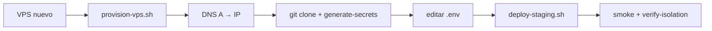

# Provision VPS — Fase 7 Bloque 2

> Checklist operativo para pasar de artefactos en repo a **staging real** en un VPS.

---

## Resumen del flujo



---

## 1. Elegir VPS

| Proveedor | Spec mínima | Notas |
|-----------|-------------|-------|
| Hetzner / DigitalOcean / Vultr / AWS Lightsail | 2 vCPU, 4 GB RAM, 40 GB SSD | Ubuntu 22.04 LTS |
| Región | Cerca del equipo QA | Latencia checkout |

Anotar: **IP pública** del VPS.

---

## 2. Provisionar servidor

SSH como root:

```bash
# Desde tu máquina (repo clonado):
scp deploy/staging/provision-vps.sh root@<VPS_IP>:/tmp/
ssh root@<VPS_IP> 'bash /tmp/provision-vps.sh'
```

Qué hace el script:

- Instala Docker Engine + Compose plugin
- UFW: permite **22, 80, 443**; deniega el resto
- Crea usuario `deploy` en grupo `docker` (opcional)

```bash
ssh-copy-id deploy@<VPS_IP>
```

---

## 3. DNS y dominio

1. Crear registro **A** (o AAAA): `staging.tu-dominio.com` → `<VPS_IP>`
2. Esperar propagación (1–30 min)
3. Verificar: `dig +short staging.tu-dominio.com`

---

## 4. Clonar repo y secretos

Como usuario `deploy` en el VPS:

```bash
git clone <repo-url> ~/pasarela && cd ~/pasarela
./scripts/generate-staging-secrets.sh
chmod 600 deploy/staging/.env
```

Editar `deploy/staging/.env`:

| Variable | Valor |
|----------|-------|
| `STAGING_DOMAIN` | `staging.tu-dominio.com` |
| `PUBLIC_BASE_URL` | `https://staging.tu-dominio.com` |
| `ACME_EMAIL` | email válido para Let's Encrypt |
| `SOLANA_WALLET_PUBKEY` | wallet devnet con SPL |
| `SOLANA_TOKEN_MINT` | mint devnet usado |

Validar:

```bash
./scripts/check-staging-env.sh --preflight
./scripts/setup-solana-devnet-staging.sh   # opcional, riel Solana
```

---

## 5. Primer deploy

```bash
./scripts/deploy-staging.sh
# Primera vez: build Rust ~15–25 min en VPS modesto
```

Verificar en el VPS:

```bash
cd deploy/staging
docker compose --env-file .env ps
curl -s https://staging.tu-dominio.com/health
```

---

## 6. Verificación desde tu máquina (gate Bloque 2–3)

```bash
export STAGING_BASE_URL=https://staging.tu-dominio.com
export GATEWAY_TEST_API_KEY=sk_test_...   # de deploy/staging/.env en VPS
./scripts/smoke-staging.sh

export STAGING_VPS_IP=<VPS_IP>
./scripts/verify-staging-isolation.sh
```

| Check | Esperado |
|-------|----------|
| Smoke 3 rieles | 3/3 OK |
| Puertos 8080–8083, 5432 | Cerrados desde Internet |
| TLS | Certificado válido en navegador |
| Oracle logs | Sin PAN completo |

---

## 7. Deploys siguientes

### Manual (SSH)

```bash
ssh deploy@<VPS_IP> 'cd ~/pasarela && git pull && ./scripts/deploy-staging.sh'
```

### GitHub Actions (opcional)

Configurar secrets: `STAGING_SSH_HOST`, `STAGING_SSH_USER`, `STAGING_SSH_KEY`.

Actions → **Deploy Staging** → Run workflow → rama `main`, perfil `tls`.

---

## 8. Rollback rápido

```bash
cd ~/pasarela
git checkout <commit-anterior>
./scripts/deploy-staging.sh --no-smoke
```

Backup BD antes de cambios grandes:

```bash
cd deploy/staging
docker compose --env-file .env exec postgres \
  pg_dump -U pasarela pasarela_gateway > ~/backup-gateway.sql
```

---

## 9. Gate Bloque 2

- [ ] VPS provisionado (`provision-vps.sh`)
- [ ] DNS apuntando al VPS
- [ ] `deploy/staging/.env` con secretos reales (no placeholders)
- [ ] `deploy-staging.sh` exitoso + Caddy TLS activo
- [ ] Smoke riel banco verde desde Internet

Gate Bloque 3 (siguiente): smoke 3 rieles + aislamiento Oracle verificado.

Ver [Runbook-Staging.md](./Runbook-Staging.md), [Plan-de-Implementacion.md](./Plan-de-Implementacion.md) §11.
