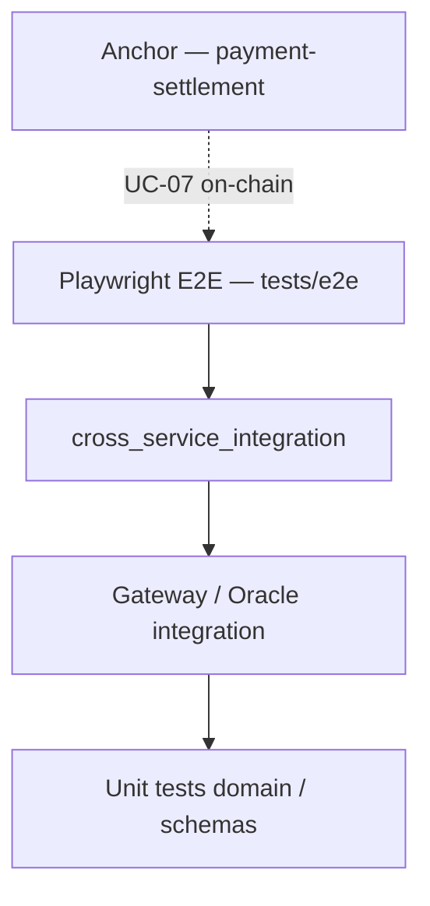

# Testing — Pasarela Multi-Rail

> Unified testing guide · Phase 6  
> **Last local stack verification:** 2026-07-27 — 3-rail smoke + devnet · frontend checkout on `:5173`

---

## 1. Test pyramid



| Layer | Tool | Requires stack | CI |
|-------|------|----------------|-----|
| Rust unit tests | `cargo test -p <crate>` | No | ✅ `rust` job |
| Gateway integration | `cargo test -p api-gateway` | Mock Oracle | ✅ |
| Cross-service | `cross_service_integration.rs` | PostgreSQL + Oracle | ✅ (Postgres in CI) |
| JSON contract | `contract_fixtures.rs` + `gateway.test.ts` | No | ✅ |
| Frontend Vitest | `pnpm test:run` | No | ✅ `frontend` job |
| Playwright E2E UI | `tests/e2e` — validation without backend | Vite only | ✅ `e2e` job |
| Playwright E2E real stack | `tests/e2e` — 3 rails | Full stack | ✅ manual (`staging-local.sh`) |
| Anchor | `anchor test` | Local Solana | ✅ path-filtered |

---

## 2. Quick regression (no stack)

```bash
# Rust — workspace (without PG: cross-service SKIPs)
cargo test --workspace -- --test-threads=1

# Gateway — contract fixtures + mock integration
cargo test -p api-gateway --test contract_fixtures
cargo test -p api-gateway

# Frontend — Vitest + Zod contract ↔ scripts/fixtures
cd frontend && pnpm test:run

# Playwright — UI only (2 tests; Playwright starts Vite)
cd tests/e2e && pnpm test
```

---

## 3. Regression with local stack

Startup order: [Runbook-Desarrollo-en.md](./Runbook-Desarrollo-en.md)

```bash
# 1. Validate synced .env + healthchecks
./scripts/check-env.sh --live

# 2. Checkout curl — 3 rails (canonical fixtures)
export API_KEY=sk_test_change_me_32chars_min
export GW=http://127.0.0.1:8080
for f in checkout-bank.json checkout-binance.json checkout-solana.json; do
  curl -s -X POST "$GW/api/v1/checkout" \
    -H "Authorization: Bearer $API_KEY" \
    -H "Idempotency-Key: test-$(date +%s)-$RANDOM" \
    -H "Content-Type: application/json" \
    -d @scripts/fixtures/$f | jq -c '{status,rail_used,settlement_proof,error_code}'
done

# 3. Full Playwright E2E (6 tests, includes 3 rails)
cd tests/e2e && pnpm test
```

**Browser requirement:** Gateway exposes **CORS** for `http://127.0.0.1:5173` and `http://localhost:5173` (local development). Without CORS, the UI shows *"Could not reach the API Gateway"* even if `curl` works.

**Solana rail:** besides the validator (`solana-test-validator`), Oracle needs a **valid pubkey** and an **SPL mint** with balance on localnet. See [Runbook-Desarrollo-en.md §8](./Runbook-Desarrollo-en.md#8-appendix--local-solana-for-e2e).

---

## 4. Suites by component

### 4.1 API Gateway (`crates/api-gateway/tests/`)

| File | Scope |
|------|-------|
| `contract_fixtures.rs` | Fixtures `scripts/fixtures/*.json` → `CheckoutRequest` |
| `e2e_integration.rs` | Phase 4 gate — mock Oracle flow |
| `cross_service_integration.rs` | Gateway + real Oracle (PostgreSQL) |
| `performance_integration.rs` | Checkout stub p99 latency |
| `security_integration.rs` | IDOR, PCI idempotency |
| `checkout_integration.rs` | Checkout + auth |
| `idempotency_integration.rs` | Idempotency-Key D9 |
| `rail_oracle_integration.rs` | Rail Switcher + fallback |
| `hold_release_integration.rs` | Hold release UC-04 |
| `error_mapping_integration.rs` | HTTP codes §6.2 |

### 4.2 Oracle (`oracle/tests/`)

Integration with PostgreSQL — use `--test-threads=1`.

### 4.3 Frontend (`frontend/src/**/*.test.ts(x)`)

77 Vitest tests — Zod schemas, components, checkout interaction.

Contract with fixtures:

```bash
pnpm test:run src/schemas/gateway.test.ts
```

### 4.4 Playwright (`tests/e2e/specs/checkout.spec.ts`)

| Suite | Tests | Stack |
|-------|-------|-------|
| `Checkout E2E — stack real` | 4 (page + 3 rails) | Gateway + Oracle + simulators |
| `Checkout E2E — validación UI` | 2 | Frontend only |

Details: [tests/e2e/README.md](../tests/e2e/README.md)

### 4.5 Canonical fixtures (`scripts/fixtures/`)

Single source for curl, manual cross-service, and contract tests. See [scripts/fixtures/README.md](../scripts/fixtures/README.md).

### 4.6 Anchor (`programs/payment-settlement/`)

On-chain UC-07 tests — independent of the HTTP checkout stack.

---

## 5. Cross-service and PostgreSQL

```bash
export ORACLE_DATABASE_URL=postgres://postgres:<password>@localhost:5432/oracle_test
cargo test -p api-gateway --test cross_service_integration -- --test-threads=1
cargo test -p oracle-authorization -- --test-threads=1
```

Without PostgreSQL: cross-service tests emit `SKIP` (do not fail).

---

## 6. CI (GitHub Actions)

See [CI-en.md](./CI-en.md). Summary:

| Job | What it tests |
|-----|---------------|
| `rust` | `cargo test --workspace` + Postgres 16 |
| `frontend` | lint, Vitest, build |
| `e2e` | Playwright — **UI always**; real stack skipped without Gateway |

The 3 full-stack E2E rails **do not run in CI** today; verified locally (2026-07-26).

---

## 7. Manual UC-01-15 verification (QA checklist)

Automated equivalent: Playwright `checkout exitoso — riel *`.

Manual steps (UI exploration):

1. Stack per runbook + `./scripts/check-env.sh --live`
2. `cd frontend && pnpm dev` → http://127.0.0.1:5173
3. Use test data → Validate card → choose rail → Confirm payment
4. Receipt with proof `ACH-*` / `CEX-*` / `SOL-*`

---

## 8. Test troubleshooting

| Symptom | Cause | Action |
|---------|-------|--------|
| E2E: *No connection to Gateway* in UI | CORS or Gateway down | Check `:8080/health`; restart Gateway (includes dev CORS) |
| E2E skip real stack | Gateway not responding in `beforeAll` | Start stack before `pnpm test` |
| Solana E2E 503 | RPC down or invalid pubkey | `solana-test-validator` + Oracle config runbook §8 |
| Solana E2E 402 | No SPL balance | Mint tokens to test wallet |
| cross-service SKIP | No PostgreSQL | Export `ORACLE_DATABASE_URL` |
| Playwright Node 18 | v1.62+ requires Node 20 | Pinned `@playwright/test@1.59.1` in `tests/e2e` |
| `.env` not loaded | `cargo run -p` from root | `cd crates/api-gateway && cargo run` |

---

## 9. References

| Document | Use |
|----------|-----|
| [Checklist-QA-Fase-6-en.md](./Checklist-QA-Fase-6-en.md) | UC-01–UC-11, gate |
| [Runbook-Desarrollo-en.md](./Runbook-Desarrollo-en.md) | Local stack |
| [CI-en.md](./CI-en.md) | Pipelines |
| [Cierre-Deuda-Fase-6.8-en.md](./Cierre-Deuda-Fase-6.8-en.md) | Fixtures + mocks |
| [Revision-Seguridad-Fase-6-en.md](./Revision-Seguridad-Fase-6-en.md) | Security tests |
| [Revision-Rendimiento-Fase-6-en.md](./Revision-Rendimiento-Fase-6-en.md) | Latency bench |

---

*Updated: 2026-07-26*
