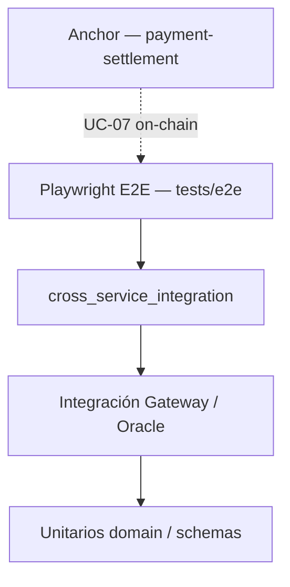

# Pruebas — Pasarela Multi-Rail

> Guía unificada de testing · Fase 6  
> **Última verificación stack local:** 2026-07-27 — smoke 3 rieles + devnet · frontend checkout en `:5173`

---

## 1. Pirámide de pruebas



| Capa | Herramienta | Requiere stack | CI |
|------|-------------|----------------|-----|
| Unitarios Rust | `cargo test -p <crate>` | No | ✅ job `rust` |
| Integración Gateway | `cargo test -p api-gateway` | Mock Oracle | ✅ |
| Cross-service | `cross_service_integration.rs` | PostgreSQL + Oracle | ✅ (Postgres en CI) |
| Contrato JSON | `contract_fixtures.rs` + `gateway.test.ts` | No | ✅ |
| Frontend Vitest | `pnpm test:run` | No | ✅ job `frontend` |
| Playwright E2E UI | `tests/e2e` — validación sin backend | Solo Vite | ✅ job `e2e` |
| Playwright E2E stack real | `tests/e2e` — 3 rieles | Stack completo | ✅ manual (`staging-local.sh`) |
| Anchor | `anchor test` | Solana local | ✅ path-filtered |

---

## 2. Regresión rápida (sin stack)

```bash
# Rust — workspace (sin PG: cross-service hace SKIP)
cargo test --workspace -- --test-threads=1

# Gateway — contrato fixtures + integración mock
cargo test -p api-gateway --test contract_fixtures
cargo test -p api-gateway

# Frontend — Vitest + contrato Zod ↔ scripts/fixtures
cd frontend && pnpm test:run

# Playwright — solo UI (2 tests; Playwright levanta Vite)
cd tests/e2e && pnpm test
```

---

## 3. Regresión con stack local

Orden de arranque: [Runbook-Desarrollo.md](./Runbook-Desarrollo.md)

```bash
# 1. Validar .env sincronizados + healthchecks
./scripts/check-env.sh --live

# 2. Checkout curl — 3 rieles (fixtures canónicos)
export API_KEY=sk_test_change_me_32chars_min
export GW=http://127.0.0.1:8080
for f in checkout-bank.json checkout-binance.json checkout-solana.json; do
  curl -s -X POST "$GW/api/v1/checkout" \
    -H "Authorization: Bearer $API_KEY" \
    -H "Idempotency-Key: test-$(date +%s)-$RANDOM" \
    -H "Content-Type: application/json" \
    -d @scripts/fixtures/$f | jq -c '{status,rail_used,settlement_proof,error_code}'
done

# 3. Playwright E2E completo (6 tests, incluye 3 rieles)
cd tests/e2e && pnpm test
```

**Requisito navegador:** el Gateway expone **CORS** para `http://127.0.0.1:5173` y `http://localhost:5173` (desarrollo local). Sin CORS, la UI muestra *“No se pudo contactar al API Gateway”* aunque `curl` funcione.

**Riel Solana:** además del validador (`solana-test-validator`), Oracle necesita un **pubkey válido** y un **mint SPL** con saldo en localnet. Ver [Runbook-Desarrollo.md §8](./Runbook-Desarrollo.md#8-anexo--solana-local-para-e2e).

---

## 4. Suites por componente

### 4.1 API Gateway (`crates/api-gateway/tests/`)

| Archivo | Alcance |
|---------|---------|
| `contract_fixtures.rs` | Fixtures `scripts/fixtures/*.json` → `CheckoutRequest` |
| `e2e_integration.rs` | Gate Fase 4 — flujo mock Oracle |
| `cross_service_integration.rs` | Gateway + Oracle real (PostgreSQL) |
| `performance_integration.rs` | Latencia p99 checkout stub |
| `security_integration.rs` | IDOR, PCI idempotency |
| `checkout_integration.rs` | Checkout + auth |
| `idempotency_integration.rs` | Idempotency-Key D9 |
| `rail_oracle_integration.rs` | Rail Switcher + fallback |
| `hold_release_integration.rs` | Liberación hold UC-04 |
| `error_mapping_integration.rs` | Códigos HTTP §6.2 |

### 4.2 Oracle (`oracle/tests/`)

Integración con PostgreSQL — usar `--test-threads=1`.

### 4.3 Frontend (`frontend/src/**/*.test.ts(x)`)

77 tests Vitest — schemas Zod, componentes, interacción checkout.

Contrato con fixtures:

```bash
pnpm test:run src/schemas/gateway.test.ts
```

### 4.4 Playwright (`tests/e2e/specs/checkout.spec.ts`)

| Suite | Tests | Stack |
|-------|-------|-------|
| `Checkout E2E — stack real` | 4 (página + 3 rieles) | Gateway + Oracle + simuladores |
| `Checkout E2E — validación UI` | 2 | Solo frontend |

Detalle: [tests/e2e/README.md](../tests/e2e/README.md)

### 4.5 Fixtures canónicos (`scripts/fixtures/`)

Fuente única para curl, cross-service manual y tests de contrato. Ver [scripts/fixtures/README.md](../scripts/fixtures/README.md).

### 4.6 Anchor (`programs/payment-settlement/`)

Tests on-chain UC-07 — independientes del stack checkout HTTP.

---

## 5. Cross-service y PostgreSQL

```bash
export ORACLE_DATABASE_URL=postgres://postgres:<password>@localhost:5432/oracle_test
cargo test -p api-gateway --test cross_service_integration -- --test-threads=1
cargo test -p oracle-authorization -- --test-threads=1
```

Sin PostgreSQL: tests cross-service emiten `SKIP` (no fallan).

---

## 6. CI (GitHub Actions)

Ver [CI.md](./CI.md). Resumen:

| Job | Qué prueba |
|-----|------------|
| `rust` | `cargo test --workspace` + Postgres 16 |
| `frontend` | lint, Vitest, build |
| `e2e` | Playwright — **UI siempre**; stack real se omite sin Gateway |

Los 3 rieles E2E con stack real **no corren en CI** hoy; verificados localmente (2026-07-26).

---

## 7. Verificación manual UC-01-15 (checklist QA)

Equivalente automatizado: Playwright `checkout exitoso — riel *`.

Pasos manuales (exploración UI):

1. Stack según runbook + `./scripts/check-env.sh --live`
2. `cd frontend && pnpm dev` → http://127.0.0.1:5173
3. Usar datos de prueba → Validar tarjeta → elegir riel → Confirmar pago
4. Comprobante con proof `ACH-*` / `CEX-*` / `SOL-*`

---

## 8. Troubleshooting pruebas

| Síntoma | Causa | Acción |
|---------|-------|--------|
| E2E: *Sin conexión al Gateway* en UI | CORS o Gateway caído | Verificar `:8080/health`; reiniciar Gateway (incluye CORS dev) |
| E2E skip stack real | Gateway no responde en `beforeAll` | Levantar stack antes de `pnpm test` |
| Solana E2E 503 | RPC caído o pubkey inválido | `solana-test-validator` + config Oracle §8 runbook |
| Solana E2E 402 | Sin saldo SPL | Mint tokens al wallet de prueba |
| cross-service SKIP | Sin PostgreSQL | Exportar `ORACLE_DATABASE_URL` |
| Playwright Node 18 | v1.62+ exige Node 20 | Fijado `@playwright/test@1.59.1` en `tests/e2e` |
| `.env` no cargado | `cargo run -p` desde raíz | `cd crates/api-gateway && cargo run` |

---

## 9. Referencias

| Documento | Uso |
|-----------|-----|
| [Checklist-QA-Fase-6.md](./Checklist-QA-Fase-6.md) | UC-01–UC-11, gate |
| [Runbook-Desarrollo.md](./Runbook-Desarrollo.md) | Stack local |
| [CI.md](./CI.md) | Pipelines |
| [Cierre-Deuda-Fase-6.8.md](./Cierre-Deuda-Fase-6.8.md) | Fixtures + mocks |
| [Revision-Seguridad-Fase-6.md](./Revision-Seguridad-Fase-6.md) | Tests seguridad |
| [Revision-Rendimiento-Fase-6.md](./Revision-Rendimiento-Fase-6.md) | Bench latencia |

---

*Actualizado: 2026-07-26*
