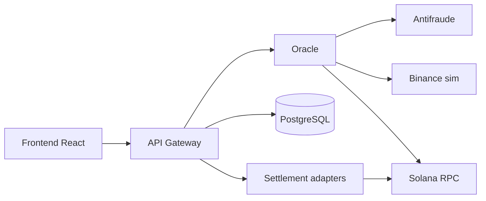

> **Documentation / Documentación:** [Español (es)](README-es.md) · [English (en)](README-en.md)

# Pasarela Multi-Rail

Payment processor with unified checkout and interchangeable settlement across **three rails**: traditional bank, Binance CEX (simulated), and Solana wallet (SPL). Microservices architecture in Rust, Anchor on-chain program, and React frontend.

> **Status:** Phases 0–6 closed · **Phase 7 (staging)** in progress — local stack and devnet validated (2026-07-27).

---

## What the system does

1. The **merchant** sends a checkout (card + amount + preferred rail) to the **API Gateway**.
2. The Gateway orchestrates validation, idempotency, and rail selection (`Rail Switcher`).
3. The **Oracle** authorizes funds (antifraud, balance per rail, temporary hold) — **accessible only from the Gateway**.
4. The **Settlement Engine** settles on the active rail (in-memory stub in dev; real adapters in progress).
5. The **frontend** displays the receipt and allows querying the transaction.



---

## Monorepo components

| Component | Path | Role |
|------------|------|-----|
| **API Gateway** | [`crates/api-gateway/`](crates/api-gateway/) | HTTP orchestrator (Axum): checkout, idempotency, merchant auth, persistence |
| **Authorization Oracle** | [`oracle/`](oracle/) | Holds, Luhn, funds per rail, antifraud; internal network in production |
| **Domain** | [`crates/domain/`](crates/domain/) | Business types and rules without infrastructure dependencies |
| **Rail Switcher** | [`crates/rail-switcher/`](crates/rail-switcher/) | Rail selection and fallback (Strategy) |
| **Settlement adapters** | [`crates/settlement-adapters/`](crates/settlement-adapters/) | Settlement per rail: bank, CEX, Solana |
| **Oracle client** | [`crates/oracle-client/`](crates/oracle-client/) | HTTP contract Gateway → Oracle |
| **Antifraud (sim)** | [`antifraud/`](antifraud/) | Simulated scoring and rules for the Oracle |
| **Binance Spot (sim)** | [`binance-sim/`](binance-sim/) | Simulated Spot API for CEX balance |
| **Checkout frontend** | [`frontend/`](frontend/) | React + Vite + Zod UI; consumes only the Gateway |
| **Solana program** | [`programs/payment-settlement/`](programs/payment-settlement/) | Anchor — SPL settlement; deployed on **devnet** |
| **Staging (Docker)** | [`deploy/staging/`](deploy/staging/) | Compose + Caddy TLS + deploy scripts |
| **Fixtures / smoke** | [`scripts/fixtures/`](scripts/fixtures/) | Canonical checkout JSON and post-deploy tests |
| **E2E Playwright** | [`tests/e2e/`](tests/e2e/) | UI and checkout against real stack |

---

## Quick start (local)

### Requirements

| Tool | Purpose |
|-------------|-----|
| Rust 1.75+ | Backend |
| PostgreSQL 14+ | Oracle (required) |
| Node 18+ / pnpm 9+ | Frontend and E2E |
| Solana CLI (optional) | `solana_wallet` rail locally or on devnet |

### 1. Clone and secrets

```bash
git clone <url-del-repo> pasarela && cd pasarela
./scripts/staging-local.sh init
```

### 2. Start backend stack

```bash
./scripts/staging-local.sh up
./scripts/staging-local.sh smoke          # 3 rails (Solana: local validator or devnet)
```

### 3. Frontend

```bash
cd frontend && pnpm install && pnpm dev
# → http://127.0.0.1:5173
```

Demo card: `4111111111111111` · `12/2030` · CVV `123`.

### Validation against Solana devnet

```bash
./scripts/staging-devnet.sh
```

Step-by-step details: [Doc/Runbook-Desarrollo-en.md](Doc/Runbook-Desarrollo-en.md) · [Doc/Runbook-Staging-en.md](Doc/Runbook-Staging-en.md).

---

## Documentation

> **Languages:** each doc has [`-es`](Doc/Documentation-i18n-es.md) and [`-en`](Doc/Documentation-i18n-en.md) variants. Full index: [Documentation-i18n-es.md](Doc/Documentation-i18n-es.md) · [Documentation-i18n-en.md](Doc/Documentation-i18n-en.md).

### Design and planning

| Document | Content |
|-----------|-----------|
| [Doc/Arquitectura-en.md](Doc/Arquitectura-en.md) | Components, security, boundaries, decisions D1–D12 |
| [Doc/Casos-de-Uso-ER-Flujos-en.md](Doc/Casos-de-Uso-ER-Flujos-en.md) | Use cases UC-01–UC-11, ER, flow diagrams |
| [Doc/Contexto General-en.md](Doc/Contexto%20General-en.md) | Product context and phase confirmation rules |
| [Doc/Plan-de-Implementacion-en.md](Doc/Plan-de-Implementacion-en.md) | Roadmap by phases (0–8) and current status |

### Operations and deploy

| Document | Content |
|-----------|-----------|
| [Doc/Runbook-Desarrollo-en.md](Doc/Runbook-Desarrollo-en.md) | Local stack without containers |
| [Doc/Runbook-Staging-en.md](Doc/Runbook-Staging-en.md) | Docker staging + Caddy |
| [Doc/Provision-VPS-Fase-7-en.md](Doc/Provision-VPS-Fase-7-en.md) | VPS checklist and first deploy |
| [Doc/CI-en.md](Doc/CI-en.md) | GitHub Actions (Rust, frontend, Playwright, staging build) |

### Quality and debt

| Document | Content |
|-----------|-----------|
| [Doc/Pruebas-en.md](Doc/Pruebas-en.md) | Test pyramid and regression |
| [Doc/Checklist-QA-Fase-6-en.md](Doc/Checklist-QA-Fase-6-en.md) | Functional QA UC-01–UC-11 |
| [Doc/Revision-Seguridad-Fase-6-en.md](Doc/Revision-Seguridad-Fase-6-en.md) | OWASP / PCI review |
| [Doc/Revision-Rendimiento-Fase-6-en.md](Doc/Revision-Rendimiento-Fase-6-en.md) | Latency budgets |
| [Doc/Deuda-Tecnica-en.md](Doc/Deuda-Tecnica-en.md) | P0–P3 registry |
| [Doc/Cierre-Deuda-Fase-6.8-en.md](Doc/Cierre-Deuda-Fase-6.8-en.md) | Critical debt closure pre-staging |

### Phase closure records

[Fase 0](Doc/Acta-Cierre-Fase-0-en.md) · [Fase 1](Doc/Acta-Cierre-Fase-1-en.md) · [Fase 2](Doc/Acta-Cierre-Fase-2-en.md) · [Fase 4](Doc/Acta-Cierre-Fase-4-en.md) · [Fase 5](Doc/Acta-Cierre-Fase-5-en.md)

### Service READMEs

[`oracle/`](oracle/README-en.md) · [`crates/domain/`](crates/domain/README-en.md) · [`crates/rail-switcher/`](crates/rail-switcher/README-en.md) · [`crates/api-gateway/`](crates/api-gateway/README-en.md) · [`antifraud/`](antifraud/README-en.md) · [`binance-sim/`](binance-sim/README-en.md) · [`frontend/`](frontend/README-en.md) · [`programs/payment-settlement/`](programs/payment-settlement/README-en.md) · [`deploy/staging/`](deploy/staging/README-en.md)

---

## Useful scripts

| Script | Purpose |
|--------|-----|
| [`scripts/staging-local.sh`](scripts/staging-local.sh) | Local stack: `init` · `up` · `smoke` · `down` · `status` |
| [`scripts/staging-devnet.sh`](scripts/staging-devnet.sh) | Validate Solana rail against devnet |
| [`scripts/check-env.sh`](scripts/check-env.sh) | `.env` synchronization across services |
| [`scripts/smoke-staging.sh`](scripts/smoke-staging.sh) | HTTP smoke post-deploy |
| [`scripts/deploy-staging.sh`](scripts/deploy-staging.sh) | Docker deploy on VPS |

---

## CI/CD

Push to `main` / `master` / `liquidacion` triggers:

- **Rust** — `cargo test --workspace`
- **Frontend** — lint, Vitest, build
- **Playwright** — E2E UI
- **Staging build** — Docker image validation
- **Anchor** — program tests (path `programs/payment-settlement/`)

See [Doc/CI-en.md](Doc/CI-en.md).

---

## Solana devnet

| Field | Value |
|-------|--------|
| Program ID | `4cKoeammHN8UjAbiJRw2DqxBPL1Mb1EaPQeJFFuo564B` |
| RPC | `https://api.devnet.solana.com` |
| Metadata | [`programs/payment-settlement/deploy/devnet.json`](programs/payment-settlement/deploy/devnet.json) |

---

## Before pushing to the repository

- **Do not commit** `.env`, `.env.local`, Solana keys, or `deploy/staging/.env` (see [`.gitignore`](.gitignore)).
- Copy from `*.env.example` and use `./scripts/generate-staging-secrets.sh` for staging.
- Run minimum regression: `cargo test --workspace` and `cd frontend && pnpm test:run`.
- Review that no secrets appear in history (`git log -p` on sensitive files).

---

## License

Define license before public release (pending).

---

## Contact / contribution

Repository being prepared for publication. Issues and PRs per maintainer policy.
