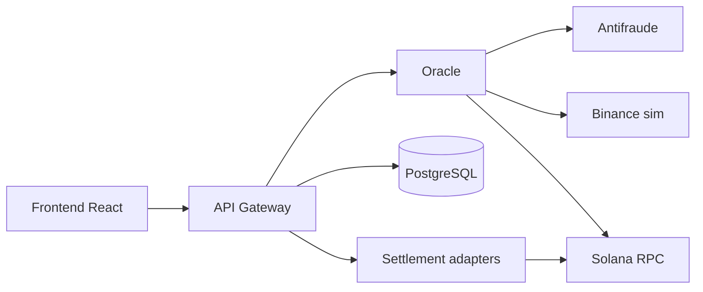

> **Documentation / Documentación:** [Español (es)](README-es.md) · [English (en)](README-en.md)
>
# Pasarela Multi-Rail

Procesador de pagos con checkout unificado y liquidación intercambiable en **tres rieles**: banco tradicional, Binance CEX (simulado) y wallet Solana (SPL). Arquitectura de microservicios en Rust, programa Anchor on-chain y frontend React.

> **Estado:** Fases 0–6 cerradas · **Fase 7 (staging)** en curso — stack local y devnet validados (2026-07-27).

---

## Qué hace el sistema

1. El **comercio** envía un checkout (tarjeta + monto + riel preferido) al **API Gateway**.
2. El Gateway orquesta validación, idempotencia y selección de riel (`Rail Switcher`).
3. El **Oracle** autoriza fondos (antifraude, saldo por riel, hold temporal) — **solo accesible desde el Gateway**.
4. El **Settlement Engine** liquida en el riel activo (stub in-memory en dev; adapters reales en evolución).
5. El **frontend** muestra el comprobante y permite consultar la transacción.



---

## Componentes del monorepo

| Componente | Ruta | Rol |
|------------|------|-----|
| **API Gateway** | [`crates/api-gateway/`](crates/api-gateway/) | Orquestador HTTP (Axum): checkout, idempotencia, auth comercio, persistencia |
| **Oracle de autorización** | [`oracle/`](oracle/) | Holds, Luhn, fondos por riel, antifraude; red interna en producción |
| **Dominio** | [`crates/domain/`](crates/domain/) | Tipos y reglas de negocio sin dependencias de infra |
| **Rail Switcher** | [`crates/rail-switcher/`](crates/rail-switcher/) | Selección y fallback entre rieles (Strategy) |
| **Settlement adapters** | [`crates/settlement-adapters/`](crates/settlement-adapters/) | Liquidación por riel: banco, CEX, Solana |
| **Oracle client** | [`crates/oracle-client/`](crates/oracle-client/) | Contrato HTTP Gateway → Oracle |
| **Antifraude (sim)** | [`antifraud/`](antifraud/) | Scoring y reglas simuladas para el Oracle |
| **Binance Spot (sim)** | [`binance-sim/`](binance-sim/) | API Spot simulada para saldo CEX |
| **Frontend checkout** | [`frontend/`](frontend/) | UI React + Vite + Zod; consume solo el Gateway |
| **Programa Solana** | [`programs/payment-settlement/`](programs/payment-settlement/) | Anchor — liquidación SPL; desplegado en **devnet** |
| **Staging (Docker)** | [`deploy/staging/`](deploy/staging/) | Compose + Caddy TLS + scripts de deploy |
| **Fixtures / smoke** | [`scripts/fixtures/`](scripts/fixtures/) | JSON canónicos de checkout y pruebas post-deploy |
| **E2E Playwright** | [`tests/e2e/`](tests/e2e/) | UI y checkout contra stack real |

---

## Inicio rápido (local)

### Requisitos

| Herramienta | Uso |
|-------------|-----|
| Rust 1.75+ | Backend |
| PostgreSQL 14+ | Oracle (obligatorio) |
| Node 18+ / pnpm 9+ | Frontend y E2E |
| Solana CLI (opcional) | Riel `solana_wallet` local o devnet |

### 1. Clonar y secretos

```bash
git clone <url-del-repo> pasarela && cd pasarela
./scripts/staging-local.sh init
```

### 2. Levantar stack backend

```bash
./scripts/staging-local.sh up
./scripts/staging-local.sh smoke          # 3 rieles (Solana: validador local o devnet)
```

### 3. Frontend

```bash
cd frontend && pnpm install && pnpm dev
# → http://127.0.0.1:5173
```

Tarjeta demo: `4111111111111111` · `12/2030` · CVV `123`.

### Validación contra Solana devnet

```bash
./scripts/staging-devnet.sh
```

Detalle paso a paso: [Doc/Runbook-Desarrollo.md](Doc/Runbook-Desarrollo.md) · [Doc/Runbook-Staging.md](Doc/Runbook-Staging.md).

---

## Documentación

> **Idiomas:** cada `.md` tiene variantes [`-es`](Doc/Documentation-i18n-es.md) y [`-en`](Doc/Documentation-i18n-en.md). Índice completo: [Doc/Documentation-i18n-es.md](Doc/Documentation-i18n-es.md) · [Doc/Documentation-i18n-en.md](Doc/Documentation-i18n-en.md).

### Diseño y planificación

| Documento | Contenido |
|-----------|-----------|
| [Doc/Arquitectura.md](Doc/Arquitectura.md) | Componentes, seguridad, fronteras, decisiones D1–D12 |
| [Doc/Casos-de-Uso-ER-Flujos.md](Doc/Casos-de-Uso-ER-Flujos.md) | Casos de uso UC-01–UC-11, ER, diagramas de flujo |
| [Doc/Contexto General.md](Doc/Contexto%20General.md) | Contexto del producto y reglas de confirmación por fase |
| [Doc/Plan-de-Implementacion.md](Doc/Plan-de-Implementacion.md) | Hoja de ruta por fases (0–8) y estado actual |

### Operación y deploy

| Documento | Contenido |
|-----------|-----------|
| [Doc/Runbook-Desarrollo.md](Doc/Runbook-Desarrollo.md) | Stack local sin contenedores |
| [Doc/Runbook-Staging.md](Doc/Runbook-Staging.md) | Staging Docker + Caddy |
| [Doc/Provision-VPS-Fase-7.md](Doc/Provision-VPS-Fase-7.md) | Checklist VPS y primer deploy |
| [Doc/CI.md](Doc/CI.md) | GitHub Actions (Rust, frontend, Playwright, build staging) |

### Calidad y deuda

| Documento | Contenido |
|-----------|-----------|
| [Doc/Pruebas.md](Doc/Pruebas.md) | Pirámide de tests y regresión |
| [Doc/Checklist-QA-Fase-6.md](Doc/Checklist-QA-Fase-6.md) | QA funcional UC-01–UC-11 |
| [Doc/Revision-Seguridad-Fase-6.md](Doc/Revision-Seguridad-Fase-6.md) | Revisión OWASP / PCI |
| [Doc/Revision-Rendimiento-Fase-6.md](Doc/Revision-Rendimiento-Fase-6.md) | Presupuestos de latencia |
| [Doc/Deuda-Tecnica.md](Doc/Deuda-Tecnica.md) | Registro P0–P3 |
| [Doc/Cierre-Deuda-Fase-6.8.md](Doc/Cierre-Deuda-Fase-6.8.md) | Cierre deuda crítica pre-staging |

### Actas de cierre por fase

[Fase 0](Doc/Acta-Cierre-Fase-0.md) · [Fase 1](Doc/Acta-Cierre-Fase-1.md) · [Fase 2](Doc/Acta-Cierre-Fase-2.md) · [Fase 4](Doc/Acta-Cierre-Fase-4.md) · [Fase 5](Doc/Acta-Cierre-Fase-5.md)

### READMEs por servicio

[`oracle/`](oracle/README.md) · [`crates/domain/`](crates/domain/README.md) · [`crates/rail-switcher/`](crates/rail-switcher/README.md) · [`crates/api-gateway/`](crates/api-gateway/README.md) · [`antifraud/`](antifraud/README.md) · [`binance-sim/`](binance-sim/README.md) · [`frontend/`](frontend/README.md) · [`programs/payment-settlement/`](programs/payment-settlement/README.md) · [`deploy/staging/`](deploy/staging/README.md)

---

## Scripts útiles

| Script | Uso |
|--------|-----|
| [`scripts/staging-local.sh`](scripts/staging-local.sh) | Stack local: `init` · `up` · `smoke` · `down` · `status` |
| [`scripts/staging-devnet.sh`](scripts/staging-devnet.sh) | Validar riel Solana contra devnet |
| [`scripts/check-env.sh`](scripts/check-env.sh) | Sincronización de `.env` entre servicios |
| [`scripts/smoke-staging.sh`](scripts/smoke-staging.sh) | Smoke HTTP post-deploy |
| [`scripts/deploy-staging.sh`](scripts/deploy-staging.sh) | Deploy Docker en VPS |

---

## CI/CD

Push a `main` / `master` / `liquidacion` dispara:

- **Rust** — `cargo test --workspace`
- **Frontend** — lint, Vitest, build
- **Playwright** — E2E UI
- **Staging build** — validación de imágenes Docker
- **Anchor** — tests del programa (path `programs/payment-settlement/`)

Ver [Doc/CI.md](Doc/CI.md).

---

## Solana devnet

| Campo | Valor |
|-------|--------|
| Program ID | `4cKoeammHN8UjAbiJRw2DqxBPL1Mb1EaPQeJFFuo564B` |
| RPC | `https://api.devnet.solana.com` |
| Metadatos | [`programs/payment-settlement/deploy/devnet.json`](programs/payment-settlement/deploy/devnet.json) |

---

## Antes de subir al repositorio

- **No commitear** `.env`, `.env.local`, claves Solana ni `deploy/staging/.env` (ver [`.gitignore`](.gitignore)).
- Copiar desde `*.env.example` y usar `./scripts/generate-staging-secrets.sh` para staging.
- Ejecutar regresión mínima: `cargo test --workspace` y `cd frontend && pnpm test:run`.
- Revisar que no haya secretos en el historial (`git log -p` en archivos sensibles).

---

## Licencia

Definir licencia antes de publicación pública (pendiente).

---

## Contacto / contribución

Repositorio en preparación para publicación. Issues y PRs según política del mantenedor.
