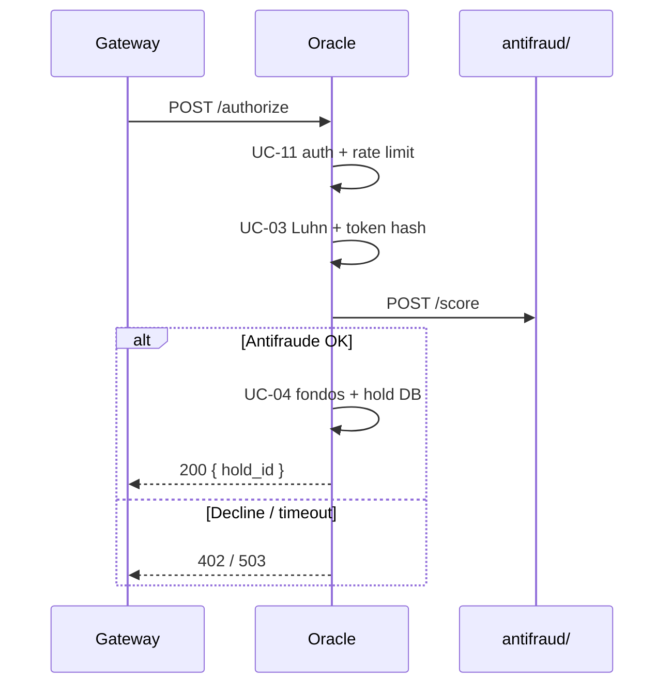

# Oracle — Internal API v1 Contract

> Version: **1.0.0** · Base path: `/internal/v1`  
> Machine-readable OpenAPI: [openapi/v1.yaml](../openapi/v1.yaml)  
> Rust DTOs: [crates/oracle-client](../../crates/oracle-client/) (shared contract with Gateway)

## Trust boundary

| Rule | Detail |
|-------|---------|
| Single consumer | API Gateway (`pasarela/`) |
| Authentication | Header `X-API-KEY` = `ORACLE_API_KEY` |
| Network | Internal network only; IP in `ORACLE_ALLOWED_CALLERS` |
| Rate limit | `ORACLE_RATE_LIMIT_PER_MINUTE` req/min per API key + IP |
| PII | PAN/CVV in transit only; never persisted (D6) |

## Endpoints

### Public (no auth)

| Method | Route | Description |
|--------|------|-------------|
| `GET` | `/health` | Healthcheck for orchestration |

### Internal (require `X-API-KEY`)

| Method | Route | UC | Description |
|--------|------|----|-------------|
| `POST` | `/internal/v1/authorize` | UC-03, UC-12, UC-04 | Validate card + antifraud + hold |
| `POST` | `/internal/v1/hold/release` | UC-04 | Release hold if settlement fails |

### Planned (v1.1 — Phase 4)

| Method | Route | Description |
|--------|------|-------------|
| `POST` | `/internal/v1/hold/consume` | Mark hold as `consumed` after successful settlement |

---

## `GET /health`

**Response 200**

```json
{
  "status": "ok",
  "service": "oracle-authorization"
}
```

---

## `POST /internal/v1/authorize`

Authorizes a transaction and creates an off-chain hold.

### Headers

| Header | Required | Description |
|--------|-----------|-------------|
| `X-API-KEY` | Yes | Shared key with Gateway |
| `Content-Type` | Yes | `application/json` |
| `X-Forwarded-For` | No | Gateway IP (allowlist + rate limit) |

### Request body

```json
{
  "gateway_request_id": "550e8400-e29b-41d4-a716-446655440000",
  "card": {
    "pan": "4111111111111111",
    "expiry_month": "12",
    "expiry_year": "30",
    "cvv": "123",
    "cardholder": "Demo User"
  },
  "amount": 100.0,
  "currency": "USD",
  "funding_type": "traditional_bank"
}
```

| Field | Type | Description |
|-------|------|-------------|
| `gateway_request_id` | UUID | Correlation with Gateway `TRANSACTION` |
| `card.pan` | string | Mock PAN; validated with Luhn |
| `amount` | number | Requested amount (> 0) |
| `currency` | string | ISO 4217 (3 chars) |
| `funding_type` | enum | `traditional_bank` \| `binance_cex` \| `solana_wallet` |

### Response 200

```json
{
  "hold_id": "660e8400-e29b-41d4-a716-446655440001",
  "brand": "visa",
  "brand_code": 1,
  "last_four": "1111",
  "gateway_request_id": "550e8400-e29b-41d4-a716-446655440000"
}
```

| `brand_code` | Brand |
|--------------|-------|
| 1 | Visa |
| 2 | Mastercard |
| 3 | Amex |

### Errors

| HTTP | `error_code` | Condition |
|------|--------------|-----------|
| 401 | `UNAUTHORIZED` | Missing API key or invalid key |
| 403 | `FORBIDDEN` | IP outside allowlist |
| 429 | `TOO_MANY_REQUESTS` | Rate limit exceeded |
| 422 | `INVALID_CARD` | Luhn failed or unknown brand |
| 402 | `INSUFFICIENT_FUNDS` | Insufficient balance on rail |
| 402 | `FRAUD_DECLINED` | Antifraud declined |
| 503 | `RAIL_UNAVAILABLE` | Antifraud/rail not responding (fail closed) |
| 500 | `INTERNAL_ERROR` | Persistence or other error |

Error format:

```json
{
  "error_code": "INSUFFICIENT_FUNDS",
  "message": "fondos insuficientes"
}
```

### Internal flow



---

## `POST /internal/v1/hold/release`

Releases a hold when settlement fails in the Gateway.

### Request body

```json
{
  "hold_id": "660e8400-e29b-41d4-a716-446655440001"
}
```

### Response 200

```json
{
  "hold_id": "660e8400-e29b-41d4-a716-446655440001",
  "status": "released"
}
```

| `status` | Meaning |
|----------|-------------|
| `released` | Hold released (or already was) |
| `expired` | Hold expired by TTL (idempotent) |

### Additional errors

| HTTP | `error_code` | Condition |
|------|--------------|-----------|
| 404 | `NOT_FOUND` | Hold does not exist |
| 409 | `CONFLICT` | Hold already `consumed` |

---

## Contract fixtures

JSON examples in `crates/oracle-client/tests/fixtures/` — validated by `crates/oracle-client/tests/api_contract.rs` and `oracle/tests/gateway_contract.rs`:

- `authorize_request.json`
- `authorize_response.json`
- `release_hold_response.json`
- `error_response.json`

---

## Contract evolution

| Version | Change |
|---------|--------|
| v1.0 | Current endpoints: authorize, release, health |
| v1.1 | `POST /hold/consume` (Phase 4 Gateway) |
| v2.0 | Mandatory mTLS (Phase 7/8, D7) |

Route versioning (`/internal/v1/`) allows evolution without breaking consumers.
