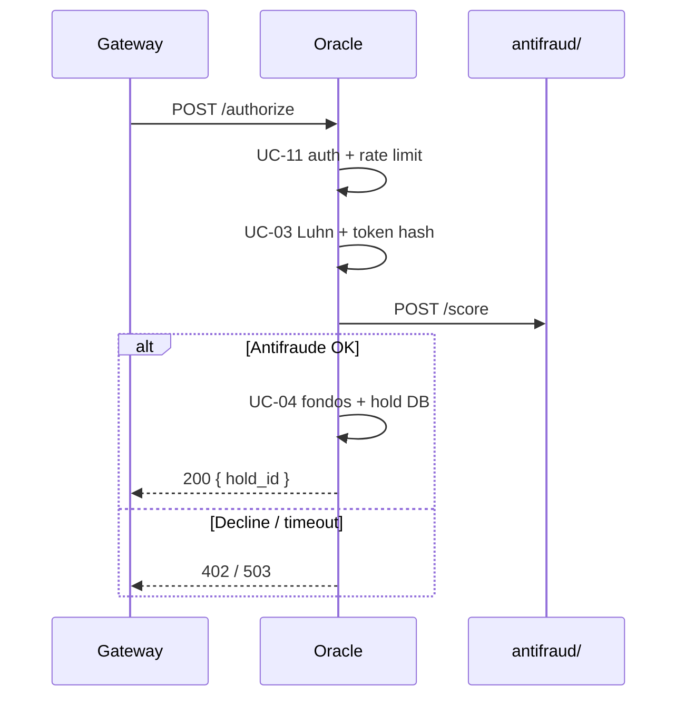

# Oracle — Contrato API interna v1

> Versión: **1.0.0** · Base path: `/internal/v1`  
> OpenAPI machine-readable: [openapi/v1.yaml](../openapi/v1.yaml)  
> DTOs Rust: [crates/oracle-client](../../crates/oracle-client/) (contrato compartido con el Gateway)

## Frontera de confianza

| Regla | Detalle |
|-------|---------|
| Consumidor único | API Gateway (`pasarela/`) |
| Autenticación | Header `X-API-KEY` = `ORACLE_API_KEY` |
| Red | Solo red interna; IP en `ORACLE_ALLOWED_CALLERS` |
| Rate limit | `ORACLE_RATE_LIMIT_PER_MINUTE` req/min por API key + IP |
| PII | PAN/CVV en tránsito únicamente; nunca persistidos (D6) |

## Endpoints

### Públicos (sin auth)

| Método | Ruta | Descripción |
|--------|------|-------------|
| `GET` | `/health` | Healthcheck para orquestación |

### Internos (requieren `X-API-KEY`)

| Método | Ruta | UC | Descripción |
|--------|------|----|-------------|
| `POST` | `/internal/v1/authorize` | UC-03, UC-12, UC-04 | Validar tarjeta + antifraude + hold |
| `POST` | `/internal/v1/hold/release` | UC-04 | Liberar hold si settlement falla |

### Planificado (v1.1 — Fase 4)

| Método | Ruta | Descripción |
|--------|------|-------------|
| `POST` | `/internal/v1/hold/consume` | Marcar hold como `consumed` tras settlement OK |

---

## `GET /health`

**Response 200**

```json
{
  "status": "ok",
  "service": "oracle-authorization"
}
```

---

## `POST /internal/v1/authorize`

Autoriza una transacción y crea un hold off-chain.

### Headers

| Header | Requerido | Descripción |
|--------|-----------|-------------|
| `X-API-KEY` | Sí | Clave compartida con Gateway |
| `Content-Type` | Sí | `application/json` |
| `X-Forwarded-For` | No | IP del Gateway (allowlist + rate limit) |

### Request body

```json
{
  "gateway_request_id": "550e8400-e29b-41d4-a716-446655440000",
  "card": {
    "pan": "4111111111111111",
    "expiry_month": "12",
    "expiry_year": "30",
    "cvv": "123",
    "cardholder": "Demo User"
  },
  "amount": 100.0,
  "currency": "USD",
  "funding_type": "traditional_bank"
}
```

| Campo | Tipo | Descripción |
|-------|------|-------------|
| `gateway_request_id` | UUID | Correlación con `TRANSACTION` del Gateway |
| `card.pan` | string | PAN ficticio; validado con Luhn |
| `amount` | number | Monto solicitado (> 0) |
| `currency` | string | ISO 4217 (3 chars) |
| `funding_type` | enum | `traditional_bank` \| `binance_cex` \| `solana_wallet` |

### Response 200

```json
{
  "hold_id": "660e8400-e29b-41d4-a716-446655440001",
  "brand": "visa",
  "brand_code": 1,
  "last_four": "1111",
  "gateway_request_id": "550e8400-e29b-41d4-a716-446655440000"
}
```

| `brand_code` | Marca |
|--------------|-------|
| 1 | Visa |
| 2 | Mastercard |
| 3 | Amex |

### Errores

| HTTP | `error_code` | Condición |
|------|--------------|-----------|
| 401 | `UNAUTHORIZED` | Sin API key o key inválida |
| 403 | `FORBIDDEN` | IP fuera de allowlist |
| 429 | `TOO_MANY_REQUESTS` | Rate limit excedido |
| 422 | `INVALID_CARD` | Luhn fallido o marca desconocida |
| 402 | `INSUFFICIENT_FUNDS` | Saldo insuficiente en riel |
| 402 | `FRAUD_DECLINED` | Antifraude rechazó |
| 503 | `RAIL_UNAVAILABLE` | Antifraude/riel no responde (fail closed) |
| 500 | `INTERNAL_ERROR` | Error de persistencia u otro |

Formato de error:

```json
{
  "error_code": "INSUFFICIENT_FUNDS",
  "message": "fondos insuficientes"
}
```

### Flujo interno



---

## `POST /internal/v1/hold/release`

Libera un hold cuando el settlement falla en el Gateway.

### Request body

```json
{
  "hold_id": "660e8400-e29b-41d4-a716-446655440001"
}
```

### Response 200

```json
{
  "hold_id": "660e8400-e29b-41d4-a716-446655440001",
  "status": "released"
}
```

| `status` | Significado |
|----------|-------------|
| `released` | Hold liberado (o ya lo estaba) |
| `expired` | Hold expirado por TTL (idempotente) |

### Errores adicionales

| HTTP | `error_code` | Condición |
|------|--------------|-----------|
| 404 | `NOT_FOUND` | Hold inexistente |
| 409 | `CONFLICT` | Hold ya `consumed` |

---

## Fixtures de contrato

Ejemplos JSON en `tests/fixtures/` — validados por `tests/api_contract.rs`:

- `authorize_request.json`
- `authorize_response.json`
- `release_hold_response.json`
- `error_response.json`

---

## Evolución del contrato

| Versión | Cambio |
|---------|--------|
| v1.0 | Endpoints actuales: authorize, release, health |
| v1.1 | `POST /hold/consume` (Fase 4 Gateway) |
| v2.0 | mTLS obligatorio (Fase 7/8, D7) |

El versionado de ruta (`/internal/v1/`) permite evolucionar sin romper consumidores.
